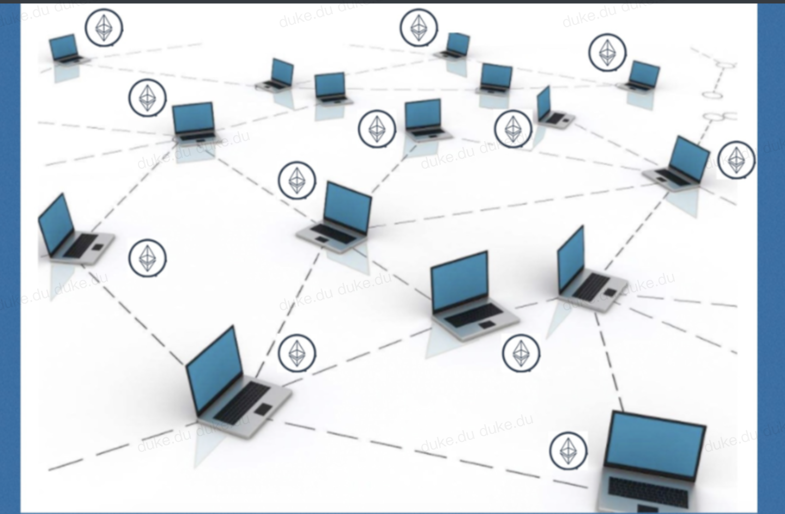

#  第3节：什么是以太坊

>  本文收录于我的开源项目：https://github.com/dukedaily/solidity-expert ，欢迎star转发，文末加V入群。


在比特币问世前期，只有小范围内的人了解它。4年之后，一个俄罗斯的小伙子受到了比特币设计的启示，来了灵感，并于2013年首次提出了以太坊（Ethereum）的概念，并将其定位为：下一代加密货币与去中心化应用平台。

以太坊的诞生，极大的推动了区块链的进程，让区块链逐步走进了大众视野，时至今日，以太坊已经成为继比特币之后，全球市值第二大的区块链项目，也拥有最大的开发者社区，而我将带领你成为万千开发者一员。


## 以太坊

你可以把以太坊网络当成一个世界型计算机，它永远不会宕机，因为有成千上万台独立计算机在运行者，这只要运行它的客户端（全节点版本），你就可以成为其中一员，我们称之为矿工。任何链上程序（我们称为智能合约）最终都会被矿工打包执行，全网同步。



官方网址：https://www.ethereum.org

交易浏览器：https://etherscan.io


## solidity

比特币的功能纯粹是金融转账，我们无法进行编程，而以太坊属于进阶版本，它的设计目的就是用来做应用开发的，而这个开发语言就是为以太坊专门设计的新语言：solidity，关于这部分我们会在后续注重讲解，先睹为快，打印helloworld。

```js
pragma solidity ^0.8.13;

contract HelloWorld {
    string public greet = "Hello World!";
}
```


## 小结

以太坊网络的搭建部分不是我们的主线，所以暂不包含，下一节我们聊一聊做DAPP开发需要哪些技术栈。


加V入群：[Adugii](https://github.com/dukedaily/solidity-expert/blob/main/assets/image-20220810134215759.png)，一起抱团拥抱web3，下期见！


> 关于作者：国内第一批区块链布道者；2017年开始专注于区块链教育(btc, eth, fabric)，目前base新加坡，专注海外defi,dex,元宇宙等业务方向。
