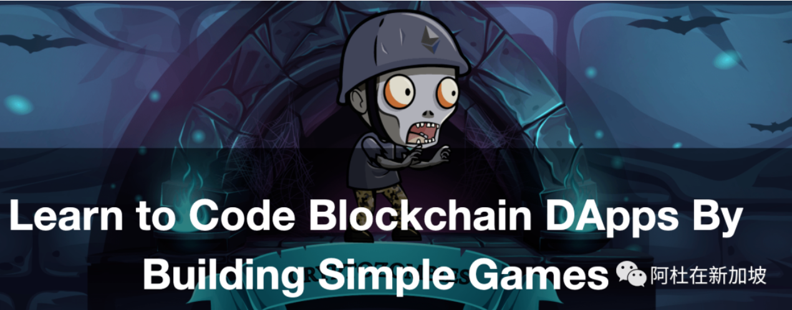
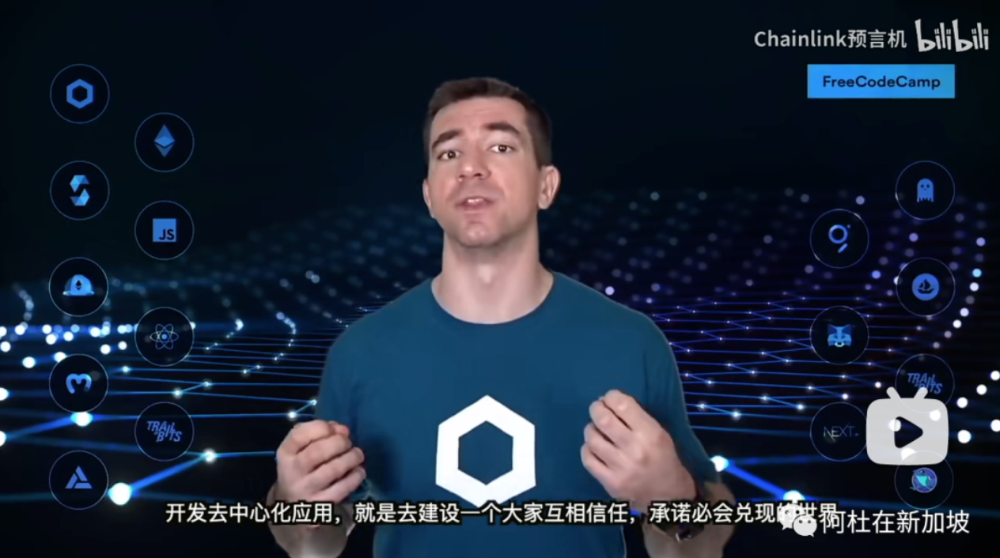
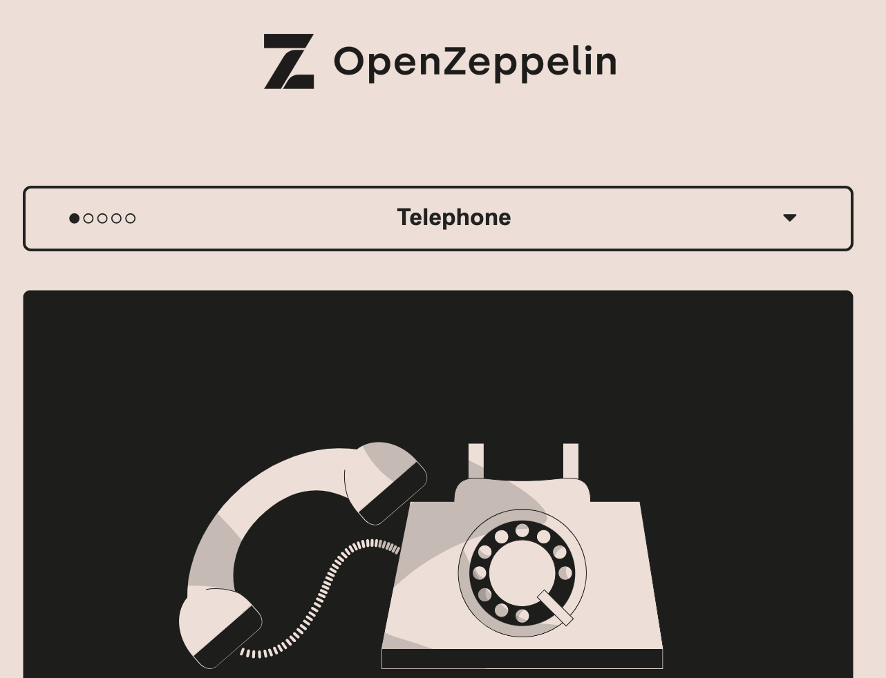
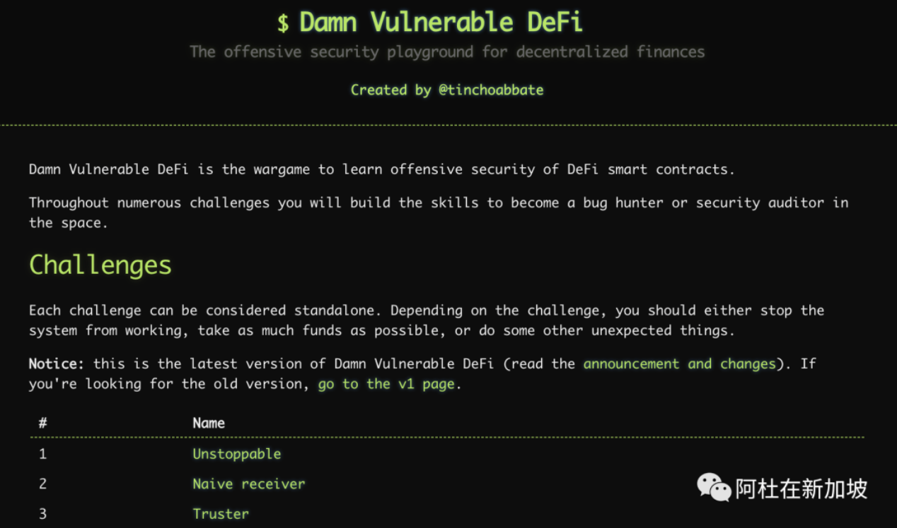

# 第6节：web3优质学习资源

> 本文收录于我的开源项目：https://github.com/dukedaily/solidity-expert ，欢迎star转发，文末加V入群。

专注技术的最大问题就是思维僵化，故步自封，保持源头活水才能与时俱进，下面是个人常用的学习资源，敬请参考，欢迎补充进来。

## 知识学习

1. 数字僵尸游戏（新手村语法）：https://cryptozombies.io/ ，适合新手从0到1体验编程乐趣

2. 语法学习（资深语法）：https://solidity-by-example.org/ ，本教程部分代码来源于此，增加了详细补充等。

3. web3全栈课程（大拿视频）：https://www.bilibili.com/video/BV1Ca411n7ta?vd_source=42fe91bf6d16ec8841b22ea520184d76 ，这个最近很出名

4. 找solidity漏洞练习（高手级）：https://ethernaut.openzeppelin.com/level/0x0b6F6CE4BCfB70525A31454292017F640C10c768 ，op出品，必属精品

5. 找defi漏洞练习（专业级）：https://www.damnvulnerabledefi.xyz/ ，对defi世界的业务尽情hack吧

6. defi专业知识（defi Mooc）：https://www.youtube.com/channel/UCB67PxhB5LAWEbI4etQS7aw/playlists?view=50&sort=dd&shelf_id=4 ， defi专业知识，你想要的应该都有。

7. 区块链科普：https://www.youtube.com/c/Finematics ，非常优质的UP主，以手绘形式讲解各种defi项目、协议。

## 日常资讯

1. 以太坊每周新闻：https://weekinethereum.substack.com/
2. 区块链安全事件资讯：https://newsletter.blockthreat.io/

加V入群：Adugii，公众号：阿杜在新加坡，一起抱团拥抱web3，下期见！

> 关于作者：国内第一批区块链布道者；2017年开始专注于区块链教育(btc, eth, fabric)，目前base新加坡，专注海外defi,dex,元宇宙等业务方向。
