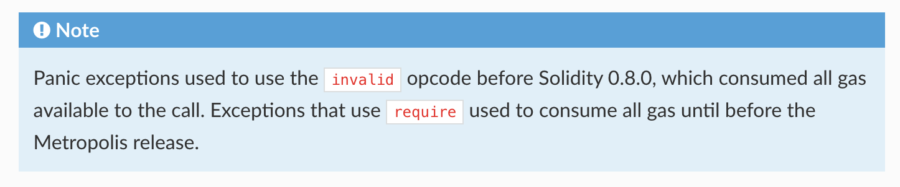

# 第20节：错误Error

合约中发生错误时，整个交易状态都会进行回滚，一共有三个错误处理方式，具体如下：

1. require：一般用于参数有效性校验，最常用。消耗的gas不会退回，剩余的gas退回；

2. revert：与require类似，适用于校验条件复杂时使用；

3. assert：用于断言绝对不改出错的地方，注意：
   1. 一般用于程序异常处理，触发了assert意味着存在bug；
   2. 不提供错误信息；
   
   

0.8.0之前，Asset**会消耗掉所有提供的gaslimit，剩余的gas也不会返回**。  [（0.8.0之后已经不会再消耗了）](https://goerli.etherscan.io/tx/0x4f23d669924b8a7462427399c81f6e125d91065f08658804fdbadb587689987a)




其他相关：

1. 也可以自定义error，可以节约gas
2. [错误消息的长度会影响：](https://medium.com/@chebyk.in/how-big-is-solidity-custom-error-messages-overhead-1e915724b450)
   1. gas消耗数量
   2. 单个合约的大小

```js
// SPDX-License-Identifier: MIT
pragma solidity ^0.8.13;

contract Error {
    function testRequire(uint _i) public pure {
      	// 期待_i > 10，如果i <= 10，则会抛出错误
        require(_i > 10, "Input must be greater than 10");
    }

    function testRevert(uint _i) public pure {
        // 如果校验条件过于复杂，则可以使用revert
        if (_i <= 10) {
            revert("Input must be greater than 10");
        }
    }

    uint public num;

    function testAssert() public view {
        // assert用于校验不可变量，一般用于校验内部错误
      	// num == 0 为true时继续向下执行
      	// 不提供错误信息
        assert(num == 0);
    }

    // custom error
    error InsufficientBalance(uint balance, uint withdrawAmount);

    function testCustomError(uint _withdrawAmount) public view {
        uint bal = address(this).balance;
        if (bal < _withdrawAmount) {
            revert InsufficientBalance({balance: bal, withdrawAmount: _withdrawAmount});
        }
    }
}
```

另一个示例：

```js
// SPDX-License-Identifier: MIT
pragma solidity ^0.8.13;

contract Account {
    uint public balance;
    uint public constant MAX_UINT = 2**256 - 1;

    function deposit(uint _amount) public {
        uint oldBalance = balance;
        uint newBalance = balance + _amount;

        // balance + _amount does not overflow if balance + _amount >= balance
        require(newBalance >= oldBalance, "Overflow");

        balance = newBalance;

        assert(balance >= oldBalance);
    }

    function withdraw(uint _amount) public {
        uint oldBalance = balance;

        // balance - _amount does not underflow if balance >= _amount
        require(balance >= _amount, "Underflow");

        if (balance < _amount) {
            revert("Underflow");
        }

        balance -= _amount;

        assert(balance <= oldBalance);
    }
}
```

