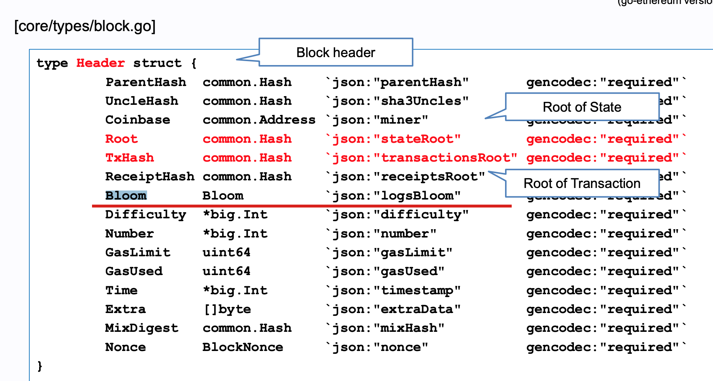
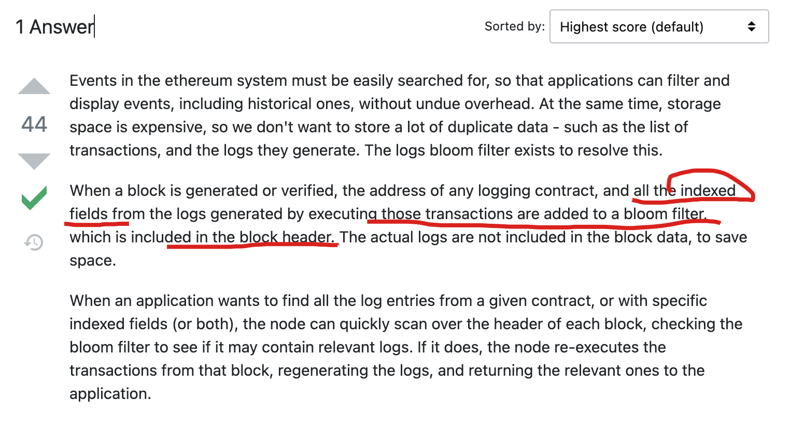

# 概述

https://blog.chain.link/events-and-logging-in-solidity-zh/

https://ethereum.stackexchange.com/questions/3418/how-does-ethereum-make-use-of-bloom-filters/3426


- Log也在区块链账本中，但是它不是链上数据；
- Log是由交易执行产生的数据，它是不需要共识的，可以通过重新执行交易生成；
- Log是经由链上校验的，无法造假，因为一笔交易的ReceiptHash是存在链上的（Header中）


1. 日志在账本中，和合约存储在不同的结构中；
2. log不能被合约读取，可以被链下读取；
3. 一部分log（使用indexed修饰的字段）存储在bloom filters中，可以由轻节点随意访问；
4. 日志是账本的一部分：https://docs.soliditylang.org/en/develop/contracts.html?highlight=events#events


# Event

- indexed：方便索引，加了inexed是topics
- non-indexed：没有解码，需要使用abi解码后才知道内容，不加indexd是data

## 描述

发送一笔交易之后，我们可以得到tx交易的返回值，在返回值中会包含TransactionRecept字段，进一步会发现Event，指定id可以获取这个事件的详情，进一步会获得每个字段的具体数值。

```js
console.log(transactionReceipt.events[0].args.oldNumber.toString())
```

## Bloom

以太坊的Header中有布隆过滤器，这里面存放的是什么？（是所有事件生成的信息），当有索引过来的时候，我们会去重新生成事件。



- 只有indexed的field才会添加到bloom filter中
- 有请求的时候会快速在bloom filter中寻找，如果发现存在，则重新执行交易，并且返回log结果

