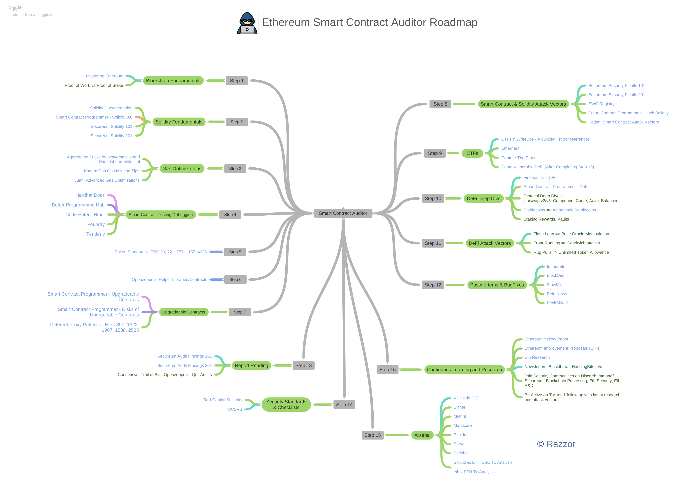

# 第6节：合约审计

审计范畴分三个层面：
1. 工具扫描（易）
2. 语法bug（中）
3. 业务bug（难

4. 成为审计师：https://www.secure3.io/
5. 查看审计报告：https://code4rena.com/
6. with公道adudit价格：https://trustchain.agency/
7. [合约审计流程](https://medium.com/@trustchain/full-smart-contract-audit-methodology-2023-b29db744bf3e)
8. 工具集：https://github.com/trailofbits/eth-security-toolbox
9. 静态扫描工具：Slither、Mythril

