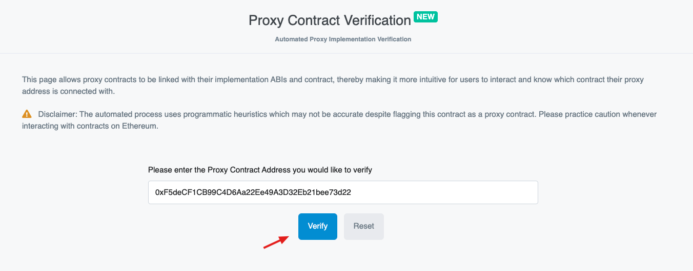
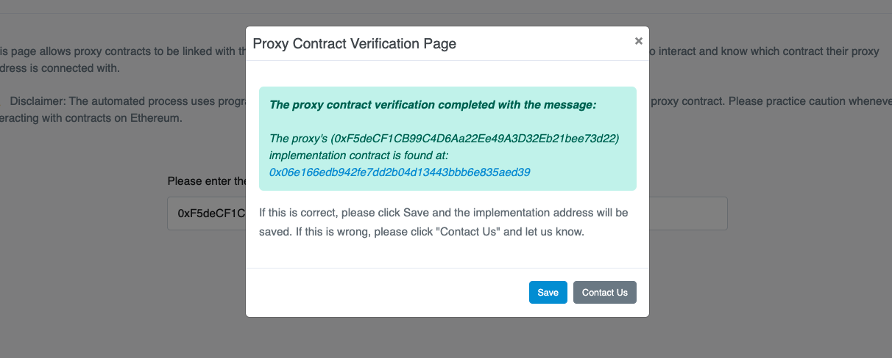
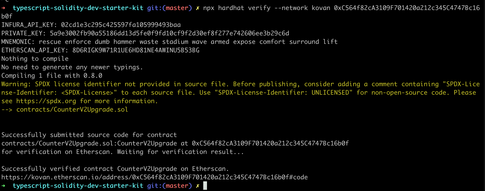
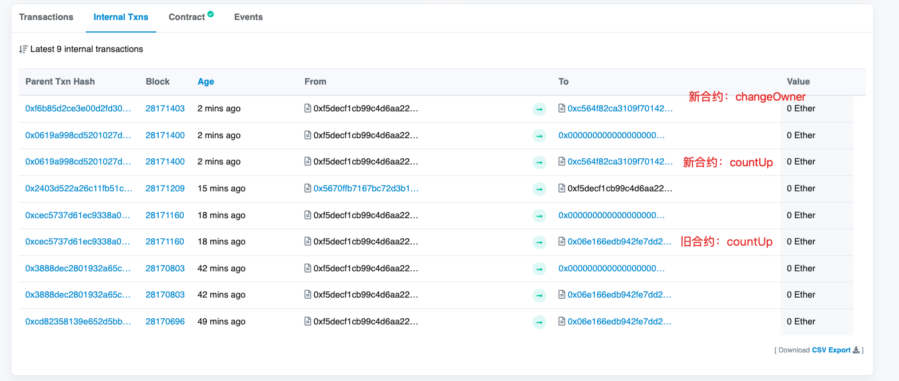

## 本教程介绍：

1. 使用hardhat部署到不同网络，自动verify代码
2. 单元测试编写
3. deploy脚本，deploy插件使用
4. 可升级合约编写，使用，页面关联

你对工具链的所有疑问都会在这里得到答案！


# 一、代码目录

我本地目录：

```js
/Users/duke/youswap/test-only/typescript-solidity-dev-starter-kit
```

github

```js
origin	https://github.com/rhlsthrm/typescript-solidity-dev-starter-kit.git (fetch)
origin	https://github.com/rhlsthrm/typescript-solidity-dev-starter-kit.git (push)
```

网页教程：

```js
https://medium.com/@rahulsethuram/the-new-solidity-dev-stack-buidler-ethers-waffle-typescript-tutorial-f07917de48ae
```

# 二、部署在localhost

启动本地内存区块链环境：

```sh
npx hardhat node 
```

##1. 普通部署
方式1，使用hardhat-deploy包部署，具体编写查看`deploy`文件夹

```js
npx hardhat --network localhost deploy
```

方式2，使用脚本部署

```js
npx hardhat run --network localhost scripts/deploy.ts
```

测试一下，需要修改地址`testV1.ts`中的地址为刚刚部署的地址。

```js
npx hardhat run scripts/testV1.ts --network localhost
```


##2. 可升级部署

### - 以可升级方式部署合约

1. 执行命令：

  ```sh
  npx hardhat run --network localhost scripts/01-deploy_counter.ts
  ```

  > 得到地址：0xCf7Ed3AccA5a467e9e704C703E8D87F634fB0Fc9

### - 调用后查看运行结果

1. 修改testV1.ts中的地址为: `0xCf7Ed3AccA5a467e9e704C703E8D87F634fB0Fc9`

2. 执行命令：

   ```js
   npx hardhat run --network localhost scripts/testV1.ts
   ```

### - 修改代码后开始升级

1. 首先创建新文件：CounterV2Upgrade.sol，相比之下比之前的合约增加了`changeOwner`方法。

2. 修改`02-upgradeCounterV2.t`中的合约地址为：`0xCf7Ed3AccA5a467e9e704C703E8D87F634fB0Fc9`。

3. 执行升级命令：

   ```sh
   npx hardhat run --network localhost scripts/02-upgradeCounterV2.ts
   ```

### - 调用合约，确认结果

1. 修改`testV2.ts`中的地址为：`0xCf7Ed3AccA5a467e9e704C703E8D87F634fB0Fc9`

2. 执行命令，查看结果，结果应该`加1`，`manager`也应该发生改变。

   ```sh
   npx hardhat run --network localhost scripts/testV2.ts
   ```


# 三、部署在kovan

## 1. 普通部署（略）

略，同上，只需要将localhost改为kovan即可。

```sh
#部署在本地：
npx hardhat --network localhost deploy

#部署在kovan：
npx hardhat --network kovan deploy
```


##==2. 可升级部署==

> 先备份.openzeppelin下面的kovan.json文件（若有）

### - 以可升级方式部署合约

1. 执行命令：

   ```sh
   npx hardhat run --network kovan scripts/01-deploy_counter.ts
   ```

2. 该操作会部署三个合约，得到三个地址（存在vscode工程下：.openzeppelin/kovan.json文件中）

   1. **proxy合约（==对外不变的==）：**
      1. 地址：0xF5deCF1CB99C4D6Aa22Ee49A3D32Eb21bee73d22。
      2. 默认verify，因为这个升级合约是openzeppelin官方提供的，很多人已经验证过了。
   2. **proxyAdmain合约：**
      1. 地址：0x5670ffB7167bc72d3B11e209133aCC73Fb9292be。
      2. 默认verify，proxy的管理合约，用于修改代理与实现升级操作。
   3. **我们的Counter合约：**
      1. 地址：0x06e166edB942fe7Dd2b04d13443BbB6e835aEd39。
      2. 我们真正关心的业务逻辑。
   

### - 调用后查看运行结果

1. 修改`testV1.ts`中的地址为: `0xF5deCF1CB99C4D6Aa22Ee49A3D32Eb21bee73d22`。

2. 执行命令：

   ```js
   npx hardhat run --network kovan scripts/testV1.ts
   ```

3. 通过浏览器，输入代理合约Proxy地址，我们可以看到已经成功调用了一次CountUp，数据变成：1， 并且通过Internal Txns标签看到交互的合约是具体实现合约：

   

   具体交互合约正是我们的Counter合约，如下图：

   

   疑问：为什么上面还有个：0x0000交互？细节需要看代码。

4. 查看`proxyAdmin`合约，检查一下数据，在读方法中，如下图：输入proxy地址，可以得到我们的Counter合约地址：

   

   在写方法，可以看到proxyAdmain的相关方法：更换管理员，更换实现合约

   

   4. 接下来我们verify我们的Counter合约代码：

   ```sh
   #npx hardhat verify --network kovan <合约地址> constructor参数
   npx hardhat verify --network kovan 0x06e166edB942fe7Dd2b04d13443BbB6e835aEd39
   ```

   

   5. 为了在proxy下可以直接操作具体的实现逻辑，需要我们手动关联proxy和implementation的关系，操作为：在proxy页面点击：more option -> is this a proxy?

   

   点击：verify

   

   点击：save

   

   此时，回到proxy页面，可以看到implementation对应的方法

   

   

   点击：countUp后，数据变成：2

   

### - 修改代码后开始升级

1. 修改：（proxy地址）

   ```sh
   02-upgradeCounterV2.ts中的地址为：0xF5deCF1CB99C4D6Aa22Ee49A3D32Eb21bee73d22
   ```

2. 执行：

   ```sh
   npx hardhat run --network kovan scripts/02-upgradeCounterV2.ts
   ```

   在upgradeCounterV2合约中，我们增加了一个`changeOwner`方法，其他内容未改变。

   ```js
       function changeOwner(address owner) public {
           require(msg.sender == manager, "forbidden!"); 
           manager = owner;
       }
   ```

   升级成功：

   

3. 到adminProxy中检查升级后的implementation地址： [0xC564f82cA3109F701420a212c345C4747Bc16b0f](https://kovan.etherscan.io/address/0xC564f82cA3109F701420a212c345C4747Bc16b0f)

   

4. 回到proxy中，查看内部交易，发现：

   

5. 对新发布的implementation合约进行verify代码：

   ```js
   npx hardhat verify --network kovan 0xC564f82cA3109F701420a212c345C4747Bc16b0f
   ```

   

6. 查看proxy的写方法，我们的新方法中，看到新方法已经存在：

   

   读方法中，getCount依然为升级之前的值：2

   

### - 调用合约，确认结果

1. 修改`testV2.ts`中的地址为：0xF5deCF1CB99C4D6Aa22Ee49A3D32Eb21bee73d22

2. 执行命令

   ```sh
   npx hardhat run --network kovan scripts/testV2.ts
   ```

3. 效果

   

   数值改变，owner改变：

   


## 其他琐碎问题：

1. 需要安装：

```js
npm i --save-dev @types/chai-as-promised
npm install --save-dev solidity-coverage  #为了运行coverage
```

2. 什么是覆盖测试？这个使用solidity-coverage提供的功能

3. hre与hardhat的关系，这回终于弄清楚了。

```sh
#hardhat这个包export的是env，这个env就是：HardhatRuntimeEnvironment
import hre from 'hardhat'  

#这句的意思是从env中解析出ethers，因为HardhatRuntimeEnvironment是包含ethers的
import { ethers} from "hardhat"; 
上面这句等价于从hre对象解析出了：ethers
即hre中包含ethers
	#hre.ethers
	#{ ethers} = hre

#想导入原生的ethers需要指定为
import ethers_raw from "ethers"

#hre.ethers包里面实现了原生包的所有功能，并且做了增强
```

4. chai和hardhat-waffle的关系是什么？


## deploy

https://learnblockchain.cn/article/2354

```js
npm install -D hardhat-deploy
```


## 升级

翻译：https://learnblockchain.cn/article/1990

原文：https://docs.openzeppelin.com/learn/upgrading-smart-contracts

```js
npm install --save-dev @openzeppelin/hardhat-upgrades

npm i @openzeppelin/contracts
```
