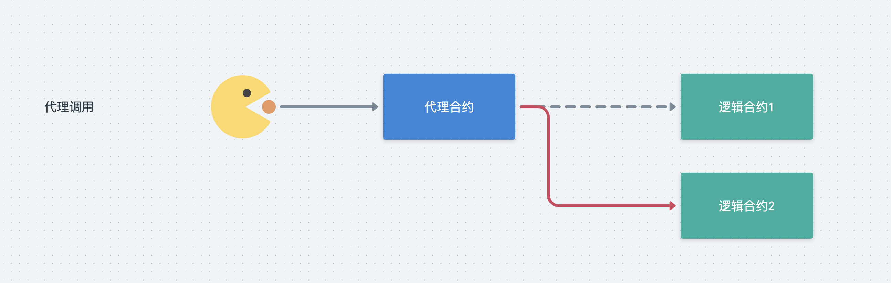

# 第6节：世界杯竞猜（upgrade）

> 本文收录于我的开源项目：https://github.com/dukedaily/solidity-expert ，欢迎star转发，文末加V入群。

# 概述

想必大家都知道区块链的特点，即：数据公开、可追溯、不可篡改，这个在比特币身上为人津津乐道。但是到了以太坊上，由于支持编写智能合约，即程序，那么数据不可篡改就变成了一个棘手的问题：

1. 如果程序有bug怎么补救？
2. 如果程序需要拓展功能怎么办？
3. ...

因此，如果一个合约是可以动态升级的，可以在用户无感知的情况下修复bug、拓展功能似乎就变成了迫切的需要。

好消息是经过多年的发展，业界已经为我们提供了解决方案，即使用代理模式完成可升级合约，目前主流有三种升级方法，

1. transparent方式；
2. uups方式；
3. beacon方式；

我们本节聚焦在transparent方式（第一种），这是最主流的升级方案。


- [点击查看代码](https://github.com/dukedaily/solidity-expert/tree/main/08_项目实战-世界杯竞猜)

- [点击查看效果](https://goerli.etherscan.io/address/0x3ee1fa4d194c32428464b6725317fa0d3af380e8#code)

# 升级分析

## 1. 升级的原理

对于普通的合约，一般是用户直接与业务逻辑交互，如下图所示：


```js
// 简化表达
User ---- tx ----------> Implementation_v0
```

此时，如果重新部署Logic合约，那么地址会发生变化，用户可以感知到，而且Logic中的用户数据也会发生变化。

可升级合约的实现思路是：**引入一个代理合约Proxy（蓝色）**，用户User仅与这个代理合约进行交互，由代理合约去与Loigc合约进行交互，因此在Logic合约发生变化（升级）的时候，用户User无感，并且历史数据也能够保留下来，如下图所示：



```js
// 简化表达
User ---- tx ---> Proxy ----------> Implementation_v0
                     |
                      ------------> Implementation_v1
```


## 2. 代理转发delegatecall

既然业务合约（Logic1和Logic2）可以随意的进行替换，那么说明数据与逻辑一定是分离的，那数据存储在哪里呢？你可能已经猜到了，数据一定是存储在Proxy中的，即业务逻辑执行后，将数据写入到proxy中，大致如下：


用户调用代理合约，代理合约调用逻辑合约，并将数据最终写入到Proxy的存储空间中，因此逻辑合约可以随时被替换。


上图中，我们见到了delegatecall关键字，这是代理合约的核心，为了能够说清楚细节，我们需要先回顾一下solidity提供的三个合约调用方法：call、staticdall、delegatecall，对比他们之间的异同。


上图中，图一使用了call和staticcall，图二使用了delegatecall，具体区别如下：

- call：主要是进行常规的合约调用，比如进行合约向普通EOA进行转账时，语法为：to.call{value: value}("")，此时目标合约中的msg.sender是调用者，即Caller Contract；

- staticcall: 与call类似，但是它不会修改合约状态，单纯调用计算而已，原理同上；（不常用）

- **delegatecall**：这个是专门为代理合约Proxy准备的，**作用是，帮助用户User来调用Target Contract合约**，但是有以下特点：（图二）

  1. 从Target Contract角度来看：msg.sender是user，而不是Proxy，即Proxy对user的请求进行了透传；

  2. 在Target Contract被调用时，使用的是Proxy的上下文，即执行合约带来的状态变化会存在Proxy中，而不是Target Contract之中

正是由于delegatecall的这两个特性，才使得代理合约能够实现，因为这使得从目标合约的角度来看，所有的操作都是在修改用户的数据，并且存储在了Proxy中。

（注，由于Transparent模式升级时，implementation和proxy不用相互关心彼此的storage数据，因此这种模式被称为：unstructed storage）


delegatecall调用并返回核心逻辑如下：

```js
function _delegate(address implementation) internal virtual {
        assembly {
            // Copy msg.data. We take full control of memory in this inline assembly
            // block because it will not return to Solidity code. We overwrite the
            // Solidity scratch pad at memory position 0.
            calldatacopy(0, 0, calldatasize())

            // Call the implementation.
            // out and outsize are 0 because we don't know the size yet.
            let result := delegatecall(gas(), implementation, 0, calldatasize(), 0, 0)

            // Copy the returned data.
            returndatacopy(0, 0, returndatasize())

            switch result
            // delegatecall returns 0 on error.
            case 0 {
                revert(0, returndatasize())
            }
            default {
                return(0, returndatasize())
            }
        }
    }
```


## 3. 为什么会有存储冲突？

在solidity中，状态变量存储在slot中，slot可以理解为key-value存储空间，evm为每个合约代码提供了最多256个slot，每个slot可以最多存储32字节数据。

状态变量一般是从slot 0开始进行存储的，在使用delegatecall的时候，由于需要在`Proxy`的slot中存储`目标合约`中指定的数据结构，此时如果proxy的storage布局与目标合约的storage布局不相同，那么就会出现存储冲突（Storage collisioin）的问题，即：**目标合约在Proxy合约中修改了错误的位置。**


```j
|Proxy                     |Implementation           |
|--------------------------|-------------------------|
|address _implementation   |address _owner           | <=== Storage collision!
|...                       |mapping _balances        |
|                          |uint256 _supply          |
|                          |...                      |
```

如图所示，由于在Proyx中需要存储逻辑合约的地址，而在逻辑合约中不用存储，所以此时两个合约的storage布局不同，两者的slot 0分别存储的是 **逻辑合约地址_imp** 和**管理员地址**，因此当逻辑合约想修改owner时，会错误的修改了_imp地址。


## 4. 解决存储冲突

在代理合约Proxy中，一共需要指定两个状态变量：

- 逻辑合约地址implementation，用来指明被代理的合约；
- Admin，代理合约的管理员，有权限进行合约升级；

因此，如果不进行特殊处理，则一定会出现存储slot冲突，我们要做的是：将Proxy中的默认slot留出来，不要占用，而是在代理合约使用指定的slot来中存储`逻辑合约_imp`和admin地址，如何存储，业界对此有标准，[EIP-1967](https://eips.ethereum.org/EIPS/eip-1967)

```js
|Proxy                     |Implementation           |
|--------------------------|-------------------------|
|...                       |address _owner           |
|...                       |mapping _balances        |
|...                       |uint256 _supply          |
|...                       |...                      |
|...                       |                         |
|...                       |                         |
|...                       |                         |
|...                       |                         |
|address _implementation   |                         | <=== Randomized slot.
|...                       |                         |
|...                       |                         |
```

存储逻辑合约地址的位置为：

```sh
# implementation slot 生成规则：
bytes32(uint256(keccak256('eip1967.proxy.beacon')) - 1), 
# 存储位置：
0xa3f0ad74e5423aebfd80d3ef4346578335a9a72aeaee59ff6cb3582b35133d50


# admin slot 生成规则：
bytes32(uint256(keccak256('eip1967.proxy.admin')) - 1)),
# 存储位置：
0xb53127684a568b3173ae13b9f8a6016e243e63b6e8ee1178d6a717850b5d6103
```

当proxy将两个状态变量存储在特定位置后，由于将默认slot的空间留给了业务合约，因此相当于storage布局与逻辑合约一致了，冲突解决！


## 4. 务必遵循升级规则

按照上述方式进行storage布局，我们解决了proxy和implementation之间的存储冲突问题，但是在执行的时候，Implementation0 和implementation1之间还是可能会存在storage collision问题，为何？

因为如果在新合约Implementation1中，改变了Implementation0中原始状态变量的顺序，那么就会出现存储冲突问题，如下图

```sh
|Implementation_v0   |Implementation_v1        |
|--------------------|-------------------------|
|address _owner      |address _lastContributor | <=== Storage collision!
|mapping _balances   |address _owner           |
|uint256 _supply     |mapping _balances        |
|...                 |uint256 _supply          |
|                    |...                      |
Correct storage preservation:

|Implementation_v0   |Implementation_v1        |
|--------------------|-------------------------|
|address _owner      |address _owner           |
|mapping _balances   |mapping _balances        |
|uint256 _supply     |uint256 _supply          |
|...                 |address _lastContributor | <=== Storage extension.  #修改了原来
|                    |...                      |
```

所以在升级的合约Implementation1中，如果有新变量的添加，那么新的状态变量只能添加在原始合约状态末尾依次往后添加，切记切记，否则升级失败！


## 5. initializer代替constructor

如果一个合约定义为可升级的，那么这个合约需要将构造函数移除（如有），并且使用initialize函数来代替初始化工作。原因为：我们需要将部署时的数据存储在Proxy合约中，如果提供了构造函数，这些数据就会错误的写在了逻辑合约中。

# 代码集成

## 1. 修改原有代码

说了这么多，我们测试一下升级，我们使用openzeppelin标准库来完成合约升级，并且使用[hardhat-upgrade](https://docs.openzeppelin.com/upgrades-plugins/1.x/)来进行集成。

为了实现合约升级，我们需要改写一下原来的Worldcup代码，将构造函数去掉，增加初始化函数

```sh
# 安装升级版本的合约，我们需要使用标准的初始化函数
$ npm i @openzeppelin/contracts-upgradeable
```

修改代码：

```js
    //1. 导入标准包
    import "@openzeppelin/contracts-upgradeable/proxy/utils/Initializable.sol";

    //2. 继承
    contract WorldCupV1 is Initializable {  
      //3. 将构造函数替换为初始化函数 constructor(uint256 _deadline) 
      function initialize(uint256 _deadline) public initializer {
          admin = msg.sender;
          require(
              _deadline > block.timestamp,
              "WorldCupLottery: invalid deadline!"
          );
          deadline = _deadline;
      }   
    }
```


## 2. 编写准备升级的新合约

创建升级合约WorldCupV2.sol，与V1相比，增加了代码，包括：一个函数，一个状态变量，一个事件，具体如下：

```js
		 // 1. 增加函数，支持修改deadline
    function changeDeadline(uint256 _newDeadline) external {
      require(_newDeadline > block.timestamp, "invalid timestamp!");

      // 2.增加新事件
      emit ChangeDeadline(deadline: _newDeadline); 
      
      // 4.状态变量
      changeCount++;  
      deadline = _newDeadline;
    }
```

合约编写完毕，确保编译通过！

```sh
npm run compile

$ Successfully generated 86 typings!
$ Compiled 24 Solidity files successfully
```


## 3. 安装升级插件

```sh
# 升级插件，在部署脚本中使用
$ npm install --save-dev @openzeppelin/hardhat-upgrades
```

在配置文件中导入：

```js
// hardhat.config.js
require('@openzeppelin/hardhat-upgrades');
```


## 4. 编写升级脚本

contracts/scripts/upgrade/deployAndUpgrade.ts，

1. 部署WorldCupV1合约，读取deadline；
2. 升级为WorldCupV2合约；
3. 调用WorldCupV2的新增方法：changeDeadline，设置新的deadline（加100）；
4. 读取新的deadline，查看返回值。

具体内容如下：

```js
const { ethers, upgrades } = require("hardhat");

async function main() {
  const TWO_WEEKS_IN_SECS = 14 * 24 * 60 * 60;
  const timestamp = Math.floor(Date.now() / 1000)
  const deadline = timestamp + TWO_WEEKS_IN_SECS;
  console.log('deadline:', deadline)

  // Deploying
  const WorldCupv1 = await ethers.getContractFactory("WorldCupV1");
  const instance = await upgrades.deployProxy(WorldCupv1, [deadline]);
  await instance.deployed();
  console.log("WorldCupV1 address:", instance.address);
  console.log("deadline1:", await instance.deadline())

  console.log('ready to upgrade to V2...');

  // Upgrading
  const WorldCupV2 = await ethers.getContractFactory("WorldCupV2");
  const upgraded = await upgrades.upgradeProxy(instance.address, WorldCupV2);
  console.log("WorldCupV2 address:", upgraded.address);

  await upgraded.changeDeadline(deadline + 100)
  console.log("deadline2:", await upgraded.deadline())
}

main();
```

## 5. 部署并升级合约

```sh
npx hardhat run scripts/upgrade/deployAndUpgrade.ts --network goerli
```


我们发现升级成功了，但是返回值貌似不对，我们去浏览器确认一下，[点击查看](https://goerli.etherscan.io/address/0x3ee1fa4d194c32428464b6725317fa0d3af380e8)，我们当前看到的交易是标准的代理合约，由于已经有人verify了，所以我们直接能看到代理合约的代码


如果你点击WriteContract按钮，会发现这不是我们的业务逻辑提供的方法


但是我们的数据如何查看？答案是：我们需要手动verify我们的业务合约：WorldCupV1和WorldCupV2，然后与当前的代理合约Proxy关联起来，我们通过internal Txns可以找到WorldCupV2的合约地址：[0x4cb210f91b6d95978d1cf055ddf88701c57c01f0](https://goerli.etherscan.io/address/0x4cb210f91b6d95978d1cf055ddf88701c57c01f0)


对其进行verify，并查看数据，发现都是空的。

```sh
npx hardhat verify 0x4cb210f91b6d95978d1cf055ddf88701c57c01f0  --network goerli
```


## 6. 关联合约

能走到这里说明你已经是个高手了，接下来是最后一步，我们即将代理合约与逻辑合约关联起来，操作为：找到代理合约-> More Options -> Is this a proxy? -> Verify -> Save


此时代理合约会自动根据我们的设置，自动去关联逻辑合约


再次回到代理合约页面，你会惊奇的发现，页面上多了两个按钮：Read as Proxy 和 Write as Proxy，查看数据，发现正好是我们设置的值，因此升级成功！


我们最终暴露给用户的地址就是这个代理合约，用户的所有操作都相当于在读写着两个新方法，这两个方法会被Proxy传递到逻辑合约中，并把执行结果返回到代理合约中，这就是delegatecall的力量！

# 总结

本节我们系统的介绍了solidity中最主流的的代理方式：Transparent，代理合约使用delegatecall将用户的请求透传给业务合约，从而保证用户在无感知的情况下完成合约的升级。


合约升级带来好处显而易见，但是同时也意味着合约可以被随意的篡改或者做坏事，但是这就不是单纯的技术能够解决的问题了，由于升级操作只能有管理员来进行，所以将权力交给社区，由Dao组织来管理可能是一个比较好的选择。


# 参考连接

- https://docs.openzeppelin.com/upgrades-plugins/1.x/proxies

- https://docs.openzeppelin.com/contracts/4.x/api/proxy

  

---

加V入群：Adugii，公众号：[阿杜在新加坡](https://mp.weixin.qq.com/s/kjBUa2JHCbOI_2UKmZxjJQ)，一起抱团拥抱web3，下期见！

> 关于作者：国内第一批区块链布道者；2017年开始专注于区块链教育(btc, eth, fabric)，目前base新加坡，专注海外defi,dex,元宇宙等业务方向。
