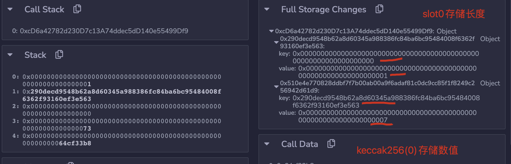

# 第3节：storage工作原理？

[Reversing and debugging EVM Smart contracts: How the storage layout works?-part3](https://medium.com/@TrustChain/reversing-and-debugging-ethereum-evm-smart-contracts-part-3-ebe032a08f97)


小的type会节约slot，但是会增加OPCODE步骤（增加mask步骤），所以不能滥用小byte，否则会适得其反。


## 1. Simple example

```js
// SPDX-License-Identifier: MIT 
pragma solidity ^0.8.0;  
contract Test {     
    uint balance;     
    uint balance2;     
    uint balance3;   
   
    function modify() external {         
        balance = 1;         
        balance2 = 2;         
        balance3 = 3;     
    } 
}
```

- 三个元素都是uint256类型，每一个都占用空间为：32字节（256/8 = 32）
- 但是在存储时，每个元素都占用一个独立的slot（每个slot容量为：32字节）
- 所以最终存储事实为：Slot0: 1、Slot1: 2、Slot2: 3，天经地义！


## 2. using uint8 instead of uint256

```js
// SPDX-License-Identifier: MIT 
pragma solidity ^0.8.0;  
contract Test {     
    uint8 balance;     
    uint8 balance2;
    uint8 balance3; 
    
    function modify() external {
         balance = 1; 
         balance2 = 2; 
         balance3 = 3;    
    } 
    function modify2() external {   
         balance2 = 5; 
    } 
}
```

- 三个元素都是uint8类型，即一个字节，共计：3个字节，远小于一个slot的容量（32字节）
- 所以最终存储为：使用一个slot0：**030201**


## 3. Using different types of data

```js
// SPDX-License-Identifier: MIT 
pragma solidity ^0.8.0;  
contract Test {     
    uint8 balance;     
    bytes4 data;     
    address addr;      
    function modify() external {         
        balance = 17;        
        data = 0xaaaaaaaa;       
        addr = 0x358AA13c52544ECCEF6B0ADD0f801012ADAD5eE3;     
    } 
}
```

- Uint8: 1字节，bytes4: 4字节，address：20字节，共计字节数：25，小于一个slot的容量
- 因此最终存储为，slot0: 358aa13c52544eccef6b0add0f801012adad5ee3aaaaaaaa11
- 拆分为：**0x358aa13c52544eccef6b0add0f801012adad5ee3**, **data = 0xaaaaaaaa**, **balance = 0x11**


## 4. Does the placement of variables count ?

```js
// SPDX-License-Identifier: MIT 
pragma solidity ^0.8.0;  
contract Test {     
    uint8 balance;
    address addr;
    bytes4 data;      // 这里的顺序变了
    function modify() external {      
        balance = 17;    
        data = 0xaaaaaaaa;     
        addr = 0x358AA13c52544ECCEF6B0ADD0f801012ADAD5eE3;   
   } 
}
```

- 也是存储在一个slot0中，但是顺序有变化：**aaaaaaaa358aa13c52544eccef6b0add0f801012adad5ee311**


## 5. How are stored structs ?

```js
// SPDX-License-Identifier: MIT 
pragma solidity ^0.8.0;  
contract Test {     
    struct Values {  
        uint8 balance;   
        address addr;  
        bytes4 data;    
    }      
    Values value;      
    function modify() external { 
        value.balance = 17;  
        value.addr = 0x358AA13c52544ECCEF6B0ADD0f801012ADAD5eE3;    
        value.data = 0xaaaaaaaa;   
     }
 }
Here is the full disassembly of the function
045 JUMPDEST 
046 PUSH1 00 |0x00|
048 DUP1     |0x00|0x00|
049 SLOAD    |0x00|0x00|
050 PUSH1 01 |0x01|0x00|0x00|
052 PUSH1 01 |0x01|0x01|0x00|0x00|
054 PUSH1 c8 |0xc8|0x01|0x01|0x00|0x00|
056 SHL      |0x00.50zeros.0100...00|0x01|0x00|0x00|
057 SUB      |0x00.15zeros0tttffff.49f.fffff|0x00|0x00|
058 NOT      |0xfffffffffffffff00..49zeros..00|0x00|0x00|
059 AND      |0x00|0x00|
060 PUSH25 aaaaaaaa358aa13c52544eccef6b0add0f801012adad5ee311 |0x00...00358aa13...|0x00|0x00|
086 OR       |0x00...00358aa13...|0x00|
087 SWAP1    |0x00|0x00...00358aa13...|
088 SSTORE   ||
089 STOP     ||
```

- 与普通的layout没有任何区别


## 6. What about arrays ?

```js
// SPDX-License-Identifier: MIT 
pragma solidity ^0.8.0;  
contract Test1 { 
    uint[] values;
    // uint value2 in comment 
    function modify() external {   
        values.push(7);   
        values.push(8);  
    } 
}
 
contract Test2 { 
		uint value2 in comment 
    uint[] values;

    function modify() external {   
        values.push(7);   
        values.push(8);  
    } 
}
```

数组存储非常特殊，数组存储方式为：

- 如果数组在slot0（上图Test1中，values是在slot0）：那么slot0存储数组长度，keccak256(0) + 0存储第0个元素，keccak256(0) + N -1 存储第N个元素
- 如果数组在slot1（上图Test2中，values是在slot1）：那么slot1存储数组长度，**keccak256(1)** + 0存储第0个元素，**keccak256(1)** + N -1 存储第N个元素




## 7. How are stored mapping ?

```js
// SPDX-License-Identifier: MIT 
pragma solidity ^0.8.0;  
contract Test {     
    mapping(address => uint) balances;      
    function modify() external {                  
      balances[0xbc5D291D2165f130375B94c62211f594dB48fEF2] = 15;     		
      balances[0x9a8af21Ac492D5055eA7e1e49bD91BC9b5549334] = 55; 
    } 
}
```

- **slot：SHA3(mapping_slot . key)**
  - keccak256(memory[offset:offset+length])
  - offset = Stack(0) = 0, length = Stack(1) = 40


## 8. conclusion

If you read this entire article, congratulations! It’s not that easy but it worth it. 

You now know more about **EVM than 99.9% of developers**.