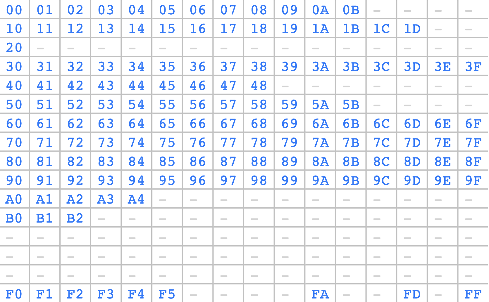

# 第4节：5个终止指令介绍

[Reversing and Debugging EVM Smart contracts: 5 Instructions to end/abort the Execution](https://medium.com/@TrustChain/reversing-and-debugging-evm-the-end-of-time-part-4-3eafe5b0511a)


## 1. Stop

消耗0gas，不返回任何数据。

```js
// SPDX-License-Identifier: UNLICENSED
pragma solidity ^0.8.0;

contract Test {
    function test() external {

    }
}
```

得到汇编如下：

```js
045 JUMPDEST |function signature discarded|
046 PUSH1 33 |0x33|
048 PUSH1 35 |0x35|0x33|
050 JUMP     |0x33|
053 JUMPDEST |0x33|
054 JUMP     ||
051 JUMPDEST ||
052 STOP     ||
053 JUMPDEST
054 JUMP
```

- 注意：50 byte时，跳转到0x35（53 byte）位置，54byte时，进一步跳转到0x33处（51 byte）位置，最后STOP退出，此时内存中数据为空，栈中只有signature，所以返回数据为空。
- 消耗gas为0


## 2. Return

```js
// SPDX-License-Identifier: UNLICENSED
pragma solidity ^0.8.0;

contract Test {
    function test() external returns(uint) {
        return(8);
    }
}
```

得到汇编如下：（打开优化开关，run 1）

```js
045 JUMPDEST ||
046 PUSH1 08 |0x08|  the return value of test()
048 PUSH1 40 |0x40|0x08|
050 MLOAD    |0x80|0x08|  mload(0x40) mloads the free memory pointer（内存中的值不会被清除或覆盖）
051 SWAP1    |0x08|0x80|
052 DUP2     |0x80|0x08|0x80|（DUP2的意思是，复制栈上第2个元素，即下标为1的元素）
053 MSTORE   |0x80|       mstore(0x80,0x08) store the return value in memory[0x80]，把08放到0x80中
054 PUSH1 20 |0x20|0x80|
056 ADD      |0xa0|
057 PUSH1 40 |0x40|0xa0|
059 MLOAD    |0x80|0xa0|  从0x40中将0x80压入栈中
060 DUP1     |0x80|0x80|0xa0|
061 SWAP2    |0xa0|0x80|0x80|
062 SUB      |0x20|0x80|
063 SWAP1    |0x80|0x20|
064 RETURN   ||
```

- 消耗gas为0
- return于STOP相似，不同之处在与return会返回数值。
- 如上分析，最终内存0x80中会存放08数值。


## 3. Revert

```js
pragma solidity ^0.8.0;

contract Test {
    function test() external returns(uint) {
        revert("eight");
    }
}
```

汇编如下：（打开优化开关，run 1）

```sh
069 JUMPDEST          ||
070 PUSH1 40          |0x40|
072 MLOAD             |0x80|
073 PUSH3 461bcd      |0x461bcd|0x80|
077 PUSH1 e5          |0xe5|0x461bcd|0x80|
079 SHL               |0x08c379a000...000|0x80|  binary shift 197 times (e5 in hex), YES a binary shift can modify hex numbers...
080 DUP2              |0x80|0x08c379a000...000|0x80|
081 MSTORE            |0x80|
082 PUSH1 20          |0x20|0x80|
084 PUSH1 04          |0x04|0x20|0x80|
086 DUP3              |0x80|0x04|0x20|0x80|
087 ADD               |0x84|0x20|0x80|
088 MSTORE            |0x80|
089 PUSH1 05          |0x05|0x80|
091 PUSH1 24          |0x24|0x05|0x80|
093 DUP3              |0x80|0x24|0x05|0x80|
094 ADD               |0xa4|0x05|0x80|
095 MSTORE            |0x80|
096 PUSH5 195a59da1d  |0x195a59da1d|0x80|
102 PUSH1 da          |0xda|0x195a59da1d|0x80|
104 SHL               |0x00..195a59da1d..00|0x80|
105 PUSH1 44          |0x44|0x00..195a59da1d..00|0x80|
107 DUP3              |0x80|0x44|0x00..195a59da1d..00|0x80|
108 ADD               |0xc4|0x00..195a59da1d..00|0x80|
109 MSTORE            |0x80|
110 PUSH1 00          |0x00|0x80|
112 SWAP1             |0x80|0x00|
113 PUSH1 64          |0x64|0x80|0x00|
115 ADD               |0xe4|0x00|
116 PUSH1 40          |0x40|0xe4|0x00|
118 MLOAD             |0x80|0xe4|0x00|
119 DUP1              |0x80|0x80|0xe4|0x00|
120 SWAP2             |0xe4|0x80|0x80|0x00|
121 SUB               |0x64|0x80|0x00|
122 SWAP1             |0x80|0x64|0x00|
123 REVERT            |0x00|
```

- 消耗gas为0、状态回滚、返回剩余gas给EOA
- 0x08c379a0 is the Error(string) function signature. Every time someone uses revert with an argument in his smart contract, **as error function is returned** when… There is an error.
- 20
- 5
- 0x5569676874 is the eight string

Basically, it just means that the revert return the function Error(20,5,”eight”) to the blockchain.


## 4. Invalid

**These not assigned OPCODES are called : INVALID opcode.**




写solidity的时候，只要能编译，就不会出现invalid code，但是如果直接使用汇编，就会实现，一旦evm发现invalid code，就会进行revert。

- [Contract Metadata](https://docs.soliditylang.org/en/v0.8.13/metadata.html)

- 相同的合约代码，在相同的version时，也可以通过配置，生成不同的bytecode，区别在于bytecode末尾，ipfs开关（有53yte的hash值）

> The compiler appends by default the IPFS hash of the metadata file to the end of the bytecode (for details, see below) of each contract, so that you can retrieve the file in an authenticated way without having to resort to a centralized data provider. The other available options are the Swarm hash and not appending the metadata hash to the bytecode. These can be configured via the [Standard JSON Interface](https://docs.soliditylang.org/en/v0.8.13/using-the-compiler.html#compiler-api).


## 5. SelfDestruct

```js
// SPDX-License-Identifier: UNLICENSED
pragma solidity ^0.8.0;

contract Test {
    function test() external {
        selfdestruct(payable(0x0000000000000000000000000000000000000000));
    }
}
```

- 这个命令会从以太坊上删除这个合约代码，并且将合约中的ETH强制转移到任何地址（哪怕revert）
- 这个特性会使得其他合约受到攻击（ self-destruct security flaw）
- 这个命令很便宜（5000），当我们想放弃一个合约，并且想把里面的主币取出来的时候，相比于transfer主币，这个可以更加快捷的取出资金。

> But a question arises: what if the new address is a smart contract **WITHOUT** receive and fallback function (or what if receive function reverts?) where does the funds goes?
>
> The answer is simple, in this case Ethereum will make an exception: the smart contract will still get the funds even if the function reverts!
>
> This means that it’s possible to send ETH to a smart contract and force it to accept the funds.


## 6. Conclusion

This section was pretty easy, I wanted to show you ALL the possible ways a smart contract execution can be halted, here is what you learned:

- 5 instructions to halt the contract.
- Some security about self-destruct.
- What is the metadata hash of the contract
- Return values of REVERT and RETURN
