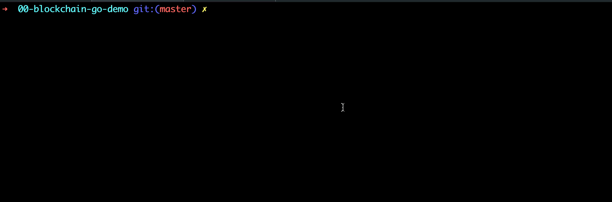
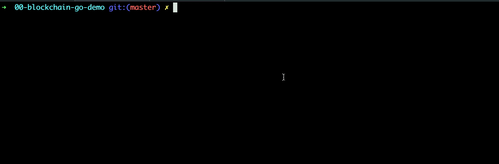

## 概述

该项目介绍了比特币的基本原理，通过5个版本（da1-day5分支）的迭代，逐步介绍了：区块链、哈希、UTXO、梅克尔根、非对称加密、签名、私钥地址、ECDSA等晦涩概念，从而打下进入web3世界坚实的基础。


**建议配套阅读《精通比特币》一书，差缺补漏，事半功倍。**


获取源码：

```js
git clone git@github.com:dukedaily/go-bitcoin-demo.git
```


## 项目资源

- 教程：[油管视频](https://www.youtube.com/watch?v=Wpf5KkgzElc&list=PLO_KaIZjoik9oY-Rs9BsDkHY2RJy7WcE-)
- 教程：[B站视频](https://www.bilibili.com/video/BV1EY4y1c7Yq/?spm_id_from=333.999.0.0&vd_source=42fe91bf6d16ec8841b22ea520184d76)


## 安装

```sh
go mod init go-bitcoin
go mod tidy
```

## 编译

```sh
# ./build.sh
go build -o blockchain *.go
```

## 运行

```sh
./blockchain
```


## 创建钱包

```sh
./blockchain createWallet
```



## 打印钱包

```sh
./blockchain listAddress
```


## 创世块

```sh
./blockchain create 15xGXrzZqrCHjZNcZSQyjDaToPX4agz9R7
```



## 查询余额

```sh
./blockchain getBalance 1Q2DT2JithztxChbLhzEUTShrv78EW3duo
```


## 转账

```sh
./blockchain send \
	1EiLdWg278u261DNs5Vb2Wyh7opscWvV6G \
	1Q2DT2JithztxChbLhzEUTShrv78EW3duo \
	5 1NkNkQUYXWwrw3ewNw3XSdMjdv5keVK1L3 \
	"send 5 btc"
```


## 打印交易

```sh
./blockchain printTx
```


