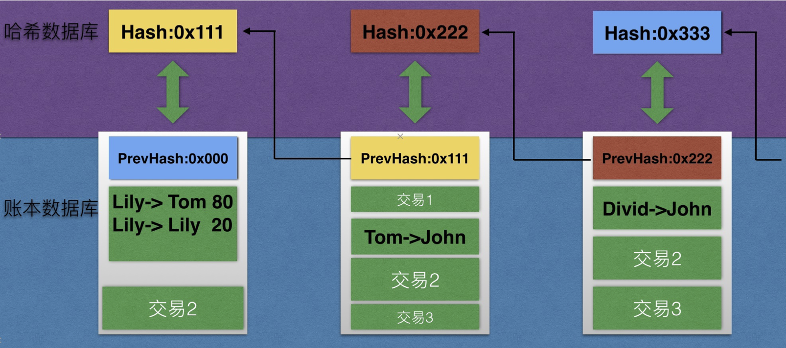
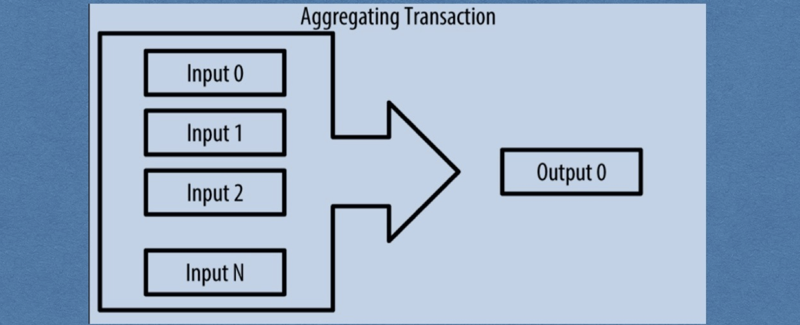
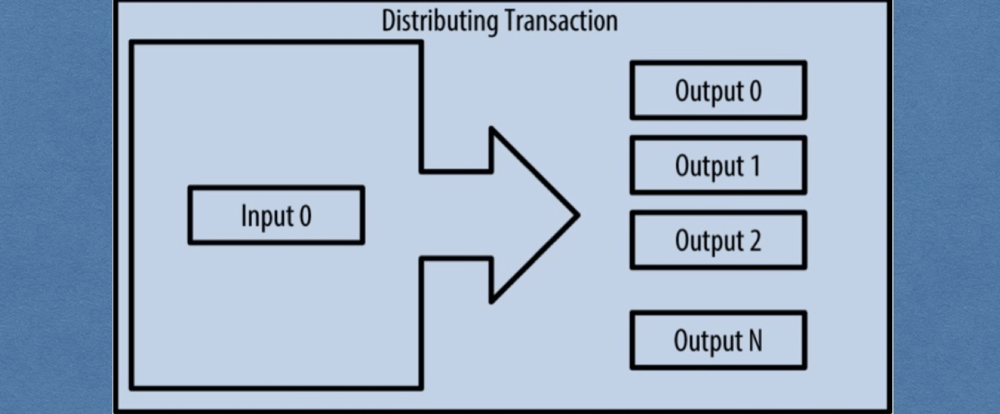
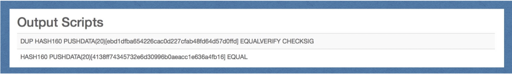
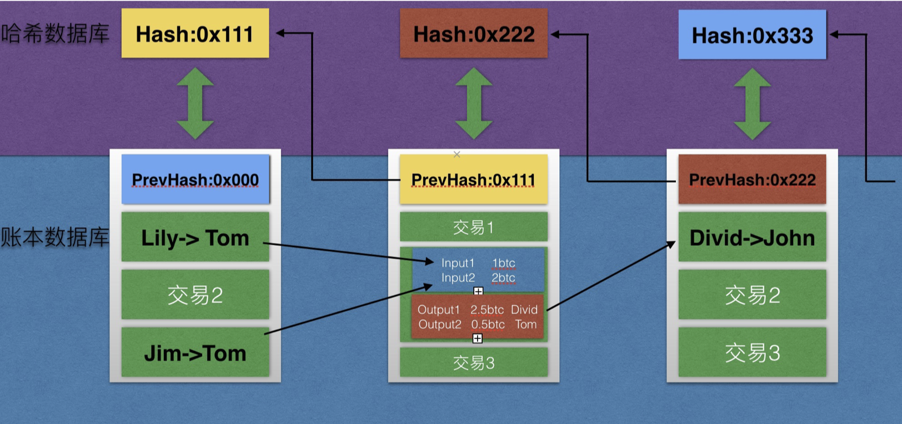
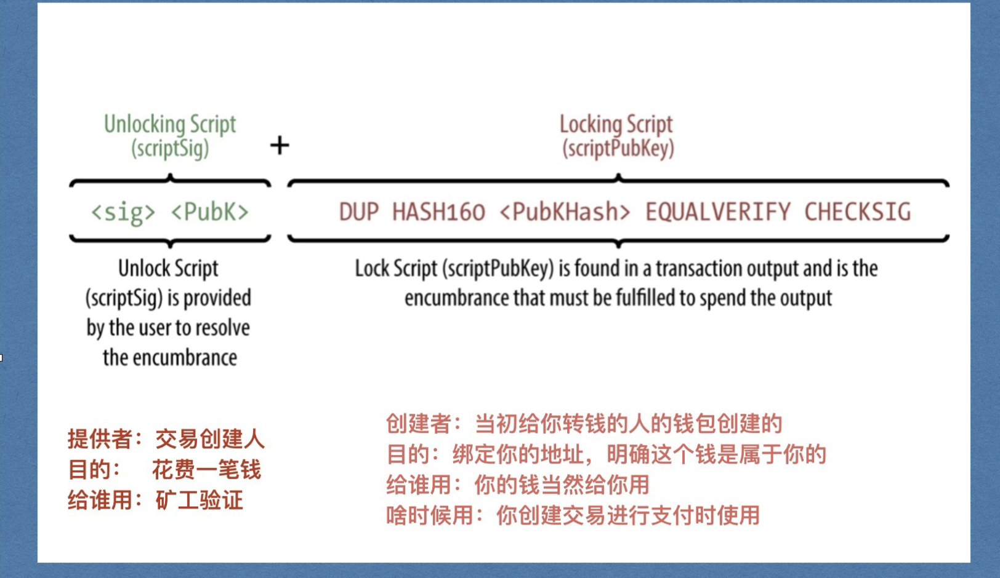
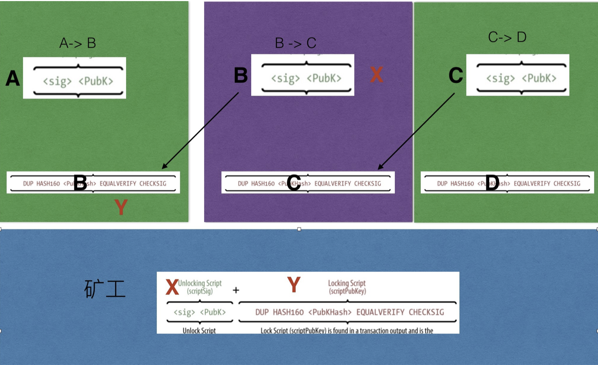
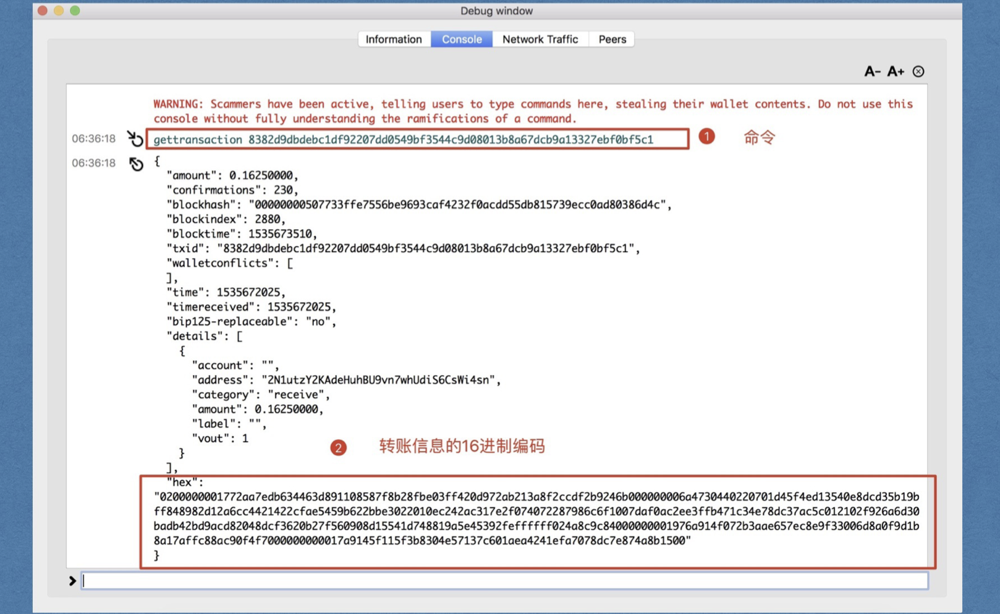
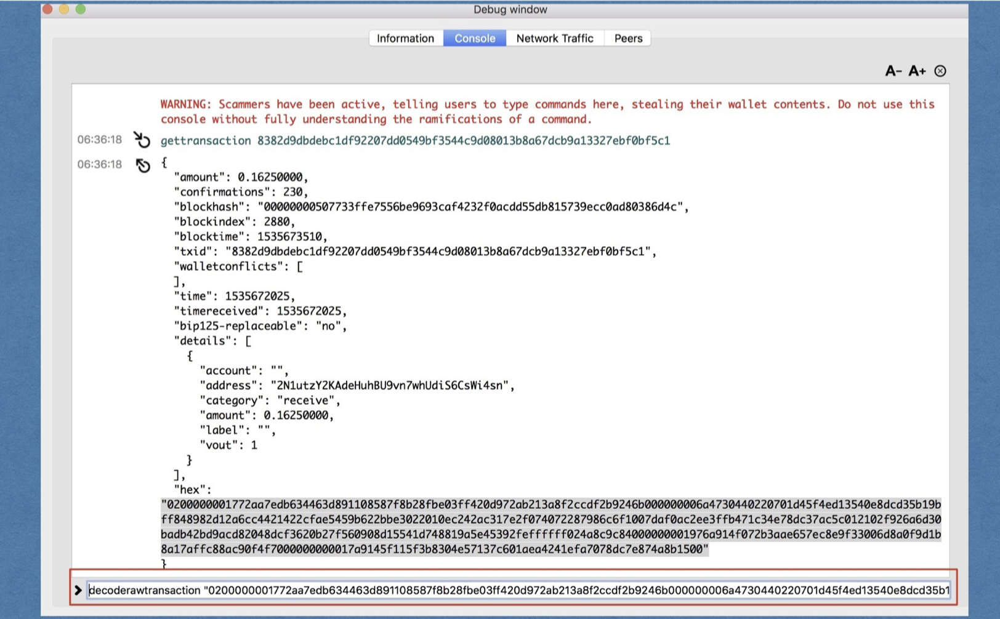
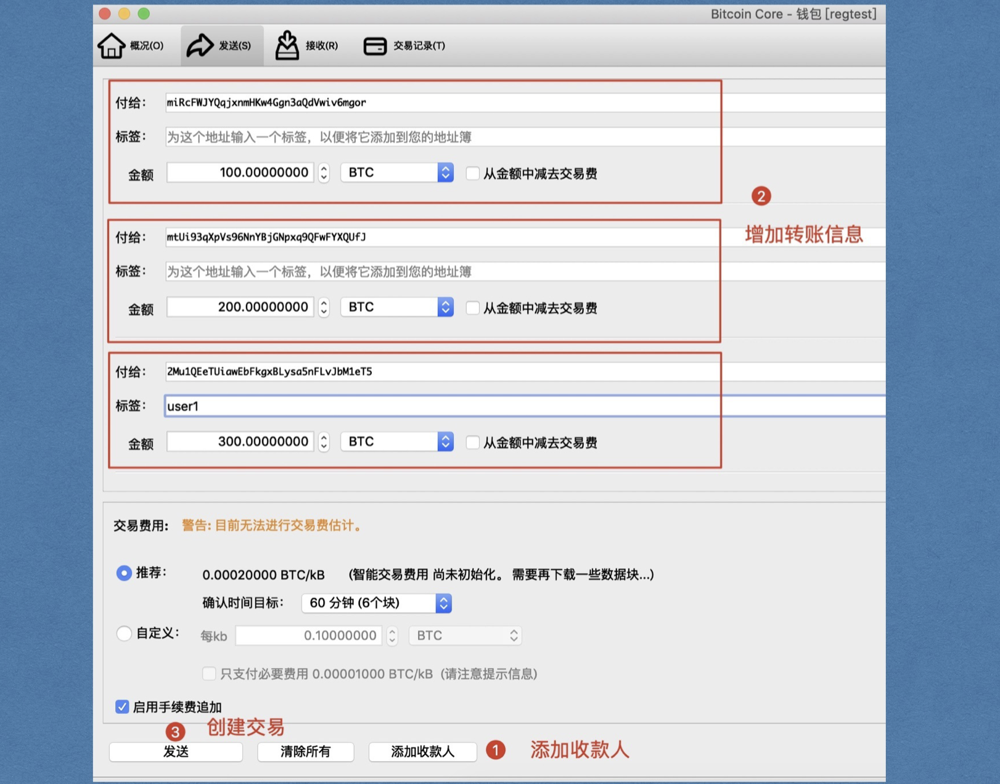

# 一、项目地图


# 二、转账方式

思考两个问题：

1. 转账时都做了什么
2. 如何统计余额


## 1. 传统银行

传统银行的每个账户都会有一个数据库表来存储用户的信息，包括姓名，卡号，余额等基本信息，没产生一笔交易后，最终都会更新这个余额字段，这个数据表就是这个账户的存储结构。


**转账成功与否只看这个字段的金额是否足够即可，不用把整个钱的来源检验一遍**


## 2. 比特币转账

**比特币的数据库中只有交易，没有这个用来集中保存用户基本信息的数据表，也就是没有地方存储账户，没有地方存储余额**

那么比特币系统如何维护我们的钱呢？请看面这张图。

每个交易要以以前的交易为基础，而不是以以特定字段记录的余额为基础，**而是一切都在交易记录中**


我们的钱零散的分布在不同的交易中。如果想要知道某个地址的余额，那就需要遍历整个账本，把所有属于整个地址的钱统计累加。

思考：如果张三不转李四100，而是转80呢？


## 3. 比特币找零机制

李四的钱从哪里来？？张三！那张三的钱如何扣除呢？去上笔交易中修改数据么？比特币是防篡改的，那怎么办？

**解决办法：把上笔交易中张三的钱全部花掉，扣除转给李四的钱，余额转给自己，对，就是自己转给自己。**

这类似于我们现实生活中的找零机制！


你可以理解为张三的钱就是一个不可分割的整体，就像是100元钞票，你不可以撕开一部分支付80元，撕开了就不值钱了。你要么不花费，要么就必须把这100元给别人，然后自己拿到小面值的零钱。

你可以理解为比特币中的任何一笔转账都是一个固定面额的钞票，有30元的，20.5元的，0.9元面额的钞票，我们现实生活中只有1,，5，10，20，50，100，但是比特币系统中有任意面额，这和我们现实生活中的不一样，请仔细体会。


### - 一对一转账




### - 介绍input和output


### - 手续费

大多数交易包含交易费（矿工费），这是为了确保网络安全而给比特币矿工的一种补偿。费用本身也作为一个安全机制，使经济上不利于攻击者通过交易来淹没网络。

交易费作为矿工打包（挖矿）一笔交易到下一个区块中的一种激励；同时作为一种抑制因素，通过对每一笔交易收取小额费用来防止对系统的滥用。成功挖到某区块的矿工将得到该区内包含的矿工费， 并将该区块添加至区块链中。

交易费是基于交易的千字节规模来计算的，而不是比特币交易的价值。

交易的数据结构没有交易费的字段。相替代地，交易费是指输入和输出之间的差值。从所有输入中扣掉所有输出之后的多余的量会被矿工作为矿工费收集走。

**交易费即输入总和减输出总和的余量：交易费 = 求和（所有输入） - 求和（所有输出）**


### - 多对一转账

Tom的钱来⾃Lily，Jim也可以给Tom转账，这样Tom就有了两笔钱，当Tom给Divid进⾏转账的时候， 可以能需要两笔钱加起来才能凑⻬⾦额，那么此时，Tom对Divid的转账就要同时花掉这两笔钱，如果 有余额，Tom同样要转回给⾃⼰，**请记住Tom给Divid转账的场景，我们接下来会频繁⽤到**。（如 何转给⾃⼰后⾯介绍），请看下图：


那么这个过程相当于下图：


# 三、比特币多种交易形式

比特币中，没有付款人和收款人，只有输入(input)和输出(output)，每个输入都对应着之前别人给你转账时产生的某个输出。

## 1. 普通交易（找零）


## 2. 多对一（凑零钱付账） 



## 3. 一对多（代发工资）



## 4. 多对多(大额支付加找零)


# 四、比特币交易结构

## 1. 如何同时转账并且找零

一笔交易中可以有多个输入和多个输出，给自己找零就是给自己生成一个输出。

在上⾯Tom给Divid转账中，对于output⽽⾔，Divid和Tom完全相同的地位。


## 2. 交易输出(output)如何产生

### - 输出产生流程

先从Lily给Tom转账开始说起，Lily给Tom转账时，⽐特币系统会⽣成⼀个output，这个output⾥⾯包括 两个东⻄：

1. Lily给你转的⾦额，例如1btc
2. ⼀个锁定脚本，使⽤Tom的公钥哈希对转账⾦额1btc进⾏锁定。

**两个注意点:**

1. 是公钥哈希，不是Tom的地址，地址可以推出来公钥哈希（忘记请回顾第⼀天课件）。
2. 不⽤关⼼锁定脚本是什么，⽬前只要理解为这个钱被Tom的公钥加密了，只有Tom能解开⽀配。


### - 真实的锁定脚本

锁定脚本：给我收款人的地址，我用这个人公钥进行锁定

解锁脚本：提供支付人的私钥签名（公钥）

```sh
OP_DUP OP_HASH160 <Cafe Public Key Hash> OP_EQUALVERIFY OP_CHECKSIG
```



[参考链接](http://book.8btc.com/books/6/masterbitcoin2cn/_book/ch06.html)


## 3. 交易输入(input)如何产生

与output对应的是input结构，每一个input都源自一个output，在李四对王五进行转账时，系统会创建input，为了定位这笔钱的来源，这个input结构包含以下内容：

1. 在哪一笔交易中，即需要张三->李四这笔转账的交易ID(hash)

2. 所引用交易的那个output，所以需要一个output的索引(int)

3. 定位到了这个output，如何证明能支配呢，所以需要一个张三的签名。（解锁脚本，包括签名和自己的公钥）


**注意一个点：**

1. 不用关心这个解锁脚本原理，只需记得这个能解开用我公钥加密的比特币即可。
2. 挖矿奖励不需要引用任何output，相当于有一个特殊的input。


在上⾯的场景中，Tom引⽤Lily转给他的1btc以及Jim转给他的2btc，完成对Divid转账2.5btc，找零

0.5btc给⾃⼰。也就是说：这笔交易中，有两个input和两个output。




真实的解锁脚本如下，我们后面再做介绍：

```
<Cafe Signature> <Cafe Public Key>
```


完整校验脚本（了解即可）

> 把真正的脚本贴到画板中对比



### 图示




## 4. 未消费输出（UTXO）

我们看到当Tom给Divid转账的时候，已经花掉了Lily和Jim转给他的钱，当完成给Divid的转账后，他还有找零得到的0.5btc，那这里就会涉及到output的消费问题，我们把尚未使用的output有个专用的名字，叫做未消费输出（unspent transaction output，**UTXO**）。

### - 小结

1. UTXO：unspent transaction output，是比特币交易中最小的支付单元，不可分割，每一个UTXO必须一次性消耗完，然后生成新的UTXO，存放在比特币网络的UTXO池中。

2. UTXO是不能再分割、被所有者锁住或记录于区块链中的并被整个网络识别成货币单位的一定量的比特币货币。

3. 比特币网络监测着以百万为单位的所有可用的（未花费的）UTXO。当一个用户接收比特币时，金额被当作UTXO记录到区块链里。这样，一个用户的比特币会被当作UTXO分散到数百个交易和数百个区块中。

4. 实际上，并不存在储存比特币地址或账户余额的地点，只有被所有者锁住的、分散的UTXO。

5. "一个用户的比特币余额"，这个概念是一个通过比特币钱包应用创建的派生之物。比特币钱包通过扫描区块链并聚合所有属于该用户的UTXO来计算该用户的余额。

6. UTXO被每一个全节点比特币客户端在一个储存于内存中的数据库所追踪，该数据库也被称为“UTXO集”或者"UTXO池"。新的交易从UTXO集中消耗（支付）一个或多个输出。


## 5. 交易结构


### - 交易输入（TXInput）

指明交易发起人可支付资金的来源，包含：

* 引用utxo所在交易的ID（知道在哪个房间）

* 所消费utxo在output中的索引（具体位置）

* 解锁脚本（签名，公钥）

### - 交易输出（TXOutput）

包含资金接收方的相关信息,包含：

* 接收金额（数字）

* 锁定脚本（对方公钥的哈希，这个哈希可以通过地址反推出来，所以转账时知道地址即可！）

### -交易ID

一般是交易结构的哈希值（参考block的哈希做法）


在命令行执行如下命令：

```sh
curl https://api.blockcypher.com/v1/btc/test3/txs/8382d9dbdebc1df92207dd0549bf3544c9d08013b8a67dcb9a13327ebf0bf5c1
```


### - UTXO消费和产生过程


### - 使用比特币核心查看

点击记录，找到交易ID


选择help-> Debug window->Console，进入调试模式。


输入help命令，可以列出所有支持的命令，我们找到


我们要使用的命令为gettransaction "txid"，参数为交易的id



使用	decoderawtransaction 命令解析该hex数据



得到交易详情如下


### - 使用一笔交易创建多个输出



同样的查看方式，先看输出


再看输入：


