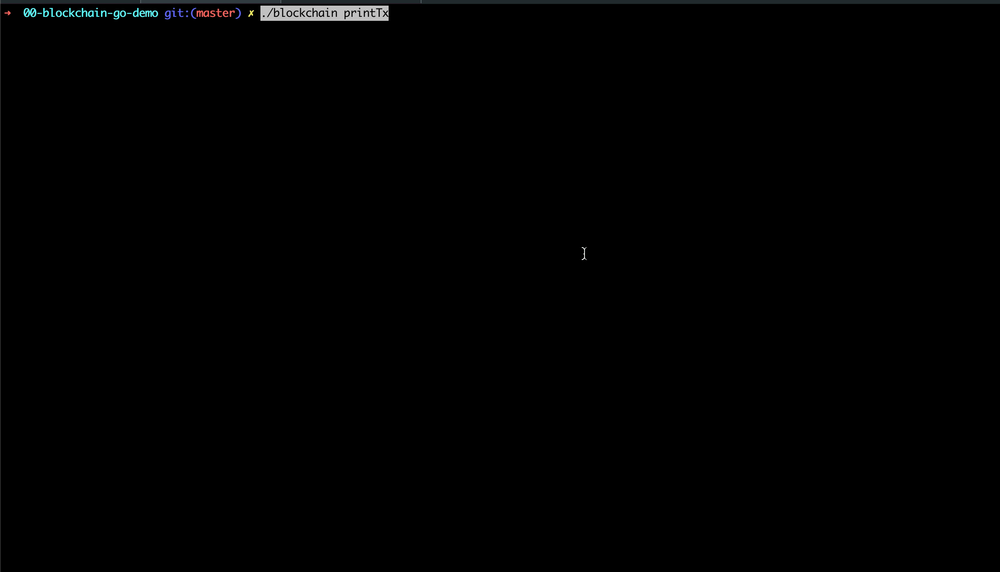

# 第11章：精通比特币


今天介绍一下2018年讲的一套五天的比特币课程，课程在制作过程中参考了 GitHub开源项目：[blockchain_go](https://github.com/Jeiwan/blockchain_go)


当时花了3个多月，反复修正、录制，终于完成了这个5天的课程。


上周末查看旧资料，不巧又把它翻出来了，想来好东西不能放着吃灰啊，所以就花了点时间把课件重新梳理了一下，于是就有了这个章节。


**五天的视频，14个章节，一句一句介绍比特币的核心各种概念，然后用一行行代码逐个实现**，可以说我当时是把比特币最根上的东西都吃透了，讲明白了。


没错，**我说的是当时吃透了**，现在很多知识点我已经忘却了，😢扎心。


## 概述 

**还是言归正传吧**，该项目介绍了比特币的基本原理，通过5个版本（da1-day5分支）的迭代，逐步介绍了：区块链、哈希、UTXO、梅克尔根、非对称加密、签名、私钥地址、ECDSA等晦涩概念，从而打下进入web3世界坚实的基础。


**建议配套阅读《精通比特币》一书，差缺补漏，事半功倍。**

<iframe src="https://drive.google.com/file/d/1-3umwssIjog6Fzi22B9A5Ru3gSO2HqxT/preview" width="640" height="480" allow="autoplay"></iframe>


获取源码：https://github.com/dukedaily/go-bitcoin-demo

```js
git clone git@github.com:dukedaily/go-bitcoin-demo.git
```


## 项目资源

- 教程：[油管视频](https://www.youtube.com/watch?v=Wpf5KkgzElc&list=PLO_KaIZjoik9oY-Rs9BsDkHY2RJy7WcE-)
- 教程：[B站视频](https://www.bilibili.com/video/BV1EY4y1c7Yq/?spm_id_from=333.999.0.0&vd_source=42fe91bf6d16ec8841b22ea520184d76)


## 快速体验

### 安装

```sh
go mod init go-bitcoin
go mod tidy
```

### 编译

```sh
# ./build.sh
go build -o blockchain *.go
```

### 运行

```sh
./blockchain
```


### 创建钱包

```sh
./blockchain createWallet
```


### 打印钱包

```sh
./blockchain listAddress
```


### 创世块

```sh
./blockchain create 15xGXrzZqrCHjZNcZSQyjDaToPX4agz9R7
```


### 查询余额

```sh
./blockchain getBalance 1Q2DT2JithztxChbLhzEUTShrv78EW3duo
```


### 转账

```sh
./blockchain send \
	1EiLdWg278u261DNs5Vb2Wyh7opscWvV6G \
	1Q2DT2JithztxChbLhzEUTShrv78EW3duo \
	5 1NkNkQUYXWwrw3ewNw3XSdMjdv5keVK1L3 \
	"send 5 btc"
```


### 打印交易

```sh
./blockchain printTx
```




怎么样，是不是很酷，这里面的黑科技才是最酷的！


## 小结

web3的路还很长，比特币作为区块链的祖师爷，值得从业者好好研究一下，了解了比特币，你会更加有底气，让你在浮躁的气氛中增添一份厚重，具体细节我这里不再赘述，喜欢的朋友，可以自行学习，加油！
