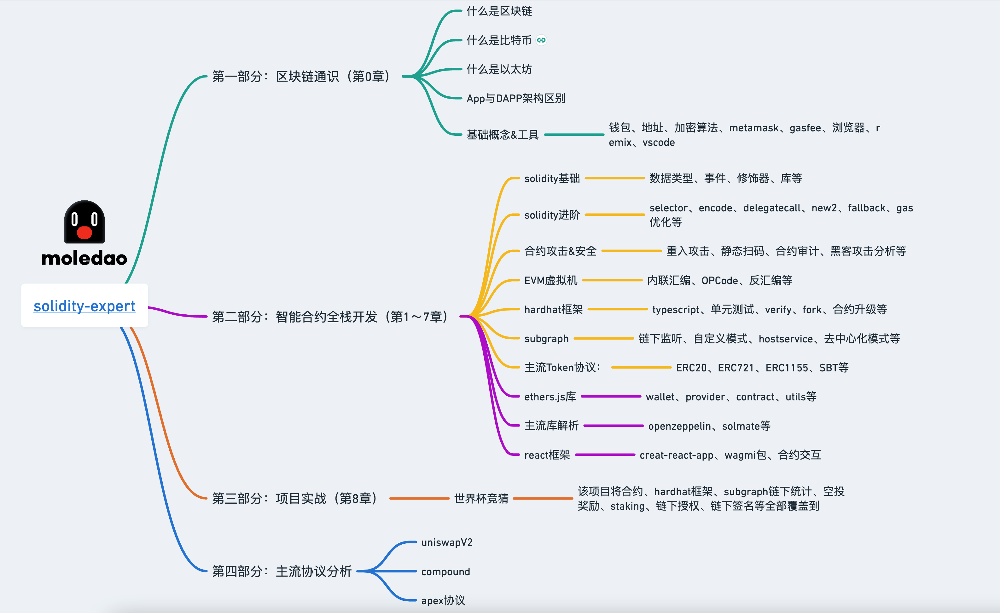

## 免责声明

1. 本教程可以理解为个人知识笔记，仅用于学习使用，不做商业用途；
2. 部分内容参考了其他博主的创作，涉及引用时会附上原文链接，如有侵权，欢迎指出。

## 项目概述

欢迎👏🏻加入web3世界，该教程专注于EVM链Dapp全栈开发，通过学习，你可以掌握以下知识点：

1. 智能合约编写：介绍solidity基础语法、高级应用、合约安全等
2. 第三方工具：框架、安全合约库openzeppelin、基建服务Moralis、Chainlink、tenderly等
3. 主流web3库：web3.js、ethers.js
4. 链下工具：subgraph、扫块服务等
5. 主流协议：uniswap、compound、aave、staking、nft等
6. 必要的前端知识：react
7. [项目实战](https://solidity-expert-worldcup.vercel.app/)

本教程为GitHub开源项目：https://github.com/dukedaily/solidity-expert  请点亮star，谢谢您的支持！

## 学习资源

- gitbook：  [点击阅读](https://dukedaily.github.io/solidity-expert/)
- 进阶教程: [https://dukeweb3.com](https://dukeweb3.com)
- 视频教程：[油管](https://www.youtube.com/channel/UCSc6tGnLIFvVMXs-ilDyb4A)、[B站](https://space.bilibili.com/102710441/channel/seriesdetail?sid=2537685&ctype=0)

## 关于作者

国内第一批区块链布道者；2017年开始专注于区块链教育(btc, eth, fabric)，目前base新加坡，专注海外defi,dex,元宇宙等业务方向。

- 微信：dukeweb3
- 公众号：[阿杜在新加坡](https://mp.weixin.qq.com/s/kjBUa2JHCbOI_2UKmZxjJQ)
- Twitter：[dukedu2022](https://twitter.com/dukedu2022)
- 加入电报：https://t.me/+bEy-E0l4KHhlODRl
- **个人网站**：https://dukeweb3.com

## 马上入群

