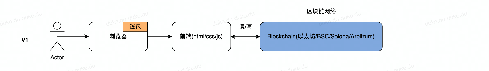

# 第4节：App与Dapp的架构异同

> 小白入门：https://github.com/dukedaily/solidity-expert ，欢迎star转发，文末加V入群。
>
>职场进阶: https://dukeweb3.com

互联发展了20多年，各种架构已经非常成熟了，移动端兴起之后App加入，其架构也没有太大变化；

但是相较于Dapp的架构，一切却有天壤之别，而这其中与其说是技术的变革，不如说是思维方式的变革。

另补充，如果你细心观察，会发现主流的dapp一般不称自己为app，而是称为：protocol（协议），如：aave、compound它们称自己为借贷协议，原因是：**app是封闭的，而协议则是可以集成拓展的**。

## App架构

B/S或C/S的架构大体如此，从前端到后台，从机房到云原生，技术在迭代，效率在提高，一切越来越丝滑。底层的系统大致分为：从Unix、Linux、Dos、MacOs、Windows、安卓、IOS等等。

## Dapp架构

而去中心化应用的架构却与App完全不同，因为**没有专门的后台**，它的**区块链网络就是底层系统**：如以太坊网络、BSC网络等。

一个最简单的Dapp应用可以直接描述如下，我们称为：**V1版本架构**

V1：我们可以看到，此时浏览器多了一个`钱包模块`，钱包是打开区块链的身份钥匙🔑，整个区块链上世界都是建立在密码学之上的（非对称加密，不懂也罢），而图中蓝色部分就是区块链网络，我们的程序就运行在其中，它既是后端服务，也是数据库。我们的前端直接与区块链网络进行交互，包括：

- 读数据（读取区块链账本数据），免费的
- 写数据（向区块链网络提交数据，永久保存，此时需要矿工打包执行），付费的（这点记住即可，后续语言学习中，陆续会讲解）

V2：随着区块链网络生态的发展，人们渐渐发现了优化空间，即我们可以将读操作预先存储到一个服务器中，然后前端直接从中获取数据，这既可以保证系统安全，又可以提高效率，因此**subgraph**（捕捉链上事件，链下存储，支持逻辑处理）这个基建得到飞速发展，图中橘黄色部分。我们称之为：**V2版本架构**

V3：当然，如果业务过于复杂，与链上合约交互的部分，我们可以独立封装出来，让前端专注于展示，合约专注于逻辑，所以引入了SDK，这部分专门处理和链上合约打交道的所有逻辑，并做相应的业务处理，时刻准备喂给前端，此时我们称为：**V3版本架构**

V4：再后来，区块链存储项目也陆续诞生，其中最为人知的便是：ipfs，它是一个致力于大文件存储的项目，最近很火的nft项目中，所有的图片都是要上传到ipfs上，从而节约以太坊网络费用，所以此时的设计更改如下，我们称之为：**V4版本架构**

## 小结

区块链基建项目的发展给系统设计带来一些灵活性， 从V1到V4中，没有最好的设计，只有最合理的设计，架构设计可以带来合理的分工，提供效率。

但只有符合业务场景的设计才有意义，我们作为开发者，千万不要为了酷炫而堆砌技术，造成过度设计，这往往只能满足开发者的虚荣心，而随之带来的却是低效和高成本，我们在开发过程中要抵制住诱惑，尽量选择最优解！

加V入群：Adugii，公众号：阿杜在新加坡，一起抱团拥抱web3，下期见！

> 关于作者：国内第一批区块链布道者；2017年开始专注于区块链教育(btc, eth, fabric)，目前base新加坡，专注海外defi,dex,元宇宙等业务方向。

