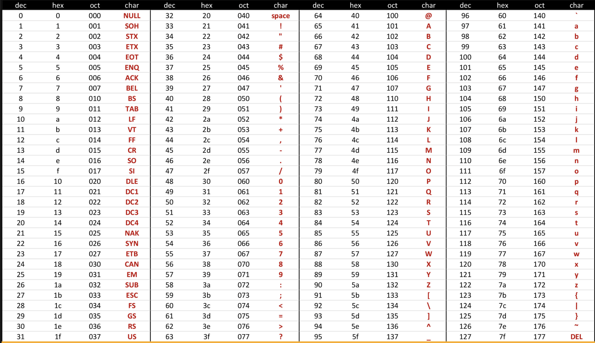

# 第一章：solidity基础

> 小白入门：https://github.com/dukedaily/solidity-expert ，欢迎star转发，文末加V入群。
>
>职场进阶: https://dukeweb3.com

本章将介绍solidity的一些基础语法，了解所有关键字，熟练掌握remix编辑器的相关功能，本文主要参考两个资源：

- solidity手册：https://docs.soliditylang.org/en/v0.8.13/
- solidity基础语法部分参考了：https://solidity-by-example.org/

Ascii（便于查询）

