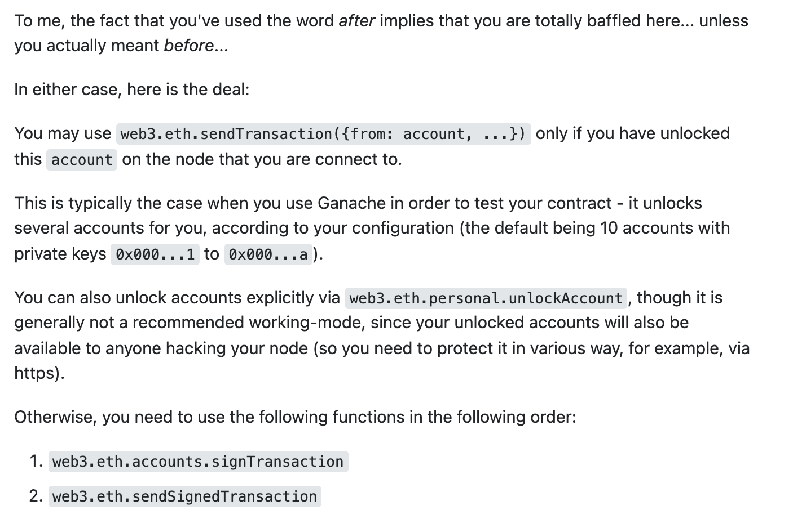

# web3

## 发送交易

如果是使用node，不是使用浏览器，那么需要分两步来做，并且指定私钥。

```js
//1. 构造交易
transactionConfig: TransactionConfig, 
  
//2. 使用私钥对交易签名，signTransaction
const signedTransaction = await this.dsa.web3.eth.accounts.signTransaction(
  transactionConfig,
  this.dsa.config.privateKey
)

//3. 发送已经签名过的交易：sendSignedTransaction
this.dsa.web3.eth.sendSignedTransaction(signedTransaction.rawTransaction)
```

如果是浏览器实例化的web3，那么直接调用：sendTransaction，该函数会在内部进行签名，前提是account已经unlock了，有几种场景是unlock的：

1. 我们可以手动unlock，
2. 使用ganache的，
3. 使用浏览器的，如metamask

```js
this.dsa.web3.eth.sendTransaction(transactionConfig)
```

## 区别

```js
//signTransaction:
will sign a transaction but it will not send it, returning an hexadecimal string with the signed transaction instead. You can use sendSignedTransaction to send it to the network.

//sendTransaction:
will sign and send the transaction to the network.
```

使用sendTransaction的前提是你的accounts都已经unlock了，在metamask中就是unlock的



### sendTransaction调用合约方法

```js
const contract = new this.dsa.web3.eth.Contract(Abi.basics.erc20, params.to)
      const data: string = contract.methods
        .approve(toAddr, params.amount)
        .encodeABI()  //<<=== 构造data

      txObj = await this.dsa.internal.getTransactionConfig({
        from: params.from,
        to: params.to,
        data: data,
        gas: params.gas,
        gasPrice: params.gasPrice,
        nonce: params.nonce,
        value: 0,
      } as GetTransactionConfigParams)
    }
    
调用sendTransaction(txObj)  // <<=== 发送交易
```

### ethers

使用ethers没有

```js
let ethers = require('ethers')

let privateKey = ""
let provider = ethers.getDefaultProvider('kovan');
// let wallet = new ethers.Wallet(privateKey, provider) //ok

//可以定义wallet的时候指定privateKey和provider
//也可以先指定key，后面在connect provider
let wallet = new ethers.Wallet(privateKey)
wallet = wallet.connect(provider)

console.log('addr:', wallet.address)


sendTx = async () => {

    // All properties are optional
    let transaction = {
        // nonce: 0,
        gasLimit: 21000,
        gasPrice: ethers.BigNumber.from("20000000000"),

        to: "0x6491D615b6DB93154d6123e97751897CCe524787",
        // ... or supports ENS names
        // to: "ricmoo.firefly.eth",

        value: ethers.utils.parseEther("1.0"),
        data: "0x",

        // 这可确保无法在不同网络上重复广播
        chainId: ethers.providers.getNetwork('kovan').chainId
    }

    console.log('estimate:',(await provider.estimateGas(transaction)).toString())

    // let signedTransaction = await wallet.signTransaction(transaction)

    // console.log('signedTransaction:', signedTransaction);

    // let tx = await wallet.sendTransaction(signedTransaction)

    //sendTransaction内部会使用wallet进行签名:signedTransaction
    //返回值是一个response不是receipt，wait之后是receipt
    //这是与web3库不同之处
    let recepit = await (await wallet.sendTransaction(transaction)).wait()

    //wait() 内部调用的是provider的waitForTransaction函数，
    //上面的.wait等价于
    // let tx = await (await wallet.sendTransaction(transaction))
    // let recepit1 = await provider.waitForTransaction(tx)

    console.log('recepit:', recepit);
}
sendTx()
console.log('over!');


//signer.sendTransaction内部会对tx进行签名，最后使用provider进行发送
//wallet就是signer的实现
```


### metamask转账

```js
import { ethers, utils } from 'ethers';


export async function payWithMetamask(sender, receiver, strEther) {
    console.log(`payWithMetamask(receiver=${receiver}, sender=${sender}, strEther=${strEther})`)

    let ethereum = window.ethereum;


    // Request account access if needed
    await ethereum.enable();


    let provider = new ethers.providers.Web3Provider(ethereum);

    // Acccounts now exposed
    const params = [{
        from: sender,
        to: receiver,
        value: ethers.utils.parseUnits(strEther, 'ether').toHexString()
    }];

    const transactionHash = await provider.send('eth_sendTransaction', params)
    console.log('transactionHash is ' + transactionHash);
}
```

## 本质

sendTransaction的底层也是调用的eth_sendTransaction

