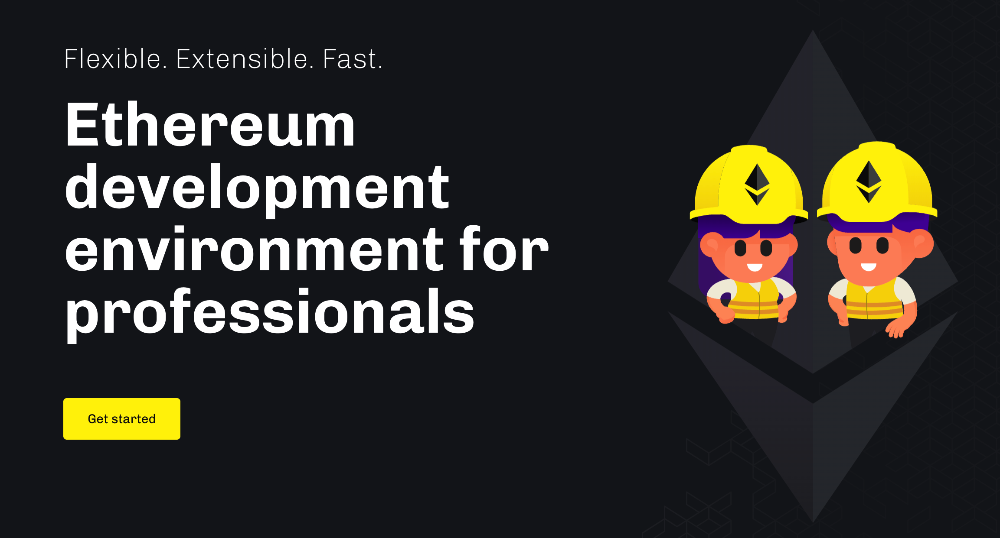
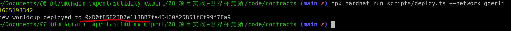

# 第2节：世界杯竞猜（hardhat框架）

> 小白入门：https://github.com/dukedaily/solidity-expert ，欢迎star转发，文末加V入群。
>
> 职场进阶: https://dukeweb3.com

## 概述

通过学习，掌握最主流的开发框架hardhat，从而了解如何管理以太坊工程代码，并掌握如何进行常用操作，单元测试等。

1. [点击查看效果](https://solidity-expert-worldcup.vercel.app/)
2. [点击获取代码](https://github.com/dukedaily/solidity-expert/tree/main/cn/08_%E9%A1%B9%E7%9B%AE%E5%AE%9E%E6%88%98-%E4%B8%96%E7%95%8C%E6%9D%AF%E7%AB%9E%E7%8C%9C/code/contracts)
3. [点击查看视频](https://dukeweb3.com/courses/enrolled/2187286)



## 前置条件

- 了解JavaScript（TypeScript）

- 了解合约开发基础

## 学习目标

1. 了解技术栈、hardhat框架使用：编译、部署、verify、单元测试、查看size、部署消耗gas统计
   1. 早期2018年工具链：solidity(0.4.16) + truffle + infura （rpc）+ web3.js（重，强大） + js
   2. 目前2022年工具链：solidity(0.8.16) + hardhat + alchemy （更快）+ ethers.js（轻） + ts
1. 集成WorldCup合约，完成部署、verify、单元测试


## 创建hardhat项目

```Bash
#创建npm空项目
npm init 

#安装命令，对照两个版本的差异性
npm install --save-dev hardhat@2.11.1 # 新案例，新工具包
npm install --save-dev hardhat@2.9.7

#创建工程
npx hardhat-》选择高级ts项目
```

## 目录结构


## 运行测试

```sh

#编译合约
npx hardhat compile

#单元测试
npx hardhat test
```

执行效果如下：


至此，官方代码我们已经验证完成（逻辑很简单，请自行阅读，如有疑问请咨询：dukeweb3），接下来我们需要改造成自己的代码！


## 添加合约

将Worldcup.sol（上节编写的合约）添加到contracts目录，编译：npm run compile

## 编写单元测试

1. 创建test/WorldCup.ts，用于编写测试文件，首先引入测试工具包：

```js
import { time, loadFixture } from "@nomicfoundation/hardhat-network-helpers";
import { anyValue } from "@nomicfoundation/hardhat-chai-matchers/withArgs";
import { expect } from "chai";
import { ethers } from "hardhat";
import hre from "hardhat";
import { WorldCup } from "../typechain-types";
```

2. 合约初始化部署

```js
describe("WorldCup", function () {
  	async function deployWorldcupFixture() {
      
				// 获取第一个钱包对象，用于发起交易
        const [owner, otherAccount] = await ethers.getSigners();

      	// 获取合约对象
        const WorldCup = await ethers.getContractFactory("WorldCup");
        const deadline = (await time.latest()) + TWO_WEEKS_IN_SECS;
      
      	// 部署合约
        const worldcup = await WorldCup.deploy(deadline);
        return { worldcup, deadline, owner, otherAccount };
    }
  
    this.beforeEach(async () => {
      	// 从内存中获取合约状态快照（仅用于测试），执行每个单元测试的时候，状态都会回到最初
        const { worldcup, owner, otherAccount, deadline } = await loadFixture(deployWorldcupFixture);
        worldcupIns = worldcup
        ownerAddr = owner.address
        otherAccountAddr = otherAccount.address
        deadline1 = deadline
    })
  })
```

3. 编写测试逻辑

```js
    describe("Deployment", function () {
      	// 检查部署后，owner是否正确
        it("Should set the right owner", async function () {
            const { worldcup, owner } = await loadFixture(deployWorldcupFixture);
            expect(await worldcupIns.admin()).to.equal(ownerAddr);
        });

      	// 检查部署时，如果传入参数不满足，是否会抛出异常
        it("Should fail if the deadline is not in the future", async function () {
            const latestTime = await time.latest();
            const WorldCup = await ethers.getContractFactory("WorldCup");
            await expect(WorldCup.deploy(latestTime)).to.be.revertedWith(
                "WorldCupLottery: invalid deadline!"
            );
        });
```

编写完，运行单元测试：npm run test，效果如下：（请运行GitHub上面的代码，此处是精简版，无法运行，仅用于说明原理）


单元测试至此告一段落，接下来我们开始考虑将代码部署到区块链网络中。


## 部署到本地网络

hardhat内部实现了一个本地evm，可以运行一个本地节点，开发过程，我们可以选择启动节点，并在上面部署，具体如下：

```sh
#运行脚本，部署合约
npx hardhat run scripts/deploy.ts

#启动节点node
npx hardhat node

#部署合约到本地node节点
npx hardhat run scripts/deploy.ts --network localhost  
```

效果如下，方便快速验证合约及脚本

## 修改配置文件

如果想部署到真实的测试网络，我们需要修改一下配置文件：hardhat.config.ts，具体如下：

```JavaScript
import { HardhatUserConfig } from "hardhat/config";
import "@nomicfoundation/hardhat-toolbox";

// 在配置文件中引用，
// 需要单独安装：npm install dotenv
require('dotenv').config()

let ALCHEMY_KEY = process.env.ALCHEMY_KEY || ''
let INFURA_KEY = process.env.INFURA_KEY || ''
let PRIVATE_KEY = process.env.PRIVATE_KEY || ''
let ETHERSCAN_API_KEY = process.env.ETHERSCAN_API_KEY || ''

console.log(ALCHEMY_KEY);
console.log(INFURA_KEY);
console.log(PRIVATE_KEY);
console.log(ETHERSCAN_API_KEY);

const config: HardhatUserConfig = {
    // solidity: "0.8.9",
    // 配置网络 kovan, bsc, mainnet
    networks: {
        hardhat: {
        },
      	// 配置goerli网络
        goerli: {
            url: `https://eth-goerli.alchemyapi.io/v2/${ALCHEMY_KEY}`,
            accounts: [PRIVATE_KEY]
        },
        kovan: {
            url: `https://kovan.infura.io/v3/${INFURA_KEY}`,
            accounts: [PRIVATE_KEY]
        }
    },
    // 配置自动化verify相关
    etherscan: {
        apiKey: {
            goerli: ETHERSCAN_API_KEY
        }
    },
    // 配置编译器版本
    solidity: {
        version: "0.8.9",
        settings: {
            optimizer: {
                enabled: true,
                runs: 200
            }
        }
    },
};

export default config;
```


## 修改部署脚本

修改scripts/deploy.ts

```JavaScript
import { ethers } from "hardhat";

async function main() {
  const TWO_WEEKS_IN_SECS = 14 * 24 * 60 * 60;
  const timestamp = Math.floor(Date.now() / 1000)
  const deadline = timestamp + TWO_WEEKS_IN_SECS;
  console.log(timestamp)

  // 获取对象
  const WorldCup = await ethers.getContractFactory("WorldCup");
  // 部署
  const worldcup = await WorldCup.deploy(deadline);
	// 等待部署完成
  await worldcup.deployed();

  console.log(`new worldcup deployed to ${worldcup.address}`);
}

main().catch((error) => {
  console.error(error);
  process.exitCode = 1;
});

```

部署到goerli网络：

```sh
# npx hardhat run scripts/deploy.ts --network <netWorkName> 
npx hardhat run scripts/deploy.ts --network goerli  #在配置文件中已经配置了

# 得到地址如下：0xD0f85823D7e118BB7fa4D460A25851fCf99f7Fa9
```



自动验证代码：

```sh
# npx hardhat verify <contractAddr> [para1] [para2] ...  --network goerli
npx hardhat verify 0xD0f85823D7e118BB7fa4D460A25851fCf99f7Fa9 1665193342  --network goerli
```

效果如下：


## 小结

至此，我们本节内容全部完成了，主要学习了hardhat的安装，基础命令，单元测试编写，并且结合我们的业务合约，通过修改配置文件和脚本，成功的部署到了goerli测试网络，且自动verify代码，这些都是我们日常开发过程中的真实开发步骤，请务必好好消化！

本文代码托管在github：https://github.com/dukedaily/solidity-expert， 欢迎start，谢谢支持！


## 下次预告

- 主流token协议
  - ERC20 -> USDT，DAI，approve, allowance, transfer, transferFrom, safeTransfer...
  - ERC721 -> NFT1
  - ERC1155 -> NFT2


---

加V入群：dukeweb3，公众号：[阿杜在新加坡](https://mp.weixin.qq.com/s/kjBUa2JHCbOI_2UKmZxjJQ)，一起抱团拥抱web3，下期见！

> 关于作者：国内第一批区块链布道者；2017年开始专注于区块链教育(btc, eth, fabric)，目前base新加坡，专注海外defi,dex,元宇宙等业务方向。
