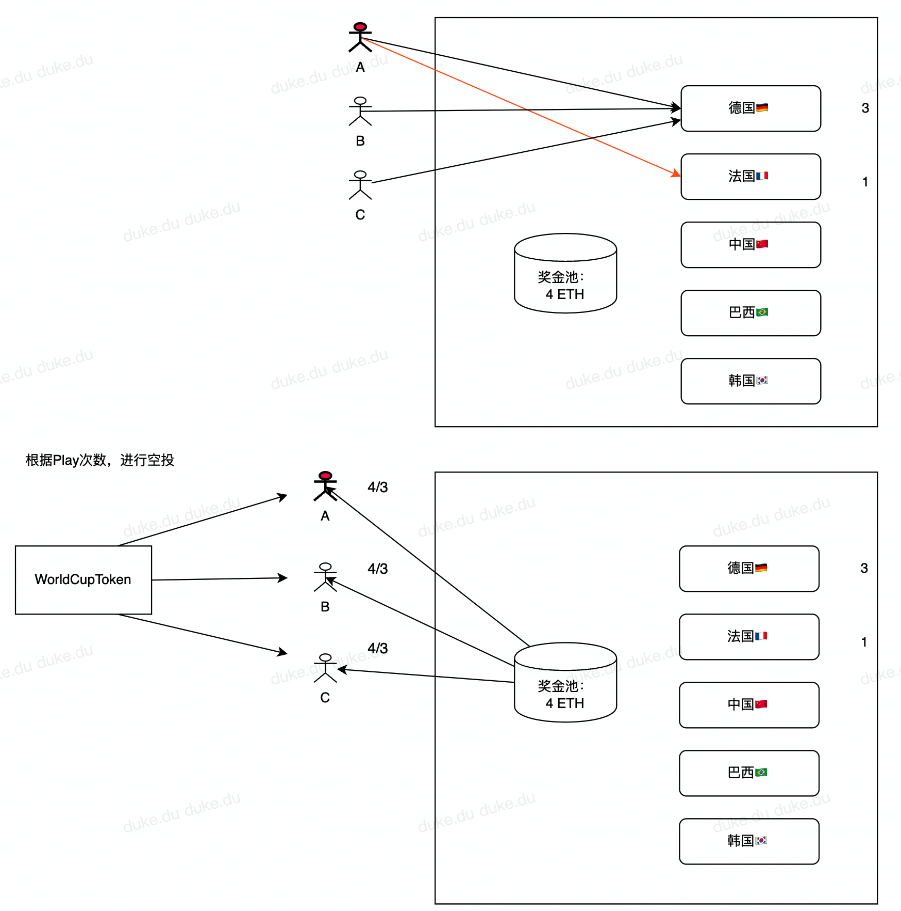
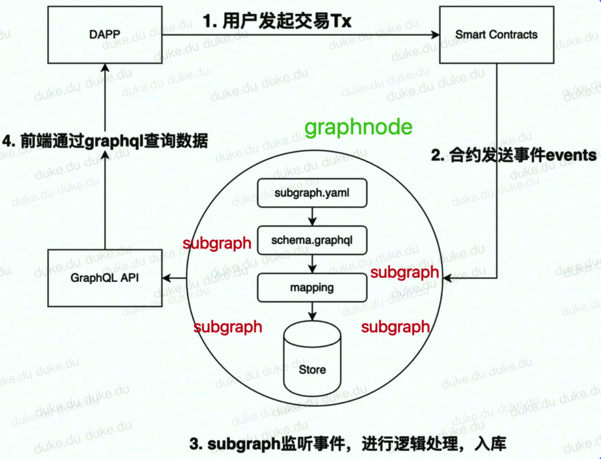
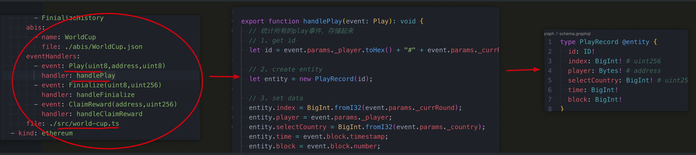
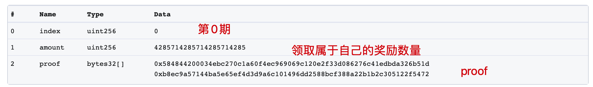

# 第5节：世界杯竞猜（airdrop）

> 小白入门：https://github.com/dukedaily/solidity-expert ，欢迎star转发，文末加V入群。
>
> 职场进阶: https://dukeweb3.com

## 概述

- WorldCup合约（已经完成）✅
- 发行一个worldCupToken（新合约）
- 统计玩家Play的历史，计算每个人分配多少（由subgraph进行链下统计）
- 管理员分配奖励（新合约）
- 用户领取奖励
- [点击查看交易](https://goerli.etherscan.io/tx/0x5959f3fcc6eff7358663b740bff3ce097ed40bf5742634139f6dee0df3cb5f80)
- [点击请求subgraph](https://thegraph.com/hosted-service/subgraph/dukedaily/worldcup)
- [点击查看视频](https://dukeweb3.com/courses/enrolled/2187286)


场景设置如下：

- 最终胜出国家：0，此时合约中一共有：4gwei，三个人平分：每个人获得 4/3 gwei，如果有剩余，则转给管理员。

- 合约地址：0x471a8f71d3bBB8254e36832FBbb6928b73298347



## 背景

| 玩家     | EOA地址                                    | 国家 | 备注     |
| -------- | ------------------------------------------ | ---- | -------- |
| 管理员   | 0xE8191108261f3234f1C2acA52a0D5C11795Aef9E |      | 负责开奖 |
| Account1 | 0xE8191108261f3234f1C2acA52a0D5C11795Aef9E | 0，1 |          |
| Account2 | 0xC4109e427A149239e6C1E35Bb2eCD0015B6500B8 | 0    |          |
| Account3 | 0x572ed8c1Aa486e6a016A7178E41e9Fc1E59CAe63 | 0    |          |

> 当前世界杯合约：0x0fd554503c88E9cE02D6f81799F928c8Aa202Dd3

## 部署奖励Token

### WorldCupToken

```JavaScript
// SPDX-License-Identifier: MIT
pragma solidity ^0.8.9;

import "@openzeppelin/contracts/token/ERC20/ERC20.sol";

//合约继承，使用 is
contract WorldCupToken is ERC20 {
    // 2. 一次性mint出来，不允许后续mint
    constructor(
        string memory name_,
        string memory symbol_,
        uint256 totalSupply_
    ) ERC20(name_, symbol_) {
        _mint(msg.sender, totalSupply_);
    }
}
```

### 部署合约

```sh
# 部署合约
npx hardhat run scripts/deployWorldCupToken --network goerli

# 验证合约
npx hardhat verify --contract contracts/tokens/WorldCupToken.sol:WorldCupToken  0x4c305227E762634CB7d3d9291e42b423eD45f1AD "World Cup Token" "WCT" 10000000000000000000000000 --network goerli

# 0x4c305227E762634CB7d3d9291e42b423eD45f1AD
```

## 统计玩家Play数据

回顾subgraph工作流程（上节介绍）



### 编写配置文件

将下面内容添加到subgraph.yaml中，其中包含对WorldCup合约的监听，以及对发放奖励合约（WorldCupDistributor）的监听。



```YAML
specVersion: 0.0.4
schema:
  file: ./schema.graphql
dataSources:
  - kind: ethereum
    name: WorldCup
    network: goerli
    source:
      # 监听世界杯主合约
      address: "0x0fd554503c88E9cE02D6f81799F928c8Aa202Dd3"
      abi: WorldCup
      startBlock: 7813068
      # ....
      abis:
        - name: WorldCup
          file: ./abis/WorldCup.json
      eventHandlers:
        # 监听事件
        - event: Play(uint8,address,uint8)
          handler: handlePlay
        - event: Finialize(uint8,uint256)
          handler: handleFinialize
        - event: ClaimReward(address,uint256)
          handler: handleClaimReward
      file: ./src/world-cup.ts
  - kind: ethereum
    name: WorldCupDistributor
    network: goerli
    source:
      # 监听奖励合约
      address: "0x857c162eB34f3FA3f14A8A7F211017D2505df724"
      abi: WorldCupDistributor
      startBlock: 7813265
      # ...
      abis:
        - name: WorldCupDistributor
          file: ./abis/WorldCupDistributor.json
      eventHandlers:
        # 监听事件
        - event: DistributeReward(indexed bytes32,indexed uint256,uint256,uint256)
          handler: handleDistributeReward
        - event: Claimed(indexed address,indexed address,indexed uint256)
          handler: handleClaimed
      file: ./src/world-cup.ts
```

### 编写 Schema

schema.graphql，这些结构相当于数据库，用于在subgraph中存储计算后的数据。

```YAML
# 玩家Player详情
type PlayRecord @entity {
  id: ID!
  index: BigInt! # uint256
  player: Bytes! # address
  selectCountry: BigInt! # uint256
  time: BigInt!
  block: BigInt!
}

# 球队winner详情
type FinializeHistory @entity {
  id: ID!
  result: BigInt!
}

# 玩家奖励详情（分配后）
type PlayerDistribution @entity {
  id: ID!
  index: BigInt!
  player: Bytes!
  rewardAmt: BigInt!
  weight: BigInt!
  isClaimed: Boolean!
}

# 更多部分参见源代码....
```

### 监听Play事件

```JavaScript
export function handlePlay(event: Play): void {
  // 统计所有的play事件，存储起来
  // 1. get id 
  let id = event.params._player.toHex() + "#" + event.params._currRound.toString() + "#" + event.block.timestamp.toHex();

  // 2. create entity
  let entity = new PlayRecord(id);

  // 3. set data
  entity.index = BigInt.fromI32(event.params._currRound);
  entity.player = event.params._player;
  entity.selectCountry = BigInt.fromI32(event.params._country);
  entity.time = event.block.timestamp;
  entity.block = event.block.number;

  // 4. save
  entity.save()

  // 5. save nohandle play record
  let noHandle = NeedToHandle.load(NO_HANDLE_ID);
  if (!noHandle) {
    noHandle = new NeedToHandle(NO_HANDLE_ID);
    noHandle.list = [];
  }

  // noHandle.list.push(id)
  let list = noHandle.list;
  list.push(id);
  noHandle.list = list;

  noHandle.save()
}

// 更多部分参见源代码....
```

### 监听Finalize事件

```JavaScript
export function handleFinialize(event: Finialize): void {
  let id = event.params._currRound.toString();
  let entity = new FinializeHistory(id);

  entity.result = event.params._country;
  entity.save();
}
```

### 部署到subgraph

### 方式一：自己部署graphnode节点

这部分我们在上一节已经介绍，按顺序执行即可。

```Bash
# 启动graphnode
docker-compose up

# 创建并
npm run codegen
npm run build
npm run create-local
npm run deploy-local

# Deployed to http://localhost:8000/subgraphs/name/duke/worldcup/graphql
```

### 方式二：使用subgraph官方结点

https://thegraph.com/hosted-service/dashboard

### 获取请求Play数据

启动subgraph后，需要安静等待一会儿，等待数据同步完成后，我们便可以查询，由于之前已经使用3个用户发起过四次Play操作，所以得到结果如下：

```JavaScript
{
    playRecords(where: {
      index: 0
    }){
      id
      index
      player
      selectCountry
      block
    }
  }
```

结果：


### 获取冠军球队

```JavaScript
{
  finializeHistories{
    id
    result
  }
}
```


## 分配奖励分析

### 技术选型

1. 使用链下签名方式，让用户链上claim：[opensea](https://testnets.opensea.io/)
   1. 需要为每个用户都生成一个链下的签名，由管理员签发；
   2. 好处是：分配时不需要调用合约；多期奖励可以一次领取；
   3. 代价是：需要入库，对后台要求更高

1. 使用merkle tree方式，对这一期所有的玩家进行统一设置，然后各自去claim：
   1. 好处是：不需要入库，直接设置一次merkleTree即可（由所有用户来当叶子节点）
   2. 代价是：需要调用一次合约；多期奖励无法一次领取，我们选用方法2

merkleRoot是一个hash值，每个节点是一个叶子（如M），根节点hash确定后，叶子节点和通向根节点路径中的hash值就都确定了，从而可以完成快速验证功能，能够满足我们的奖励方法需求。


[在线体验MerkleRoot案例](https://lab.miguelmota.com/merkletreejs/example/)


### 实现思路

1. 管理员要根据最终每个人分配到数量，生成一个merkleRoot，写入合约
   1. 需要从subgraph请求Play历史数据
   2. 然后在本地（前端或脚本），按照我们的空投策略（参与权重1，猜中权重2），生成merkleRoot
   3. [调用奖励合约设置](https://goerli.etherscan.io/tx/0xb710c3d5c23072574e128d748f712eb1d6df95d59d00a58c0978e66fc9e44ae1)merkleRoot -》发送事件，在subgraph计算每个用户可以分配的数量

1. 用户在claim的时候，需要携带叶子信息和证明信息，传递给合约，合约校验通过后，执行奖励发放
   1. 需要从subgraph请求所有用户的奖励数据-> 生成merkleRoot-> 生成证明。
   2. 然后从subgraph请求自己能够获取的数量。
   3. [调用奖励合约](https://goerli.etherscan.io/tx/0x5959f3fcc6eff7358663b740bff3ce097ed40bf5742634139f6dee0df3cb5f80)，领取奖励

### **奖励流程**

奖励发放与领取逻辑介绍：

1. 管理员调用distribute（步骤7），这个方法的核心参数是MerkleRoot，是由所有玩家的“地址+奖励数量”作为叶子结点生成的。为了得到这些叶子结点，我们需要对subgraph发起请求玩家的原始数据（步骤8），然后根据奖励分配规则，在前端本地计算后每个人分配的数量，进而生成merkleRoot（步骤9），设置到合约中。

1. 存储MerkleRoot后发出事件，subgraph内部收到事件后，会在重复这个计算过程，并将计算结果存储在subgraph的db中（reward list）

1. 玩家发起领奖（步骤11）时，点击ClaimReward，此时需要的参数为：玩家、奖励数量、证明，用于在合约内部验证MerkleRoot。这些数据在上一步已经存储在subgraph中了，所以我们发起请求获取奖励列表（步骤12），在本地计算证明proof，然后传递给合约。

1. 合约接收到玩家领奖请求时，会将当前用户当成一个叶子节点，进而与已经设置好的merkleRoot进行验证。如果验证成功，则向用户转账奖励，反之合约revert。

原图：https://whimsical.com/Nfi7rAVqvYJd8mCLYHZYrx


### 分配奖励合约

```JavaScript
// SPDX-License-Identifier: GPL-2.0-or-later
pragma solidity ^0.8.0;

import {IERC20} from "@openzeppelin/contracts/token/ERC20/IERC20.sol";
import "./libraries/MerkleProof.sol";
import './libraries/TransferHelper.sol';

/// @notice use for claim reward
contract WorldCupDistributor {
    // 省略部分代码，详见代码仓库 ....
  
    function distributeReward(
        uint256 _index,
        uint256 _amount,
        uint256 _settleBlockNumber,
        bytes32 _merkleRoot
    ) external onlyOwner {
        merkleRoot = _merkleRoot;
        
        require(_index == merkleDistributors.length, "index already exists");
        uint256 currAmount = IERC20(token).balanceOf(address(this));
        require(currAmount >= _amount, "Insufficient reward funds");
        require(block.number >= _settleBlockNumber, "!blockNumber");
        // ...

        merkleDistributors.push(
            MerkleDistributor(_merkleRoot, _index, _amount, _settleBlockNumber)
        );

        emit DistributeReward(_merkleRoot, _index, _amount, _settleBlockNumber);
    }

    function claim(
        uint256 index,
        uint256 amount,
        bytes32[] calldata proof
    ) external {
        address user = msg.sender;
        require(merkleDistributors.length > index, "Invalid index");
        require(!isClaimed(index, user), "Drop already claimed.");

        MerkleDistributor storage merkleDistributor = merkleDistributors[index];
        require(merkleDistributor.amount >= amount, "Not sufficient");
        bytes32 leaf = keccak256(abi.encodePacked(index, user, amount));

        require(
            // 核心校验逻辑
            MerkleProof.verify(proof, merkleDistributor.merkleRoot, leaf),
            "Invalid proof."
        );

        merkleDistributor.amount = merkleDistributor.amount - amount;
        // 标识用户已经领取
        claimedState[index][user] = true;
      
        // 向用户转账
        address(token).safeTransfer(msg.sender, amount);

        emit Claimed(address(this), user, amount);
    }
}
```

## 部署合约

```Bash
npx hardhat scripts/deployDistributor.ts --network goerli

# 0xF19233dFE30219F4D6200c02826B80e4347EF8BF

npx hardhat verify 0xF19233dFE30219F4D6200c02826B80e4347EF8BF 0x4c305227E762634CB7d3d9291e42b423eD45f1AD  --network goerli
```

部署后，我们需要手动向WorldCupDistributor中转入1w个奖励WorldCupToken，用于后续发放奖励。

### 分发奖励

至此，我们完成了对事件的监听，接下来要由管理员进行发奖，Player进行领奖，在合约项目中，直接运行脚本：contracts/scripts/distributeReward.ts，对第0期的所有玩家，发放10000 * 10^18 个奖励，读取数据，生成merkleRoot

```Bash
npx hardhat run scripts/distributeReward.ts
```

返回：


管理员分配奖励：调用奖励合约distruibuteRward方法，tx：https://goerli.etherscan.io/tx/0xb710c3d5c23072574e128d748f712eb1d6df95d59d00a58c0978e66fc9e44ae1，注意此处要用到newRoot值，这个是根据所有玩家奖励数计算得到的，详见脚本。


### 监听奖励事件

- 遍历本期所有的Play记录

- 计算每个玩家的权重

- 按照权重分配总奖励数

```JavaScript
监听奖励发放事件，进行计算：（核心逻辑）
export function handleDistributeReward(event: DistributeReward): void {
  // parse parameters first
  let id = event.params.index.toString();
  let rewardAmt = event.params.amount;
  let index = event.params.index;
  let settleBlockNumber = event.params.settleBlockNumber;

  // 找到当前发奖周期，查看哪个国家是winner
  let winCountry = FinializeHistory.load(id)
  if (!winCountry) {
    return;
  }

  let totalWeight = BigInt.fromI32(0)
  let rewardActuallyAmt = BigInt.fromI32(0) 
  let rewardHistoryList: string[] = []; // for history check usage

  let noHandle = NeedToHandle.load(NO_HANDLE_ID);
  if (noHandle) {
    let group = new TypedMap<Bytes, BigInt>();
    let currentList = noHandle.list; // current record
    let newList: string[] = []; // record won't be used this time
    log.warning("current list: ", currentList)

    for (let i = 0; i < currentList.length; i++) {
      // 每个玩家都会得到奖励，默认权重weight为1
      let playerWeight = BigInt.fromI32(1)
      let record = PlayRecord.load(currentList[i]) as PlayRecord;

      if (record.block > startBlock && record.block <= endBlock) {
        if (winCountry.result == record.selectCountry) {
          // 如果当前用户猜中了，奖励翻倍（权重*2）
          playerWeight = playerWeight.times(BigInt.fromI32(2))
        }

        let prevWeight = group.get(record.player)
        if (!prevWeight) {
          prevWeight = BigInt.fromI32(0)
        }

        // 更新当前用户权重到内存中，供下面👇进行奖励分配
        group.set(record.player, prevWeight.plus(playerWeight));
        totalWeight = totalWeight.plus(playerWeight);
      } else {
        // 遍历所有的record，累加到player之上, block区间之外的，会添加到newList中
        newList.push(currentList[i]);
      }
    }

    // 便利所有的group，为每个人分配奖励数量，然后存储在UserDistribution中(供最终调用)
    for (let j = 0; j < group.entries.length; j++) {
      let player = group.entries[j].key;
      let weight = group.entries[j].value;

      let id = player.toString() + "#" + index.toString()

      log.warning("totalWeight: ", [totalWeight.toString()])
      let reward = rewardAmt.times(weight).div(totalWeight);

      let playerDistribution = new PlayerDistribution(id);
      playerDistribution.index = index;
      playerDistribution.player = player;
      playerDistribution.rewardAmt = reward;
      playerDistribution.weight = weight;
      playerDistribution.isClaimed = false;
      playerDistribution.save();

      rewardHistoryList.push(id);
      rewardActuallyAmt = rewardActuallyAmt.plus(reward);
    }

    noHandle.list = newList;
    noHandle.save();
  }
}
```

### 查询分配结果

- 第0期

- 总奖励数量：10000*10^18

| user  | select | winner | weight | totalWeight | totalReward | userAmt     |                   |
| ----- | ------ | ------ | ------ | ----------- | ----------- | ----------- | ----------------- |
| user1 | 0      | 0      | 2      | 7           | 10000       | 3/7 * 10000 | 4285.714285714285 |
| user1 | 1      | 0      | 1      | 7           | 10000       |             |                   |
| user2 | 0      | 0      | 2      | 7           | 10000       | 2/7* 10000  | 2857.142857142857 |
| user3 | 0      | 0      | 2      | 7           | 10000       | 2/7* 10000  | 2857.142857142857 |

### 用户领取奖励

运行脚本，获取领取信息

```sh
npx hardhat run scripts/distributeReward.ts
```

用户领取奖励：调用奖励合约的claim方法，tx：https://goerli.etherscan.io/tx/0x5959f3fcc6eff7358663b740bff3ce097ed40bf5742634139f6dee0df3cb5f80，注意此处的amount是脚本中读取subgraph获取的，proof也是本地计算得出来的。



查看流水，发现领取奖励成功！


## 小结

至此，我们终于把奖励发放介绍完了，业务逻辑比较复杂，这是主流的方法奖励方式，接下来的课程中，我们将一起学习链下签名相关内容，并且引入个人中心，使用NFT作为用户头像。


---

加V入群：dukeweb3，公众号：[阿杜在新加坡](https://mp.weixin.qq.com/s/kjBUa2JHCbOI_2UKmZxjJQ)，一起抱团拥抱web3，下期见！


> 关于作者：国内第一批区块链布道者；2017年开始专注于区块链教育(btc, eth, fabric)，目前base新加坡，专注海外defi,dex,元宇宙等业务方向。