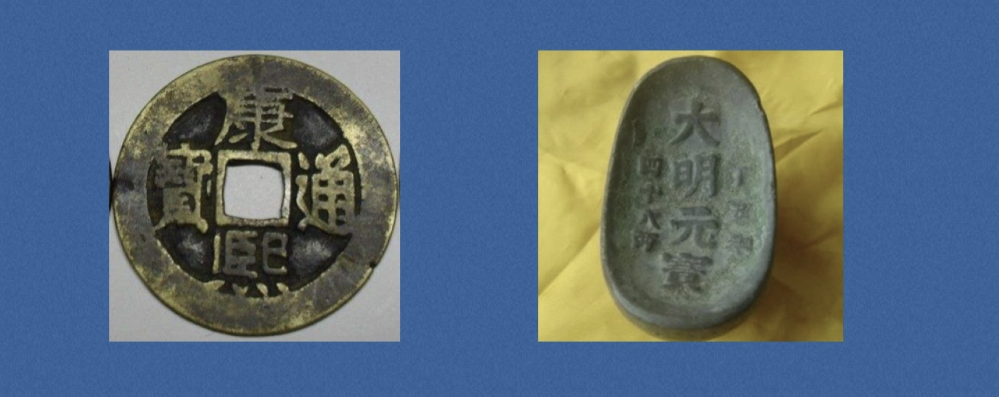
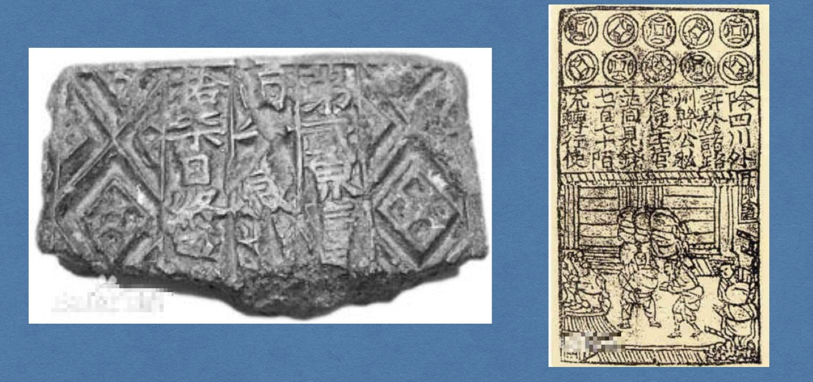
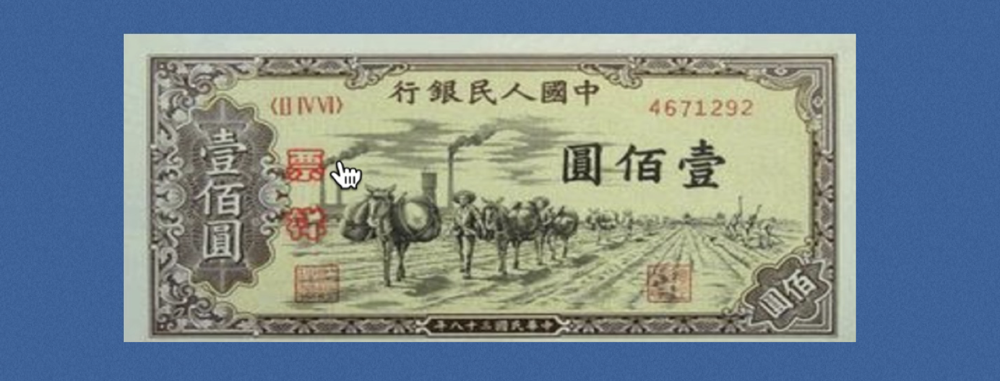

# 一、人类交易发展史

> 小白入门：https://github.com/dukedaily/solidity-expert ，欢迎star转发，文末加V入群。
>
> 职场进阶: https://dukeweb3.com

比特币是一个金融支付软件系统，目标是重塑金融秩序，为了能让大家更好地理解比特币，我们先了解一下先有的金融系统。

## 1.概述

## 2. 物物交换的时代

缺点：不方便携带，无法做大，无法有效分割，我想买只羊，我还要背两袋面去市场。

人民币符号：￥

## 3. 实物货币（自然货币）

使用有相当长的一段历史，是专门在物资与服务交换中充当等价物的特殊商品，是人们的商品价值观的物质附属物和符号附属物。稀有贝壳、石头等。

缺点：数量稀少耐磨损，供不应求。

钱相关汉字：==赚钱，贷款，贪，贫，赁，赐==

## 4. 传统货币（人工货币）

大自然已经满足不了我们了

商朝开始铸铜币，贝壳形状，秦始皇统一货币“秦半两”，确定外圆内方形状，汉朝后由中央统一铸币“汉五铢”。

### - 金属货币（称量货币）

早期的金属货币是块状的，使用时需要先用试金石测试其成色，同时还要秤量重量。随着人类文明的发展，逐渐建立了更加复杂而先进的货币制度。

缺点：重，供不应求，消耗金属

### - 纸币

由国家、政权、单位发行的一种有时限，有地域限制的货币。任何一种纸币都只能在某一时间，某一地区内流通。

北宋时贸易发达，货币供应不足，所以开始发行纸币。

世界上最早出现的纸币，是中国北宋时期四川成都的“[交子](https://baike.baidu.com/item/%E4%BA%A4%E5%AD%90)”。中国是世界上使用纸币最早的国家。

1948年12月1日，中国人民银行成立并发行[第一套人民币](https://baike.baidu.com/item/%E7%AC%AC%E4%B8%80%E5%A5%97%E4%BA%BA%E6%B0%91%E5%B8%81)

------

### - 电子货币

这是人类发明的最新的货币形式，比如，==银行卡==是其中最典型的代表。

### - 数字货币

见下节（比特币的诞生）

