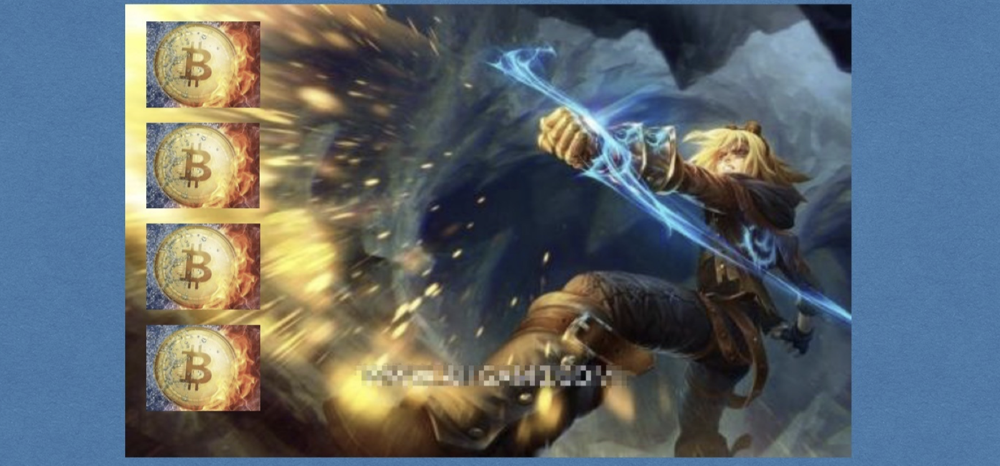

# 一、项目地图

> 小白入门：https://github.com/dukedaily/solidity-expert ，欢迎star转发，文末加V入群。
>
> 职场进阶: https://dukeweb3.com

# 二、纸币的风险

政府倒台、战乱、治理不力、经济危机等，导致通货膨胀

**津巴布韦货币（其他的国家也有，这个更有时代感）**

**购买力**，甜甜圈 vs 茶叶蛋

**幸福指数**，津巴布韦 vs 三胖

根本原因，直接原因

# 三、比特币诞生背景

## 1. 金融危机（靴子落地了）

2008年金融危机，财富缩水，人们政府失去丧失信心。美元是世界货币，全球金融海啸。

拜托政府对经济的控制意愿十分强烈，家属情绪不再稳定。

从心底喊出了那就口号：要么瘦，要么死！

NO！！！~~要么瘦，要么死~~

其实随着科技的发展，人们一直在思考，能不能不依赖政府？探寻解决方案，替代传统金融系统。

吃瓜群众（抗议，拉横幅，讨说法）觉醒之前，一群自由斗士深耕了很多年

## 2. 密码朋克组织（大拿群）

密码朋克组织（1993年），加密电子邮件系统，里面多是电脑黑客、密码学专家和追求隐私的狂热者，阿桑奇、万维网之父等人位列其中。

 密码朋克 vs 三点钟区块链群

在比特币之前已经有数个电子支付系统（**了解即可**）：

*  Ecash（1990年）：注重密码学网路支付系统，但是依赖中心化机构。
*  B-money（1998年）：是比特币的精神先导，但是未解决发行货币问题。
*  比特现金（2005年 ）：提出竞争数学难题，构建认证系统，但是他不会编程，无人响应。

这些谈说虽然没有成功，但是都对行业有这积极的推动作用，静候那个上天选中的美男子，驾着祥云拯救世界。

# 四、比特币诞生

## 1. 中本聪（Satoshi Nakamoto）

**中本聪：是时候表演真正的技术了！**，这一年中本聪正好等级到6，一个大招，刮出了一场金融革命。

- 2008年11月1日，中本聪在"==密码朋克=="题为《比特币：一种点对点式的电子现金系统》的论文，也就是我们所说的白皮书预览。

- 2009年1月3日发布了第一个版本的比特币客户端，[获得了第一批的50个比特币](https://www.blockchain.com/btc/block/000000000019d6689c085ae165831e934ff763ae46a2a6c172b3f1b60a8ce26f)，这标志着比特币金融体系的正式诞生。

## 2. 比特币客户端

[下载链接](https://bitcoin.org/en/bitcoin-core/)，详细使用请见`08-比特币核心.md`

它是个支付工具，所以有send和receive，后续详解

**注，加密技术、网络技术、共识算法,没有一个是中本聪发明的，他完成了技术融合，他是密码学里的“乔布斯”。**

# 六、疑问

比特币为何解决了传统货币带来的风险？

