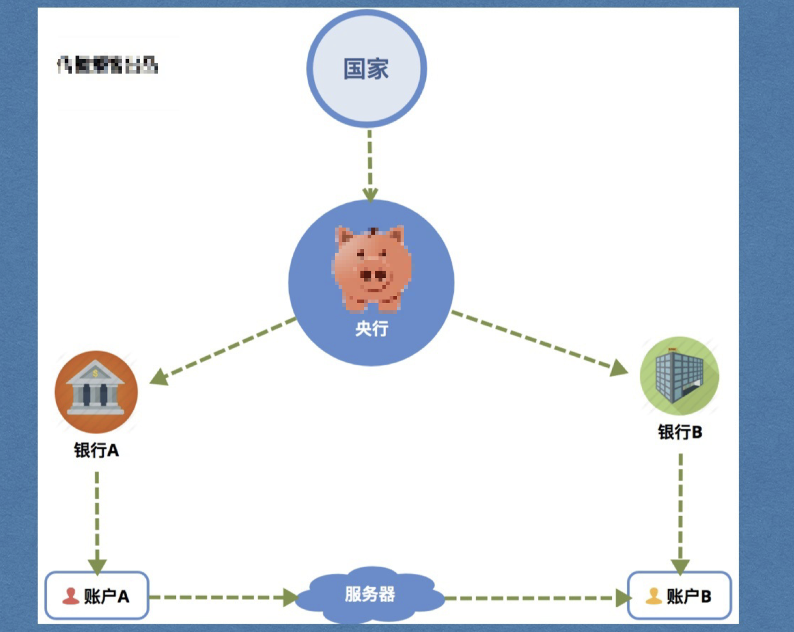
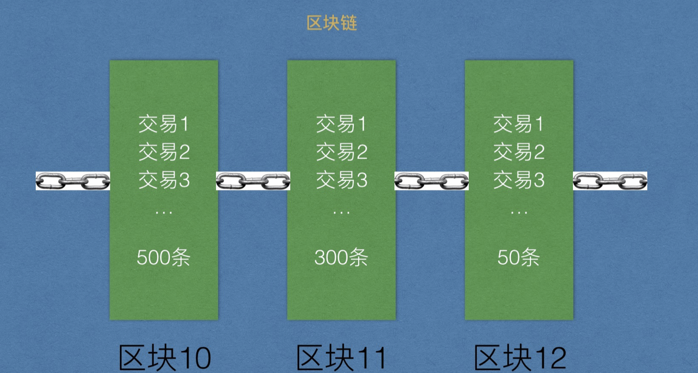
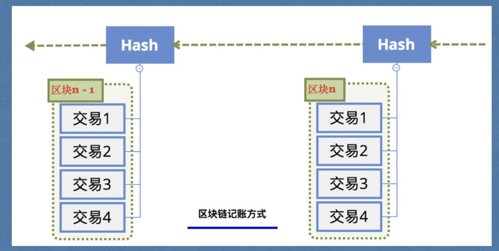
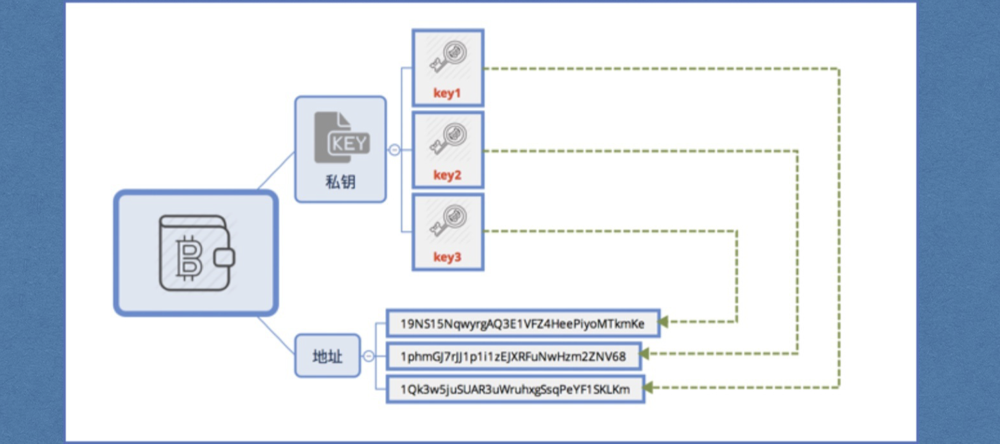
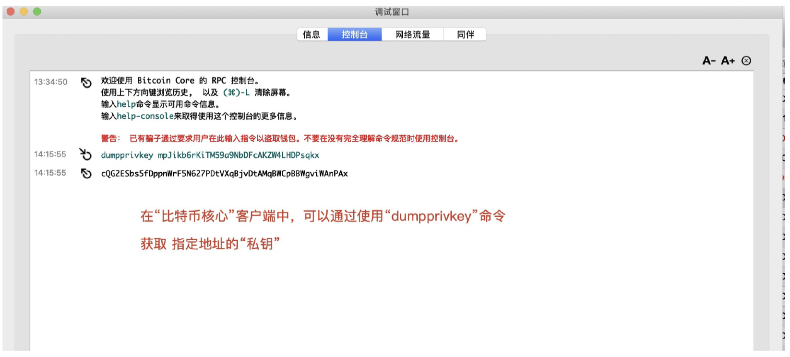
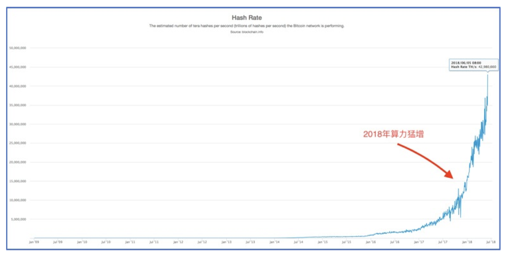
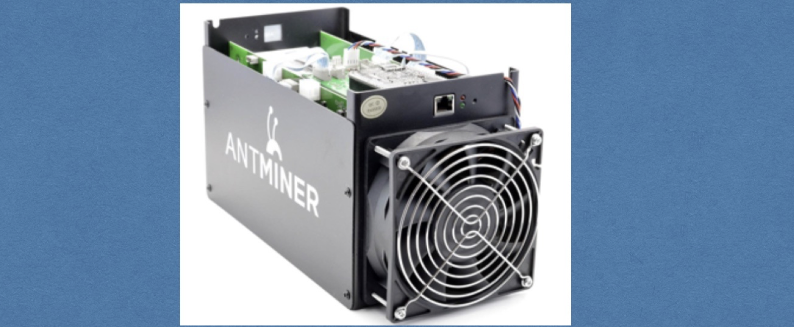
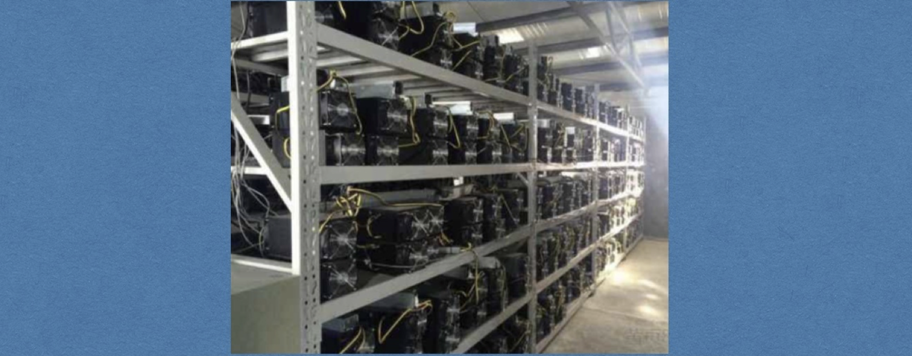
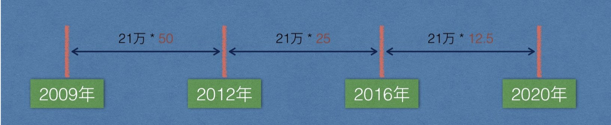

# 一、项目地图

> 小白入门：https://github.com/dukedaily/solidity-expert ，欢迎star转发，文末加V入群。
>
> 职场进阶: https://dukeweb3.com


## 1. 解答

比特币是一个软件，是一个电子支付系统，它安全可靠，解决了纸币被政府随意超发的问题，避免通货膨胀。


## 2. 那它是如何做到的？

想让人民做主，那就要避免有人手握重权！


#  二、中心化与去中心化

## 1. 中心化

寡头&垄断




单点故障问题

## 2. 去中心化

平等&互联

P2P（Peer To Peer）：端对端


   

# 三、为什么要去中心化

## 1. 去中心化到底能解决什么问题？

防篡改，更稳定可靠。

## 2. 如何实现去中心化

人手一个数据备份。你很重要，每个人都是主角（配角），主人翁精神

## 3. 去中心化跟比特币啥关系

比特币就是一个具有转账支付功能的功能的去中心化系统。


# 四、比特币

目前理解：比特币=区块链, Bitcoin : 底层技术， bitcoin：流转的数字


## 1. 概述

比特币系统就是一个软件系统，每个人都可以下载使用，使用者之间不断进行交易而产生交易数据，这些数据以数据块的形式保存，最终存储在一个数据库中，这个包含了交易数据的数据块我们叫做`区块`，这个保存所有区块的数据库我们叫做`区块链`


==直观理解：==

交易产生数据，数据存储在数据库中，它有自己存储结构，这个数据块叫做`区块`。

将所有的区块按照这个区块的哈希链接起来的链条，叫做区块链


关键词：数据，表，数据库，哈希，电话。



## 2. 基本信息

[比特币百度百科](https://baike.baidu.com/item/比特币/4143690?fr=aladdin)


早期 ：BTC coin (区块链)  bitcoin（比特币）

## 3. 记账

将系统中产生交易数据存储到数据库的过程，我们称之为`记账`。

### -  传统记账方式（黑车司机）


### - 比特币记账方式（地铁发车）

比特币系统规定一个数据块的大小上限为1M，一个数据块就是一个区块

**注，实际上是对区块头做哈希值，这里为了便于理解，后面详细介绍**

后一个区块里面存储前一个区块的哈希值（由区块本身做哈希生成的），我们就说后一个区块指向前区块（逻辑上的链接）



引入哈希值


## 4. 详细对比

| 对比项           | 传统记账                   | 比特币记账                                |
| ---------------- | -------------------------- | ----------------------------------------- |
| 交易记录存储位置 | 账单                       | 区块                                      |
| 记录集合         | 账本                       | 区块链                                    |
| 记账周期         | 写满了翻页（无论时间多久） | 10分钟翻页（无论交易多少， 容量有上限1M） |
| 记账人           | 老会计                     | 比特币客户端节点                          |
| 奖励             | 死工资                     | 记账奖励+手续费                           |
| 记账成本         | 鸵鸟蓝黑墨水               | 非常耗电/ 设备损耗                        |
| 账本数量         | 1本                        | 所有节点人手一本                          |


# 五、几个概念

## 1. 钱包


- 创建私钥公钥，保存私钥，相当于钱包，可以存放多个地址。


```sh
# 地址address：类似于钱包中不同的银行卡，2N7iL4hcMVQ2edktAwpkYQwQAha5EdsTAT8(由公钥生成)
# 私钥：类似于每张银行卡有一个密码,(私钥可以解开地址)
```
- 私钥-> 公钥-> 地址

- wallet.dat是真正的钱包，负责维护私钥和地址，但是一般把维护这个钱包的客户端，统称为钱包
- wallet.dat会自动帮助我们维护地址和私钥，保存好这个文件即可（如果有密码，一定要记住）

> **由于我们本地有wallet.dat文件，所以我们可以将私钥导出来， 导出的私钥格式为Wallet Import Format，简称WIF**
>
> WIF参考链接 : https://en.bitcoinwiki.org/wiki/Wallet_import_format
>


- 比特币转账，每次都会自动生成新的地址，从而隐藏自己的资产。



- **比特币钱包里面就是保护N个公钥/地址对**，每一个地址都有自己的私钥，wallet.dat就是私钥的集合。

- **助记词（以太坊阶段介绍）**

- 比特币核心钱包（Bitcoin Core）是官方发布的用于管理比特币私钥的客户端。拥有比特币地址的私钥代表拥有对应的比特币的控制权，私钥一旦丢失将无法恢复，因此，备份好钱包非常重要。

- 钱包客户端的钱包文件就是存储比特币私钥的数据库。私钥和公钥都 存放在比特币钱包的wallet.dat文件中。在多个地方安全地保管钱包文件可防止意外情况发生的时候恢复比特币。

```sh
# 钱包文件位置
#在文件管理器地址栏中输入： %appdata%，可以快速进入
Windows 7/8/10 - C:\Users\{username}\AppData\Roaming\Bitcoin\wallet.dat


Mac OS X ~/Library/Application Support/Bitcoin/wallet.dat
Linux ~/.bitcoin/wallet.dat
```

根据地址导出私钥：注意，地址是⽆法反推回私钥的，这⾥能取到私钥是因为wallet.dat中存储了私钥，通过地址访问了 私钥，⽽不是通过地址⽣成的




## 2. 账本

所有交易信息的集合，使用[levelDB](http://www.cnblogs.com/chenny7/p/4026447.html)数据库，每个节点都同步一个账本。


## 3. 节点（node）

每一个运行挖矿软件的人变成为一个区块链网络的节点。

* 轻节点（不下载所有的账本，只下载区块头，和自己有关的交易）==》 手机钱包是轻节点
* 全节点（强调是全指的是账本），查看当前总容量


## 4. 挖矿

> 抛出三个问题：1.谁负责记账，2.有什么好处，3.对系统有什么好处（发行货币，安全，一致）

上面说了将数据写到数据库操作叫做记账，那么具体由哪个节点进行记账呢？

* 节点间竞争记账权利的过程就叫做挖矿，竞争成功者获得记账的权利，即挖到矿。
* 每个人都想挖金矿，每个人都想挖比特币。但是有门槛，挖真实的需要有权限，有设备；挖比特币不需要权限，只需要有设备，有电力，但是全世界的一起挖，竞争激烈。
* 记账的过程会得到系统给的奖励。
* 这个过程类似于从一座矿山里从无到有的采集矿石，所以叫做挖矿。
* 挖矿过程就是比特币货币发行过程。
* 挖矿保证了系统的安全，公平的，不确定的。
* 每一个全节点都可以进行进行挖矿，成为矿工，挖矿的能力叫做算力。
* 本质：对区块数据做哈希运算，寻找一个满足条件的随机数。


挖矿举例，假设目标难度值为：0x003123412341234345345

1. sha256（区块100数据 + 1） - > 0x876987985986，大于 0x003123412341234345345， 不满足
2. sha256（区块100数据 + 2） - > 0x076987985986，大于0x003123412341234345345， 不满足，
3.  sha256（区块100数据 + 3） - > 0x000987985986，大于0x003123412341234345345， 不满足
4. .....
5.  sha256（区块100数据 + N） - > 0x0027985986 ，小于0x003123412341234345345， 满足条件， 挖矿成功
6. **N **就是我们挖矿要找的数据，N是一个随机数。


小结：

1. **谁负责记账**？ 所有的节点都可以记账，竞争记账权利的过程叫做挖矿

2. **挖矿好处？ **获得系统奖励，等到2140年比特币全部挖完的时候，靠手续费来激励。

3. **对比特币系统有什么好处？**
   1. 发行货币
   2. 保证账本的一致性
   3. 安全，避免了人为的篡改


## 5. 区块链演示

直观地看一下区块链的效果，了解区块是怎样被有效、安全地连在一起的。

> 挖矿：对区块数据做哈希运算，寻找一个随机数（稍后详解）

（主）https://anders.com/blockchain/tokens.html

（辅）https://blockchaindemo.io/


## 6. 算力

1P=1024T，1T=1024G，1G=1024M，1M=1024k

算力即计算能力，表明一个矿工挖矿能力的，算力越大算出哈希值的概率越高

单位为hash/s,即每秒计算哈希的次数，例如：14T的算力的矿机，每秒计算哈希次数为1.4 * 10^13，目前算力为 4.3 * 10^7 TH/s，即每秒运算次数为 ：4.3 * 10^20，这是全网的算力



## 7. 矿机

CPU挖矿-》GPU挖矿-》FPGA挖矿-》ASIC挖矿(专业矿机)

[比特币大陆执行董事，26岁，34亿，90后新首富](https://mp.weixin.qq.com/s/tWxFPJe0KURGAYBx2fOWIw)



## 8. 矿场



## 8. 矿池

一个软件，矿场和普通矿工接入，矿池负责打包，接入的设备负责挖矿，按照贡献算力的比例来来分配收益。

gminer软件


## 9. 小结

1. 钱包：保存私钥的文件（现在通常把客户端也直接统称为钱包，因为客户端会帮忙维护钱包文件）
2. 节点：比特币客户端（手机端，PC端）
3. 账本：记录交易数据的数据库
4. 挖矿：计算迷题获得奖励


# 六、比特币系统的参数

## 1. 出块时间

- 10分钟左右出块，系统根据当前出块时间动态调整难度值（**每2016个块调整一次，2周**），使得时间稳定在10分钟左右。包括同步时间，校验时间，计算时间等。

- 如果不控制10分钟产生一个区块，那么比特币就不能保证稳定的发行，秩序就会混乱！

- ==安全性和适用性的权衡==，太快容易同时出块（分叉，后面介绍），需要频繁的处理，太慢影响使用体验。


## 2. 出块奖励

最初50BTC，每21万个块奖励减半，10分钟，21 万 * 10分钟/60 / 24小时/ 365 = 4年，4年奖励衰减一次，当前奖励为12.5BTC



## 3. 比特币总量

2100万，2140年挖完（snappy截图对照）

```go
func main() {

	total := 0.0        // 比特币总数
	rewardCount := 50.0 // 奖励 BTC 的数量
	blockInterval := 21 // 区块间隔，单位万

	for rewardCount > 0 {
		// 在区块间隔内，统一奖励（生成）rewardCount 个比特币
        // 类型转换
		sum := float64(blockInterval) * rewardCount
		total += sum

		// 每挖到 21w 个矿，奖励减半
		rewardCount *= 0.5

	}

    fmt.Printf("比特币总数：%f 万\n", total)
}
```

## 4. 区块容量

考虑同步效率

1M大约容纳4000条交易： （已经扩容）

1M / 每笔交易的字节 = 交易数（1024 * 1024 / 223 = 4200)

## 5. 每秒成交量

4200 / 600s = 7笔/秒

## 6. 单位

1BTC = 10**8sat(聪)


