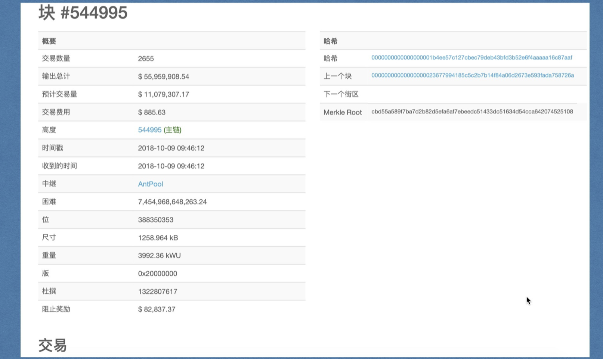
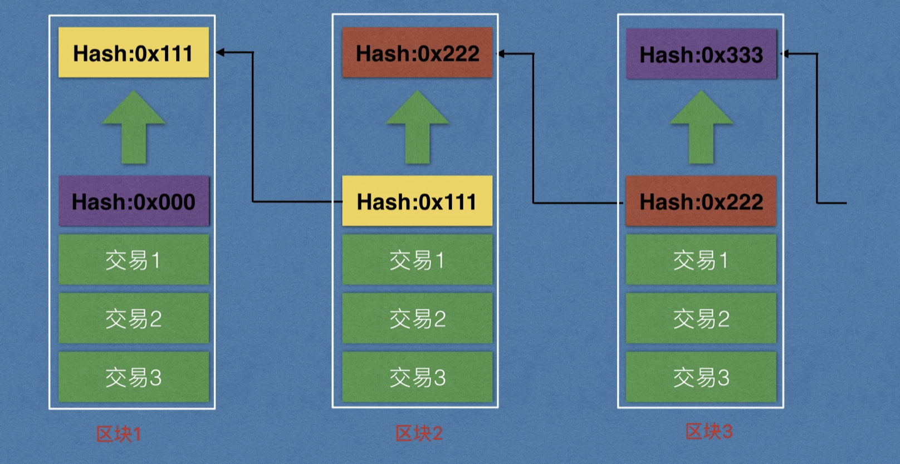
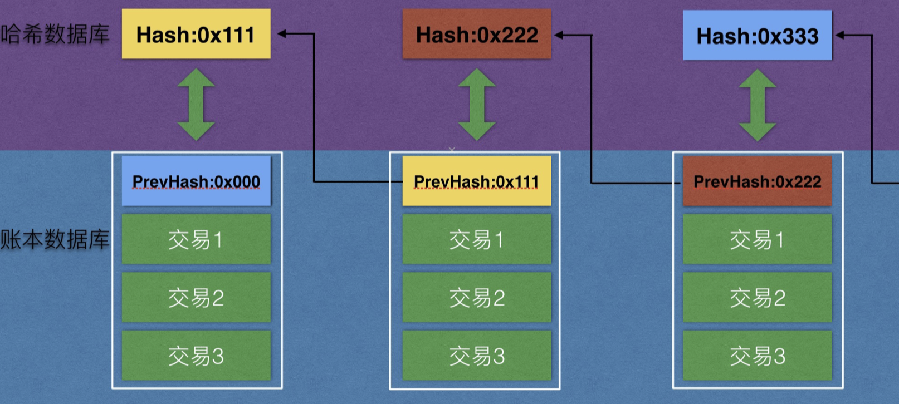

# 一、项目地图

> 小白入门：https://github.com/dukedaily/solidity-expert ，欢迎star转发，文末加V入群。
>
> 职场进阶: https://dukeweb3.com

# 二、区块结构

**注意：比特币的区块大小目前被严格限制在1MB以内。4字节的区块大小字段不包含在此内。**

## 1. 区块头（Block Header）

真实截图

**注意:区块不存储hash值，节点接收区块后独立计算并存储在本地** ，之前介绍：

现在：

## 2. 区块体（Transactions）

### - Coinbase交易

第一条交易，挖矿奖励矿工。永远是第一条，没有输入（钱的来源），只有输出（钱的流向）

### - 普通转账交易

input:输入，表明钱的来源

output:输出，表明钱的流向

每笔交易包括付款方、收款方、付款金额、手续费等等。

### - 区块完整图示

梅克尔根

### - 创世块信息

### - bitcoin-cli查看

