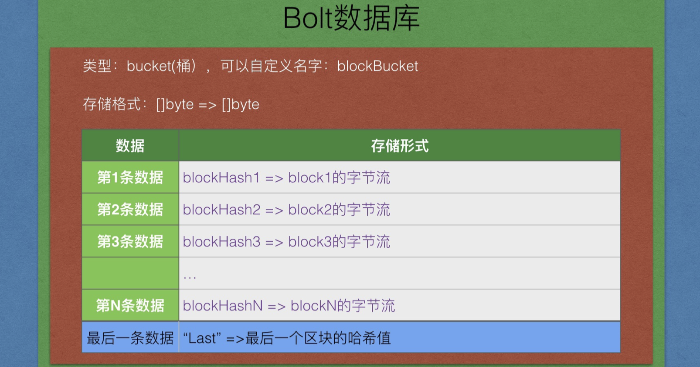
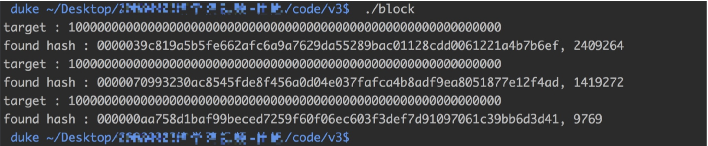
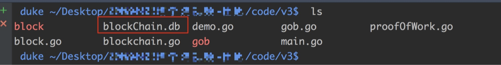
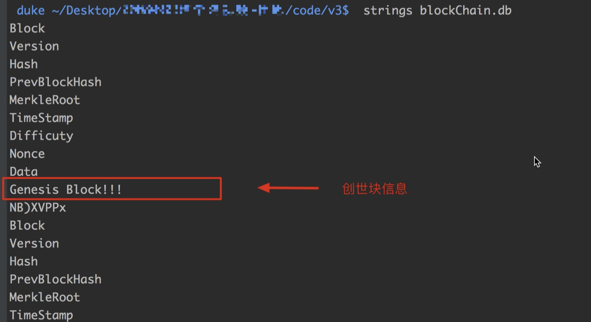
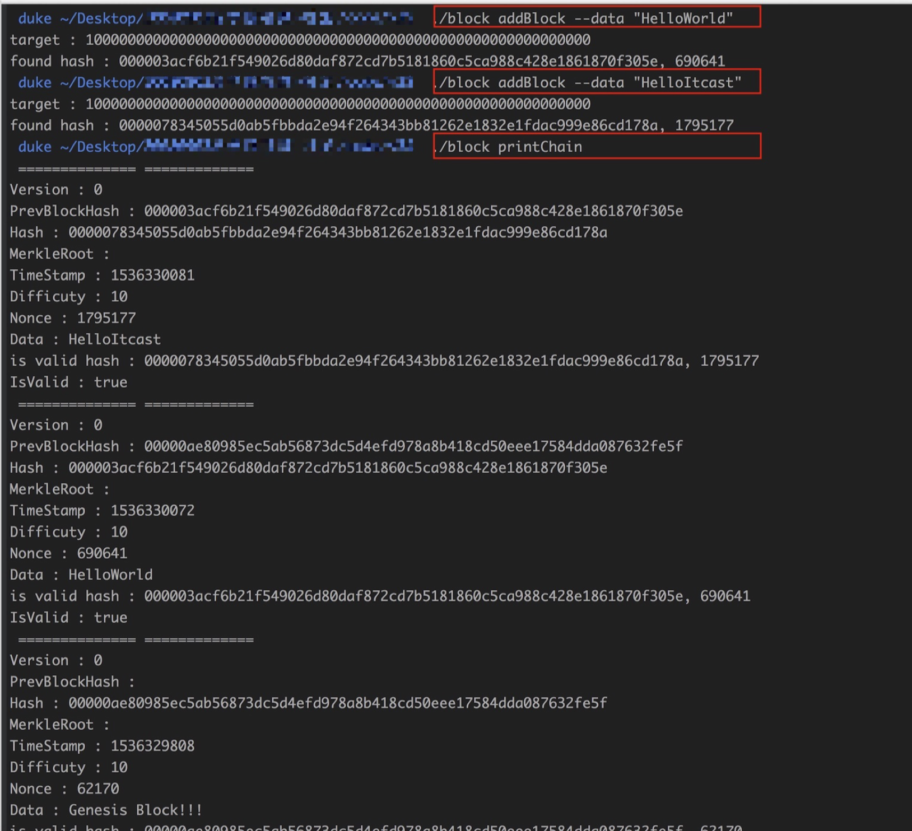

# 概述

> 小白入门：https://github.com/dukedaily/solidity-expert ，欢迎star转发，文末加V入群。
>
> 职场进阶: https://dukeweb3.com

##  1. 当前版本问题

- 区块在内存中，每次程序执行完就释放，无法重用

- 创建区块不灵活，在main中写死的，无法随意添加区块

## 2. V3版本思路

- bolt数据库的介绍，轻量级的、开源的，key->value进行读取

- BlockChain结构重写，使用数据库代替数组

- NewBlockChain函数重写，由对数组操作改写成对数据库操作，创建数据库

- AddBlock函数重写，对数据库的读取和写入

- 打印数据，对数据库的遍历（迭代器Iterator）

- 命令行介绍及编写、添加区块命令、打印区块链命令、创建区块链（可选）


# 一、BoltDB介绍

## 1. 概述


每个抽屉相当于一个存储位置，每个抽屉在bolt中的类型为bucket（桶），我们在bucket层面操作数据。


## 2. demo演示

下载[bolt](https://github.com/boltdb/bolt.git)数据库，放在GOPATH目录下

创建文件boltDemo.go，填写如下内容：

```go
package main

import (
	"bolt"
	"os"
	"fmt"
)

func main() {

	//1. 打开数据库
	db, err := bolt.Open("test.db", 0600, nil)

	if err != nil {
		fmt.Println("bolt.Open failed!", err)
		os.Exit(1)
	}

	//2.写数据库
	db.Update(func(tx *bolt.Tx) error {
		bucket := tx.Bucket([]byte("firstBucket"))

		var err error
		if bucket == nil {
			bucket, err = tx.CreateBucket([]byte("firstBucket"))
			if err != nil {
				fmt.Println("createBucket failed!", err)
				os.Exit(1)
			}
		}

		bucket.Put([]byte("aaaa"), []byte("HelloWorld!"))
		bucket.Put([]byte("bbbb"), []byte("HelloItcast!"))
		return nil
	})

	//3.读取数据库
	var value []byte

	db.View(func(tx *bolt.Tx) error {
		bucket := tx.Bucket([]byte("firstBucket"))
		if bucket == nil {
			fmt.Println("Bucket is nil!")
			os.Exit(1)
		}

		value = bucket.Get([]byte("aaaa"))
		fmt.Println("aaaa => ", string(value))
		value = bucket.Get([]byte("bbbb"))
		fmt.Println("bbbb => ", string(value))

		return nil
	})
}
```

编译执行：

```
go build -o boltDemo boltDemo.go
./boltDemo
```


## 3.分析

存储区块，使用的key必须唯一，所以使用区块的hash值作为key，block的字节流作为value。

具体存储格式：



添加一个新区块要做两件事情：

* 添加区块
* 更新”last“ 这个key对应的值，这个值就是最后一个区块的哈希值，用于新区块的创建添加。


# 二、改写BlockChain结构

```go
//使用bolt改写
type BlockChain struct {
	//操作数据库的句柄
	db *bolt.DB

	//尾巴，存储最后一个区块的哈希
	tail []byte
}
```


# 三、改写NewBlockChain

## 1. 分析

```go
//- 提供一个创建BlockChain的方法
func NewBlockChain() *BlockChain {

	var db *bolt.DB
	var lastHash []byte

	/*
	1. 打开数据库(没有的话就创建)
	2. 找到抽屉（bucket），如果找到，就返回bucket，如果没有找到，我们要创建bucket，通过名字创建
		a. 找到了
			1. 通过"last"这个key找到我们最好一个区块的哈希。

		b. 没找到创建
			1. 创建bucket，通过名字
			2. 添加创世块数据
			3. 更新"last"这个key的value（创世块的哈希值）
	*/

	return &BlockChain{db, lastHash}
}

```

## 2. 代码

1. 确定好返回的两个数据
2. 文字分析步骤
3. 先处理bucket存在逻辑
4. 再处理bucket创建逻辑
5. 不要从boltTest复用代码，重新敲一遍

```go
//- 提供一个创建BlockChain的方法
func NewBlockChain() *BlockChain {

	var lastHash []byte

	/*
	1. 打开数据库(没有的话就创建)
	2. 找到抽屉（bucket），如果找到，就返回bucket，如果没有找到，我们要创建bucket，通过名字创建
		a. 找到了
			1. 通过"last"这个key找到我们最好一个区块的哈希。

		b. 没找到创建
			1. 创建bucket，通过名字
			2. 添加创世块数据
			3. 更新"last"这个key的value（创世块的哈希值）

	*/

	db, err := bolt.Open(blockChainDb, 0600, nil)

	if err != nil {
		fmt.Println("bolt.Open failed!", err)
		os.Exit(1)
	}


	db.Update(func(tx *bolt.Tx) error {
		bucket := tx.Bucket([]byte(blockBucket))

		var err error
		//如果是空的，表明这个bucket没有创建，我们就要去创建它，然后再写数据。
		if bucket == nil {
			bucket, err = tx.CreateBucket([]byte(blockBucket))
			if err != nil {
				fmt.Println("createBucket failed!", err)
				os.Exit(1)
			}

			//抽屉准备好了，开始写区块数据，区块哪里来？？
			genesisBlock := NewBlock("Genesis Block!!!", []byte{})

			bucket.Put(genesisBlock.Hash, genesisBlock.toByte()/*block的字节流！*/) //TODO
			bucket.Put([]byte(last), genesisBlock.Hash)

			//这个别忘了，我们需要返回它
			lastHash = genesisBlock.Hash
			return nil

		//抽屉已经存在，直接读取即可
		} else {
			//获取最后一个区块的哈希
			lastHash = bucket.Get([]byte(last))
		}

		return nil
	})

	return &BlockChain{db, lastHash}
}
```


# 四、序列化/反序列化

## 1.序列化

当交易通过网络传输或在应用程序之间交换时，它们被序列化。 序列化是将内部的数据结构表示转换为可以一次发送一个字节的格式（也称为字节流）的过程。 序列化最常用于编码通过网络传输或用于文件中存储的数据结构。 

## 2.反序列化

从交易的字节流表示转换为函数库的内部数据结构表示的过程称为反序列化或交易解析。转换回字节流以通过网络传输、哈希化（hashing）或存储在磁盘上的过程称为序列化。大多数比特币函数库具有用于交易序列化和反序列化的内置函数。

## 3.gob包介绍

binary.Write(), binary.Read()

gob是Golang包自带的一个数据结构序列化的编码/解码工具。编码使用Encoder，解码使用Decoder。一种典型的应用场景就是RPC(remote procedure calls)。

gob和json的pack之类的方法一样，由发送端使用Encoder对数据结构进行编码。在接收端收到消息之后，接收端使用Decoder将序列化的数据变化成本地变量。

- [中文参考链接](http://www.cnblogs.com/yjf512/archive/2012/08/24/2653697.html)
- [官方链接](https://golang.org/pkg/encoding/gob/)

## 4.demo演示

- 定义一个结构Person
- 使用gob进行序列化（编码）得到字节流
- 使用gob进行反序列化（解码）得到Person结构
- **记住，这里所有的结构都用地址传递即可**

```go
package main

import (
	"encoding/gob"
	"bytes"
	"fmt"
)

type Person struct {
	//大写
	Name string
	Age int
}

func main()  {
	var buffer bytes.Buffer
	encoder := gob.NewEncoder(&buffer)

	lily := Person{ "Lily", 28}

	err := encoder.Encode(&lily)
	if err != nil {
		fmt.Println("encode failed!", err)
	}

	fmt.Println("after serialize :", buffer)
	var LILY Person

	decoder := gob.NewDecoder(&buffer)
	err = decoder.Decode(&LILY)
	if err != nil {
		fmt.Println("decode failed!", err)
	}

	fmt.Println(LILY)
}
```

## 5.Serialize函数

```go
/序列化:将结构转化成字节流，在网络上按字节传输。
func (block *Block)Serialize() []byte {
	//将block数据转换成字节流

	var buffer bytes.Buffer
	//创建一个编码器
	encoder := gob.NewEncoder(&buffer)

	//编码，将block编码成buffer
	err := encoder.Encode(block)

	if err != nil {
		fmt.Println("encode failed!", err)
		os.Exit(1)
	}

	return buffer.Bytes()
}
```


## 6.Deserialize函数

```go
// 反序列化:将接受到的字节流转换成目标结构。
func Deserialize(data []byte) Block {
	var block Block
	var buffer bytes.Buffer

	//将data写入buffer
	_, err := buffer.Write(data)
	if err != nil {
		fmt.Println("buffer.Read failed!", err)
		os.Exit(1)
	}

	//创建decoder
	decoder := gob.NewDecoder(&buffer)

	//将buffer数据转换成block
	err = decoder.Decode(&block)
	if err != nil {
		fmt.Println("decode failed!", err)
        os.Exit(1)
	}

	return block
}
```


# 五、改写AddBlock

记得两件事，put数据，更新lastHash

## 1. 代码

```go
func (bc *BlockChain)AddBlock(data string)  {

	/*
	//获取最后一个区块
	lastBlock := bc.blocks[len(bc.blocks) -1]
	//获取最后一个区块的哈希,作为最新（当前）区块的前哈希
	prevHash := lastBlock.Hash

	block := NewBlock(data, prevHash)
	bc.blocks = append(bc.blocks, &block)
	*/

	//获取最后区块的哈希值
	lastBlockHash := bc.tail

	//创建新区块
	newBlock := NewBlock(data, lastBlockHash)


	bc.db.Update(func(tx *bolt.Tx) error {
		bucket := tx.Bucket([]byte(blockBucket))

		//如果是空的，表明这个bucket没有创建，我们就要去创建它，然后再写数据。
		if bucket == nil {
			fmt.Println("bucket should not be nil!!")
			os.Exit(1)
		} else{
			//添加区块
			bucket.Put(newBlock.Hash, newBlock.toByte()/*block的字节流！*/) //TODO
			//更新最后区块的哈希值
			bucket.Put([]byte(last), newBlock.Hash)

			//这个别忘了，我们需要返回它
			bc.tail = newBlock.Hash
			return nil
		}
		return nil
	})
}
```


# 六、第一次测试

## 1. 修改main.go

将main函数中的打印部分去掉

```go
package main

func main() {

	bc := NewBlockChain()
	bc.AddBlock("HelloWorld!")
	bc.AddBlock("Hello Itcast!")
	bc.AddBlock("Hello i11111!")
	//block的数组
	/*
	for index, block := range bc.blocks {
		fmt.Println(" ============== current block index :", index)
		fmt.Printf("Version : %d\n", block.Version)
		fmt.Printf("PrevBlockHash : %x\n", block.PrevBlockHash)
		fmt.Printf("Hash : %x\n", block.Hash)
		fmt.Printf("MerkleRoot : %x\n", block.MerkleRoot)
		fmt.Printf("TimeStamp : %d\n", block.TimeStamp)
		fmt.Printf("Difficuty : %d\n", block.Difficuty)
		fmt.Printf("Nonce : %d\n", block.Nonce)
		fmt.Printf("Data : %s\n", block.Data)
		pow := NewProofOfWork(*block)
		fmt.Printf("IsValid : %v\n", pow.IsValid())
	}
	*/
}
```


## 2. 编译执行

```
go build *.go
./block
```

## 3. 执行结果



查看当前目录文件，看到数据库文件：



这是个二进制文件，无法直接打开，锁门使用`strings`命令简单查看一下数据库的内容（后面会详解）

**注，strings能够简单查看一些二进制文件，windows没有该命令**



如果显示如上信息，那么说明写入数据库成功，恭喜你！


# 五、迭代器

迭代器作用：遍历容器，将数据逐个返回，防止一次性加载到内存，所以一点一点读取。

类比：for循环里面range


我们的区块链迭代器图示，最初指向最后一个区块，返回区块，指针前移，直至第一个区块。


## 0. bolt自带迭代器

**特点：bolt内部使用key的大小进行自动排序，而不是按照插入顺序排序，所以不适用我们的区块打印**

**请自行验证遍历key打印输出**，代码如下

```js
func (bc *BlockChain) Printchain() {

	bc.db.View(func(tx *bolt.Tx) error {
		// Assume bucket exists and has keys
		b := tx.Bucket([]byte("blockBucket"))

		//从第一个key-> value 进行遍历，到最后一个固定的key时直接返回
		b.ForEach(func(k, v []byte) error {
			if bytes.Equal(k, []byte("LastHashKey")) {
				return nil
			}

			block := Deserialize(v)
			//fmt.Printf("key=%x, value=%s\n", k, v)
			fmt.Printf("===========================\n\n")
			fmt.Printf("版本号: %d\n", block.Version)
			fmt.Printf("前区块哈希值: %x\n", block.PrevHash)
			fmt.Printf("梅克尔根: %x\n", block.MerkelRoot)
			fmt.Printf("时间戳: %d\n", block.TimeStamp)
			fmt.Printf("难度值(随便写的）: %d\n", block.Difficulty)
			fmt.Printf("随机数 : %d\n", block.Nonce)
			fmt.Printf("当前区块哈希值: %x\n", block.Hash)
			fmt.Printf("区块数据 :%s\n", block.Data)
			return nil
		})
		return nil
	})
}
```


## 1. 定义迭代器结构

我们自定义迭代器，实现区块遍历，决堤步骤：创建文件BlockChainIterator.go，添加如下代码：

```go
//1. 定义一个区块链迭代器的结构
type BlockChainIterator struct {
	db *bolt.DB
	
	//指向当前的区块
	current_point []byte 
}
```


## 2. 定义迭代器创建函数

```go
func NewBlockChainIterator(bc *BlockChain) BlockChainIterator {

	var it BlockChainIterator

	it.db = bc.db
	it.current_point = bc.tail

	return it
}
```

## 3. 定义迭代器访问函数

```go
//一般叫Next(),迭代器的访问函数
func (it *BlockChainIterator)GetBlockAndMoveLeft() Block {
	var block Block
	//1. 获取block
	it.db.View(func(tx *bolt.Tx) error {
		bucket := tx.Bucket([]byte(blockBucket))

		//如果是空的，报错。
		if bucket == nil {
			fmt.Println("bucket should not be nil!!")
			os.Exit(1)
		} else{

			//根据当前的current_pointer获取block
			//这是一个字节流，需要反序列化
			current_block_tmp := bucket.Get(it.current_point)
			//fmt.Println("current_block_tmp : ", current_block_tmp)
			current_block := Deserialize(current_block_tmp)

			//这就拿到了我们想要的区块数据，准备返回
			block = current_block

			//将游标（指针）左移
			//2. 向左移动
			it.current_point = current_block.PrevBlockHash
		}
		return nil
	})


	return block

```

## 4. 调用迭代器访问函数

直接讲下面的代码替换原main.go内容

```go
package main

import "fmt"

func main() {

	bc := NewBlockChain()
	bc.AddBlock("HelloWorld!")
	bc.AddBlock("Hello Itcast!")
	bc.AddBlock("Hello i11111!")

	//定义迭代器
	it := NewBlockChainIterator(bc)

	for {
		//调用迭代器访问函数，返回当前block，并且向左移动
		block := it.GetBlockAndMoveLeft()

		fmt.Println(" ============== =============")
		fmt.Printf("Version : %d\n", block.Version)
		fmt.Printf("PrevBlockHash : %x\n", block.PrevBlockHash)
		fmt.Printf("Hash : %x\n", block.Hash)
		fmt.Printf("MerkleRoot : %x\n", block.MerkleRoot)
		fmt.Printf("TimeStamp : %d\n", block.TimeStamp)
		fmt.Printf("Difficuty : %d\n", block.Difficuty)
		fmt.Printf("Nonce : %d\n", block.Nonce)
		fmt.Printf("Data : %s\n", block.Data)
		pow := NewProofOfWork(block)
		fmt.Printf("IsValid : %v\n", pow.IsValid())

		//终止条件
		if len(block.PrevBlockHash)  == 0 {
			fmt.Println("print over!")
			break
		}
	}
}
```

# 七、第二次测试

## 1. 编译执行

```
go build *.go
./block
```

## 2. 执行结果

```go
duke ~/Desktop/code/v3$  ./block 
target : 100000000000000000000000000000000000000000000000000000000000
found hash : 00000d36d024711a949b9779e4d43a2a18a0707654f491a0f41840ad87f849d8, 3209217
target : 100000000000000000000000000000000000000000000000000000000000
found hash : 00000b552da1df46e5a7e39768b7d34bac2126ac4c0daec840d1e5656e412b3c, 1409047
target : 100000000000000000000000000000000000000000000000000000000000
found hash : 0000054ee9bd49cebe27eaf5ae23c77ba4640c14248814efa0b6323631a0dd9e, 1086036
target : 100000000000000000000000000000000000000000000000000000000000
found hash : 00000a6fddea8ef13c319882077606ae5c27e6ce8c62fb6f2ea2da818f6b8488, 580415
 ============== =============
Version : 0
PrevBlockHash : 0000054ee9bd49cebe27eaf5ae23c77ba4640c14248814efa0b6323631a0dd9e
Hash : 00000a6fddea8ef13c319882077606ae5c27e6ce8c62fb6f2ea2da818f6b8488
MerkleRoot : 
TimeStamp : 1536323781
Difficuty : 10
Nonce : 580415
Data : Hello i11111!
is valid hash : 00000a6fddea8ef13c319882077606ae5c27e6ce8c62fb6f2ea2da818f6b8488, 580415
IsValid : true
 ============== =============
Version : 0
PrevBlockHash : 00000b552da1df46e5a7e39768b7d34bac2126ac4c0daec840d1e5656e412b3c
Hash : 0000054ee9bd49cebe27eaf5ae23c77ba4640c14248814efa0b6323631a0dd9e
MerkleRoot : 
TimeStamp : 1536323780
Difficuty : 10
Nonce : 1086036
Data : Hello Itcast!
is valid hash : 0000054ee9bd49cebe27eaf5ae23c77ba4640c14248814efa0b6323631a0dd9e, 1086036
IsValid : true
 ============== =============
Version : 0
PrevBlockHash : 00000d36d024711a949b9779e4d43a2a18a0707654f491a0f41840ad87f849d8
Hash : 00000b552da1df46e5a7e39768b7d34bac2126ac4c0daec840d1e5656e412b3c
MerkleRoot : 
TimeStamp : 1536323778
Difficuty : 10
Nonce : 1409047
Data : HelloWorld!
is valid hash : 00000b552da1df46e5a7e39768b7d34bac2126ac4c0daec840d1e5656e412b3c, 1409047
IsValid : true
 ============== =============
Version : 0
PrevBlockHash : 
Hash : 00000d36d024711a949b9779e4d43a2a18a0707654f491a0f41840ad87f849d8
MerkleRoot : 
TimeStamp : 1536323775
Difficuty : 10
Nonce : 3209217
Data : Genesis Block!!!
is valid hash : 00000d36d024711a949b9779e4d43a2a18a0707654f491a0f41840ad87f849d8, 3209217
IsValid : true
print over!
```

至此，对于数据库的操作已经全部完成，接下来就是去添加命令行，休息一会，喝杯茶吧。


# 八、命令行

创建命令行文件，填入如下代码，代码比较简单，请仔细分析。

另，这里的实现有些笨重，比如需要反复自己解析os.Args数据，后面版本可以使用flag模块进行优化。

```go
package main

import (
	"os"
	"fmt"
)

type CLI struct {
	bc *BlockChain
}

const Usage = `
	./blockchain addBlock --data DATA "add a block"
	./blockchain printChain "print block Chain"
`

func (cli *CLI) Run() {
	if len(os.Args) < 2 {
		fmt.Println(Usage)
		os.Exit(1)
	}

	cmd := os.Args[1]

	switch cmd {
	case "addBlock":
		if len(os.Args) > 3 && os.Args[2] == "--data" {
			data := os.Args[3]
			if data == "" {
				fmt.Println("data should not be empty!")
				os.Exit(1)
			}
			cli.addBlock(data)
		} else {
			fmt.Println(Usage)
		}
	case "printChain":
		cli.printChain()
	default:
		fmt.Println(Usage)
	}
}

func (cli *CLI)addBlock(data string)  {
	cli.bc.AddBlock(data)
}

func (cli *CLI)printChain()  {

	//定义迭代器
	it := NewBlockChainIterator(cli.bc)
	for {

		block := it.GetBlockAndMoveLeft()

		fmt.Println(" ============== =============")
		fmt.Printf("Version : %d\n", block.Version)
		fmt.Printf("PrevBlockHash : %x\n", block.PrevBlockHash)
		fmt.Printf("Hash : %x\n", block.Hash)
		fmt.Printf("MerkleRoot : %x\n", block.MerkleRoot)
		fmt.Printf("TimeStamp : %d\n", block.TimeStamp)
		fmt.Printf("Difficuty : %d\n", block.Difficuty)
		fmt.Printf("Nonce : %d\n", block.Nonce)
		fmt.Printf("Data : %s\n", block.Data)
		pow := NewProofOfWork(block)
		fmt.Printf("IsValid : %v\n", pow.IsValid())


		if len(block.PrevBlockHash)  == 0 {
			fmt.Println("print over!")
			break
		}
	}
}

```

修改main.go如下，主函数只做基本的调用，其余的都由命令行类进行调度即可，这符合模块化编程。

```go
package main

func main() {
	bc := NewBlockChain()
	cli := CLI{bc}
	cli.Run()
}
```

# 九、第三次测试

编译执行同上。

执行效果如下：

```shell
 duke ~/Desktop/code/v3$  ./block 

        addBlock --data DATA "add a block"
        printChain "print block Chain"
```

如果数据库文件不存在，程序会先进行数据库创建，即进行一次挖矿，如下：

```go
 duke ~/Desktop/code/v3$  ./block 
target : 100000000000000000000000000000000000000000000000000000000000
found hash : 00000ae80985ec5ab56873dc5d4efd978a8b418cd50eee17584dda087632fe5f, 62170

        addBlock --data DATA "add a block"
        printChain "print block Chain"
```

==我们后面会把创建数据库操作也放到命令中去控制。==

## 1. 命令测试




# 十、添加创建数据库命令

我们来看NewBlockChain这个函数，它其实是有两个功能

* 数据库不存在时，创建数据库，并返回当前区块链的一个对象，以便后面操作。

* 当数据库存在时，直接返回区块链对象，以便后续操作。


如果想实现用命令行创建数据库，那么这两个必须分开成两个函数，分别实现上述的两个功能


## 1. 创建区块链函数NewBlockChain

只负责创建，然后便退出程序。

```go
//- 提供一个创建BlockChain的方法
func NewBlockChain(address string) *BlockChain {  //<<---添加了创建人的地址，后面会用到
	var lastHash []byte

	db, err := bolt.Open(blockChainDb, 0600, nil)

	if err != nil {
		fmt.Println("bolt.Open failed!", err)
		os.Exit(1)
	}

	db.Update(func(tx *bolt.Tx) error {
		bucket := tx.Bucket([]byte(blockBucket))

		var err error
		bucket, err = tx.CreateBucket([]byte(blockBucket))
		if err != nil {
			fmt.Println("createBucket failed!", err)
			os.Exit(1)
		}

		//抽屉准备好了，开始写区块数据，区块哪里来？？
		genesisBlock := NewBlock("Genesis Block!!!", []byte{})

		bucket.Put(genesisBlock.Hash, genesisBlock.Serialize() /*block的字节流！*/)
		bucket.Put([]byte(last), genesisBlock.Hash)

		//这个哈希此时是没有用的
		lastHash = genesisBlock.Hash
		return nil
	})

	//还是要返回一个实例，便于关闭数据库
	return &BlockChain{db, lastHash}
}
```


## 2. 获取区块链对象的函数

函数名字为：GetBlockChainObj调用这个方法时，确保区块链已经创建

```go
//获取一个区块链实例
func GetBlockChainObj() *BlockChain {

	var lastHash []byte
	db, err := bolt.Open(blockChainDb, 0600, nil)

	if err != nil {
		fmt.Println("bolt.Open failed!", err)
		os.Exit(1)
	}

	db.View(func(tx *bolt.Tx) error {
		bucket := tx.Bucket([]byte(blockBucket))

		var err error
		if bucket == nil {
			fmt.Println("bucket should not be nil!", err)
			os.Exit(1)

		}

		//抽屉已经存在，直接读取即可
		//获取最后一个区块的哈希
		lastHash = bucket.Get([]byte(last))
		return nil
	})

	return &BlockChain{db, lastHash}
}
```

## 3. 添加数据库文件检查函数

如果文件存在就不用创建，如果文件未创建请先创建。

```go
func dbExists() bool {
	if _, err := os.Stat(blockChainDb); os.IsNotExist(err) {
		return false
	}

	return true
}
```


在NewBlockChain中添加代码：

```go
func NewBlockChain(address string) *BlockChain {
	var lastHash []byte

	if dbExists() {   //<---这里
		fmt.Println("blockchain already exist!")
		os.Exit(1)
	}

	db, err := bolt.Open(blockChainDb, 0600, nil)
    ...
```


在GetBlockChainObj中添加代码：

```go
func GetBlockChainObj() *BlockChain {

	var lastHash []byte
	
	if !dbExists() {  //<---这里
		fmt.Println("blockchain not exist, pls create first!")
		os.Exit(1)
	}
	
	db, err := bolt.Open(blockChainDb, 0600, nil)
```


## 4.修改CLI结构

切换到commandLine.go文件

对象无需传递进来，使用一个创建方法提供。

```go
type CLI struct {
   //bc *BlockChain
}
```


更新Usage

```go
const Usage = `
	createBlockChain --address ADDRESS "create a blockchian" //<--这里
	addBlock --data DATA "add a block"
	printChain "print block Chain"
`
```


添加创建逻辑

```go
func (cli *CLI)CreateBlockChain(address string) {
	bc := NewBlockChain(address)
	err := bc.db.Close()

	if err != nil {
		//删除数据库
		if dbExists() {
			os.Remove(blockChainDb)
		}
		fmt.Println("create blockchain failed!")
	}

	fmt.Println("create blockchain successfully!")
}
```


在switch中添加调用

```go
	switch cmd {
	case "createBlockChain":
		if len(os.Args) > 3 && os.Args[2] == "--address" {
			address := os.Args[3]
			if address == "" {
				fmt.Println("address should not be empty!")
				os.Exit(1)
			}
			cli.CreateBlockChain(address)
		} else {
			fmt.Println(Usage)
		}
	case "addBlock":
```


更新AddBlock命令

此时需要我们调用GetBlockChainObj获取区块链对象

```go
func (cli *CLI)addBlock(data string)  {
	//cli.bc.AddBlock(data)
	bc := GetBlockChainObj()
	bc.AddBlock(data)
	bc.db.Close()
	fmt.Println("add block successfully: ", data)
}
```


同理，更新printChain函数

```go
func (cli *CLI)printChain()  {

	//定义迭代器
	//it := NewBlockChainIterator(cli.bc)
	bc := GetBlockChainObj()
	it := NewBlockChainIterator(bc)
	for {
        ...
```


修改main.go文件如下

```go
package main

func main() {
	//bc := NewBlockChain()
	//cli := CLI{bc}
    cli := CLI{}
	cli.Run()

```


# 十二、第四次测试

编译执行


请先删除已有的blockChain.db文件

## 1. 添加命令测试

直接进行添加测试，友好提示如下：


## 2. 创建命令测试


再次执行创建命令


## 3.再次添加区块测试


v3版本完


# 十三、下节预告

交易，前方高能，提好裤子