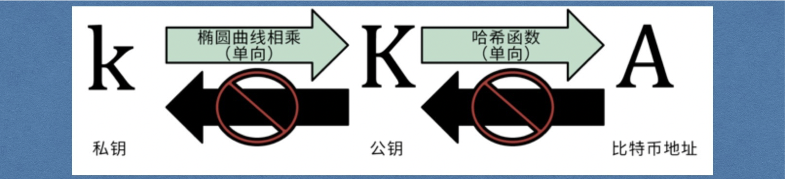
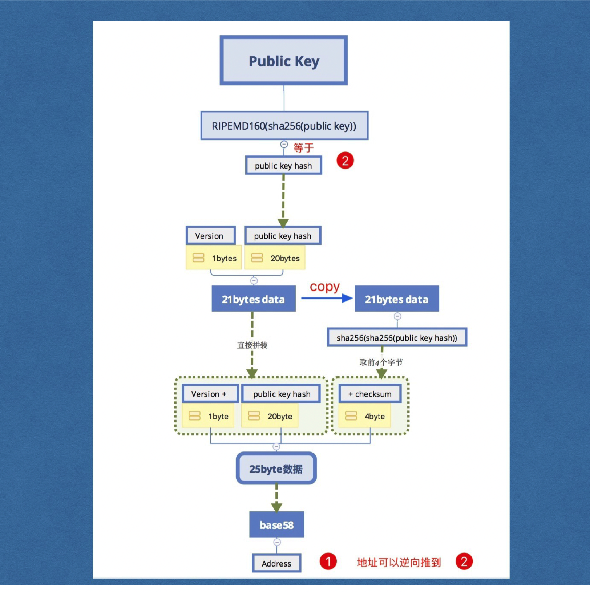
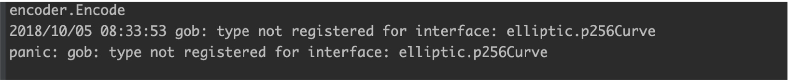

# 概述

> 小白入门：https://github.com/dukedaily/solidity-expert ，欢迎star转发，文末加V入群。
>
> 职场进阶: https://dukeweb3.com

## 1. 存在问题

1. 地址是用字符串代替的（用张三来代表地址）

2. 没有校验（需要对交易进行数字签名校验）

## 2. 授课思路

1. 创建秘钥对->公钥->地址（使用椭圆曲线算法生成私钥、由私钥生成公钥）

2. 改写代码（使用地址，公钥私钥改写代码）

3. 交易签名校验（创建交易时使用使用私钥对交易进行签名）
4. 校验（打包交易之前对交易进行校验）


# 一、项目地图


# 二、非对称加密

## 1. 签名校验图示


比特币使用ECC（椭圆曲线）算法生成非对称加密对。

RSA-->比较常用的非对称加密算法 

ECC-->比特币使用非对称加密算法


1. 非对称加密算法有RSA、ECDSA，对极大整数做因数分解的难度决定了RSA算法的可靠性，

2. ECDSA为椭圆曲线加密算法，是基于椭圆方程公式，所以安全性要高于RSA。
3. golang封装的`ecdsa`目前只有用私钥加密，公钥做校验，没有解密环节；所以目前可以应用于数字签名；


## 2. 需要签名的内容

### - 签名需要什么？

- 想要签名的数据
- 私钥


### - 验证需要什么？

- 想要签名的数据
- 数字签名
- 公钥

## 3. ECDSA演示

那么我们开始写demo，思路如下：

- 创建私钥

- 创建公钥
- 私钥签名
- 公钥验证

```go
package main

import (
	"crypto/ecdsa"
	"crypto/elliptic"
	"crypto/rand"
	"fmt"
	"log"
	"crypto/sha256"
	"math/big"
)

//1. 使用椭圆曲线算法生成一对：公钥+私钥
//2. 使用私钥进行签名
//3. 使用公钥进行校验

//注意，goland内置的椭圆曲线库支持签名校验，不支持公钥加密，私钥解密

func main() {
	//1. 使用椭圆曲线算法生成一对：公钥+私钥
	// GenerateKey generates a public and private key pair.
	//func GenerateKey(c elliptic.Curve, rand io.Reader) (*PrivateKey, error) {
	curve := elliptic.P256()
	//研究一下rand.Reader
	randNumber := rand.Reader
	fmt.Println("randNumber:", randNumber)
	privateKey, err := ecdsa.GenerateKey(curve, rand.Reader)
	if err != nil {
		log.Panic(err)
	}

	//2. 使用私钥进行签名
	data := "hello world!"
	//func Sign(rand io.Reader, priv *PrivateKey, hash []byte) (r, s *big.Int, err error) {
	randNumber1 := rand.Reader
	fmt.Println("randNumber1:", randNumber1)
	dataHashed := sha256.Sum256([]byte(data))
	r, s, err := ecdsa.Sign(randNumber1, privateKey, dataHashed[:])
	if err != nil {
		log.Panic(err)
	}

	signature := append(r.Bytes(), s.Bytes()...)
	fmt.Printf("signature : %x\n", signature)

	//3. 使用公钥进行校验

	//通过私钥获取公钥
	//为什么不能使用Public()函数呢？？
	publicKey := privateKey.PublicKey

	//func Verify(pub *PublicKey, hash []byte, r, s *big.Int) bool {
	flag := ecdsa.Verify(&publicKey, dataHashed[:], r, s)
	//flag := ecdsa.Verify(&rawPublicKey, dataHashed[:], r, s)
	fmt.Printf("verify result : %v\n", flag)
}
```

# 三、生成比特币地址

## 1. 地址规则

对随机字符串进行哈希，生成32字节的私钥




## 2. 地址生成流程



[在线生成地址](http://gobittest.appspot.com/Address)（不可靠，只为了演示）

[BitCoinAddress](https://www.bitaddress.org/bitaddress.org-v3.3.0-SHA256-dec17c07685e1870960903d8f58090475b25af946fe95a734f88408cef4aa194.html)(相当有意思的地址，生成真实可用的地址)


# 四、创建地址

## 1. 分析

* 定义一个结构，包含公钥私钥两个变量
* 提供一个方法：生成公钥私钥
* 提供一个方法：由公钥生成地址


## 2. 定义wallet结构

```go
//定义钱包结构，包括私钥和公钥
type Wallet struct {
    //首字母一定要大写，否则后面gob编码时会出错(用于保存)
	PrivateKey ecdsa.PrivateKey
    
    //由两个坐标点拼接而成的临时公钥，便于传输，校验时进行拆分，还原成原始的公钥
	PublicKey  []byte
}
```


由于我们不想在交易中传递公钥本身，想传递[]byte，所以我们将公钥拆分成两个[]byte变量。

将他们append成一个[]byte后存放在公钥字段。

在verify之前一直把这个拼接的byte数组当成公钥。

在verifty时将它再拆成X, Y 两个big.Int 类型的数据，然后拼装成真实的公钥

**(具体方式回忆一下pow时引用的big.Int: Bytes()，setBytes())**

在demo中添加下面的代码并测试：


```go
func main() {
    ...
    publicKey := privateKey.PublicKey
    
    //新增
    //拆分成两个数，拼接成一个[]byte进行传递
	fmt.Printf("X.Btytes: %x\n", publicKey.X.Bytes())
	fmt.Printf("y.Btytes: %x\n", publicKey.Y.Bytes())

    //这个就是即将存储在wallet中的publicKey
	publicKeyTmp := append(publicKey.X.Bytes(), publicKey.Y.Bytes()...)
    
	//...
    
    //传递到接收端
	len := len(publicKeyTmp)
	x := big.Int{}
	y := big.Int{}
    //对端接收后进行拆解
	x.SetBytes(publicKeyTmp[:len/2])
	y.SetBytes(publicKeyTmp[len/2:])

	curve1 := elliptic.P256()
    //重新拼出原始的公钥
	rawPublicKey := ecdsa.PublicKey{curve1, &x, &y}

    //检验
	flag := ecdsa.Verify(&rawPublicKey, dataHashed[:], r, s)
	fmt.Printf("verify result : %v\n", flag)
}
```

## 3. 创建wallet方法

```go
//2. 创建钱包结构的方法
func NewWallet() *Wallet {
	curve := elliptic.P256()

	//a. 生成私钥
	privateKey, err := ecdsa.GenerateKey(curve, rand.Reader)
	if err != nil {
		log.Panic(err)
	}
	//由私钥生成公钥
	rawPubKey := privateKey.PublicKey
	//把公钥拆分成[]byte
	publicKey := append(rawPubKey.X.Bytes(), rawPubKey.Y.Bytes()...)
	return &Wallet{*privateKey, publicKey}
}
```

## 4. 添加命令（createWallet）

### - 调整代码

修改Usage：

```go
const Usage = `
	...
	createWallet "create a new key pair wallet and save into wallet.dat"
`
```

修改Run函数：

```go
	case "createWallet":
		cli.CreateWallet()
```

添加CreateWallet函数：

```go
func (cli *CLI)CreateWallet()  {
	//只是打印钱包即可
	wallet := NewWallet()
	fmt.Printf("private key : %x\n", wallet.privateKey)
	fmt.Printf("public  key : %x\n", wallet.publicKey)
}
```

### - 测试


## 5. 由公钥生成地址

### - 分析

* 通过公钥生成地址
* 对公钥进行哈希处理: RIPEMD160(sha256())
* 获取校验码: checksum()
* 拼接: version + hash + checksum
* 对公钥哈希做base58处理


**ripe160.tar.gz 解压命令**

```sh
 tar zxvf ripe160.tar.gz -C $GOPATH/src
```


### - 代码

```go
func (w *Wallet) getAddress() []byte {
	//a. 对公钥进行哈希处理: RIPEMD160(sha256())
	ripemdHash := HashPubKey(w.publicKey)
	payload := append([]byte{version}, ripemdHash[:]...)

	//b. 获取校验码: checksum()
	checkCode := checksum(payload)

	//c. 拼接: version + hash + checksum
	pubKeyHash := append(payload, checkCode...)
	fmt.Printf("pubKeyHash : %x\n", pubKeyHash)

	//d. base58
	address := Base58Encode(pubKeyHash)
	return address
}

func checksum(payload []byte) []byte {
	hashFirst := sha256.Sum256(payload)
	hashSecond := sha256.Sum256(hashFirst[:])
	checkCode := hashSecond[:4]
	return checkCode
}

func HashPubKey(publicKey []byte) []byte {

	hash256 := sha256.Sum256(publicKey)

	ripemd160Hasher := ripemd160.New()
	_, err := ripemd160Hasher.Write(hash256[:])
	if err != nil {
		log.Panic(err)
	}

	ripemdHash := ripemd160Hasher.Sum(nil)
	return ripemdHash
}
```

### - base58

使用内置的库，github上有，是btcd的一个库。

```go
duke ~/btc/btcd$  git remote -v
origin	https://github.com/btcsuite/btcd.git (fetch)
origin	https://github.com/btcsuite/btcd.git (push)
```


```go
import "github.com/btcsuite/btcutil/base58"
```


下面这段代码是自己写的base58.go，不稳定，了解即可，不建议使用**

```go
package main

import (
	"bytes"
	"math/big"
)

var b58Alphabet = []byte("123456789ABCDEFGHJKLMNPQRSTUVWXYZabcdefghijkmnopqrstuvwxyz")

// Base58Encode encodes a byte array to Base58
func Base58Encode(input []byte) []byte {
	var result []byte

	x := big.NewInt(0).SetBytes(input)

	base := big.NewInt(int64(len(b58Alphabet)))
	zero := big.NewInt(0)
	mod := &big.Int{}

	for x.Cmp(zero) != 0 {
		x.DivMod(x, base, mod)
		result = append(result, b58Alphabet[mod.Int64()])
	}

	ReverseBytes(result)
	for b := range input {
		if b == 0x00 {
			result = append([]byte{b58Alphabet[0]}, result...)
		} else {
			break
		}
	}

	return result
}

// Base58Decode decodes Base58-encoded data
func Base58Decode(input []byte) []byte {
	result := big.NewInt(0)
	zeroBytes := 0

	for b := range input {
		if b == 0x00 {
			zeroBytes++
		}
	}

	payload := input[zeroBytes:]
	for _, b := range payload {
		charIndex := bytes.IndexByte(b58Alphabet, b)
		result.Mul(result, big.NewInt(58))
		result.Add(result, big.NewInt(int64(charIndex)))
	}

	decoded := result.Bytes()
	decoded = append(bytes.Repeat([]byte{byte(0x00)}, zeroBytes), decoded...)

	return decoded
}

// ReverseBytes reverses a byte array
func ReverseBytes(data []byte) {
	for i, j := 0, len(data)-1; i < j; i, j = i+1, j-1 {
		data[i], data[j] = data[j], data[i]
	}
}
```


### - 测试

```go
func (cli *CLI)CreateWallet()  {
	//只是打印钱包即可
	wallet := NewWallet()
	fmt.Printf("private key : %x\n", wallet.privateKey)
	fmt.Printf("public  key : %x\n", wallet.publicKey)
    //注意是使用%s打印的
   	fmt.Printf("address  : %s\n", wallet.getAddress())
}
```

### - 结果


# 五、保存私钥对

比特币客户端可以生成无数多个秘钥对，将它们持久化，保存在一个wallets.bat文件中，

我们想要实现同样的功能，定义一个装秘钥钱包的容器Wallets，保存所有的钱包秘钥对。

## 1. 定义钱包容器

新建一个wallets.go文件，使用map存储，key是地址，value是钱包指针，这样就能够将地址和钱包对应上了。

```go
//定义一个容纳所有钱包的容器
type Wallets struct {
	//key:地址  value：钱包
	WalletsMap map[string]*Wallet
}
```

### - 分析

对钱包的操作分为三步：

1. 从本地加载已有的钱包到内存
2. 添加新的钱包到内存
3. 将内存中的钱包保存到本地

## 2. 创建钱包容器

创建钱包实例并从文件中加载钱包

```go
//创建钱包容器, 这个函数在commands.go里面调用，负责打开钱包
func NewWallets() *Wallets {
	//打开钱包
	var ws Wallets
	ws.WalletsMap = make(map[string]*Wallet)
	//加载
	//TODO
	return &ws
}
```


## 3. 提供一个创建新钱包的方法

对外我们只暴露这个接口即可。

```go
func (ws *Wallets) CreateWallet() string {
    wallet := NewWallet()
	fmt.Printf("string(wallet.getAddress()): %s\n", string(wallet.getAddress()))
	address := fmt.Sprintf("%s", wallet.getAddress())
	fmt.Printf("Sprintf address %s\n", address)
    
    //直接赋值
	ws.WalletsMap[string(wallet.getAddress())] = wallet
	return string(wallet.getAddress())
}
```

## 4. 测试

```go
func (cli *CLI) CreateWallet() {
	//只是打印钱包即可
	//wallet := NewWallet()
	ws := NewWallets()
	address := ws.CreateWallet()
	//fmt.Printf("private key : %x\n", wallet.privateKey)
	//fmt.Printf("public  key : %x\n", wallet.publicKey)
	fmt.Printf("address  : %s\n", address)
}
```


## 5. 存储到本地

1. 使用gob进行编码，转化成[]byte
2. 使用ioutil.WriteFile写文件
3. **gob四个参数（后三个）必须都是地址**


```go
func (ws *Wallets) SaveToFile() {
	var content bytes.Buffer
	encoder := gob.NewEncoder(&content)
	err := encoder.Encode(ws)
	if err != nil {
		log.Panic(err)
	}

	err = ioutil.WriteFile(walletFileName, content.Bytes(), 0644)
	if err != nil {
		log.Panic(err)
	}
}
```

再次执行创建命令时，报错如下：



原因：

如果Encode/Decode类型是interface或者struct中某些字段是interface{}的时候，需要在gob中注册interface可能的所有实现或者可能类型，否则会上面的错误。[参考链接](https://blog.csdn.net/cj_286/article/details/79986458)

我们钱包中的elliptic.Curve是interface类型的，如图所示：


解决办法为：

```go
func (ws *Wallets) SaveToFile() {
	var content bytes.Buffer
    gob.Register(elliptic.P256())  //<<-----加上这句，注册一个interface对象
	encoder := gob.NewEncoder(&content)
	err := encoder.Encode(ws)
	...
}
```

重新编译即可通过。

## 6. 测试

略

## 7. 从本地加载

添加函数LoadFromFile，注意要使用地址传递func (ws *Wallets)

```go
func (ws *Wallets) LoadWalletFromFile() error {
	_, err := os.Stat(walletFileName)
	if os.IsNotExist(err) {
		return err
	}

	content, err := ioutil.ReadFile(walletFileName)
	if err != nil {
		return err
	}

	var wsLocal Wallets
	gob.Register(elliptic.P256())

	decoder := gob.NewDecoder(bytes.NewReader(content))
	err = decoder.Decode(&wsLocal)
	if err != nil {
		return err
	}

	ws.WalletsMap = wsLocal.WalletsMap
	return nil
}
```

## 8. 更新NewWallets

```js
//获得钱包容器实例，加载到内存中
func NewWallets() *Wallets {
	//打开
	//为什么可以返回局部变量的地址啊？？ 这特么在C++中就是野指针。
	var ws Wallets
	ws.WalletsMap = make(map[string]*Wallet)
	//加载
	err := ws.LoadWalletFromFile()
	if err != nil {
		log.Panic(err)
	}
	return &ws
}
```

## 9. 获取所有地址

```go
func (ws *Wallets) GetAllAddresses() []string {
	var addressContainer []string
	for address := range ws.WalletsMap {
		addressContainer = append(addressContainer, address)
	}
	return addressContainer
}
```

## 10. 添加命令（listAddresses）

### - 调整代码

修改Usage：

```go
const Usage = `
	...
	listAddresses "list all addresses in wallet.dat"
`
```

修改Run:

```go
	case "listAddresses":
		cli.ListAddresses()
```

添加函数ListAddresses

```go
func (cli *CLI) ListAddresses() {
	ws := NewWallets()

	for i, address := range ws.GetAllAddresses() {
		fmt.Printf("address[%d] : %s\n", i, address)
	}
}
```

### - 测试


