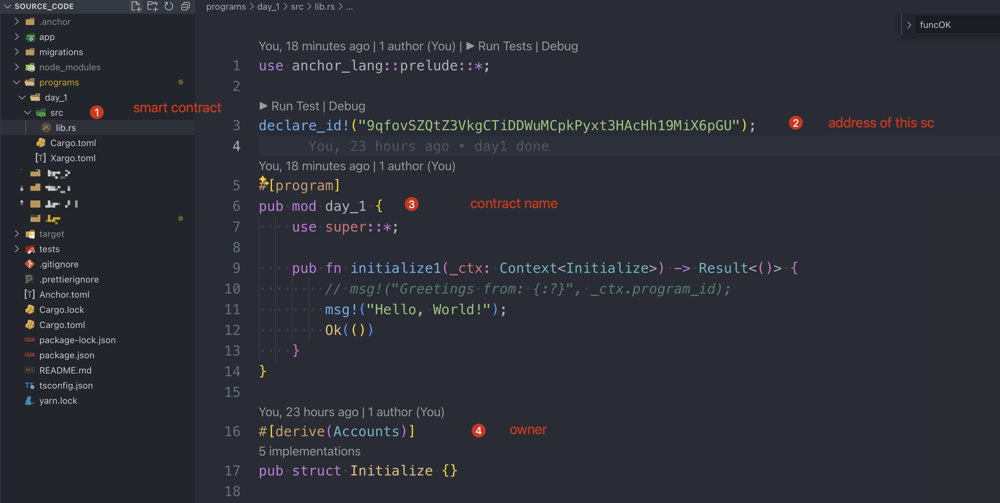
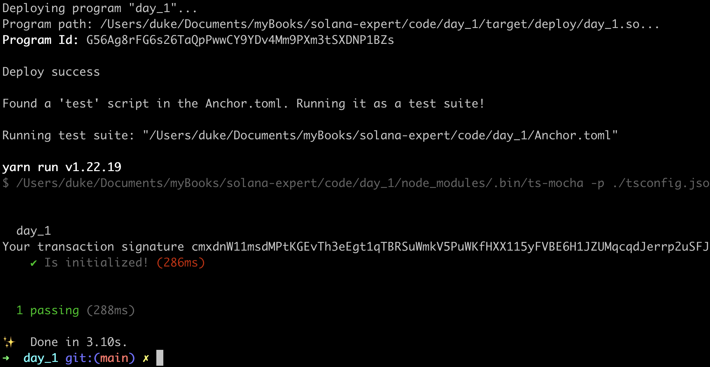

# Hello World

## Install Requirements

### Rust

```sh
curl --proto '=https' --tlsv1.2 -sSf https://sh.rustup.rs | sh
```

### Solana cli

```sh
# install solana
sh -c "$(curl -sSfL https://release.solana.com/stable/install)"
```

### Anchor

```sh
# install anchor
cargo install --git https://github.com/coral-xyz/anchor avm --locked --force

avm install latest
avm use latest
```

## Create Project

```sh
anchor init day1 # use day_1 if you have a mac
cd day1
```

this command will create an default project:



- `day_1/src/lib.rs`: where the smart contract code locates.
- `declare_id!`: same concept to the address of solidity, but it's called `program_id` in solana. The id above is auto generated by framework, you can find it in `Anchor.toml` under the root directory level.
- `day_1`: the name of this smarct contract (program)
- `Accounts`:  tx.origin in solidity.

please note: there is no `constructor`in solana program. the default func of `initialize`is automatically created by `Anchor`framework, it is just a common function, same as any arbitrary customized function: `pub fn test1()`

```rust
use anchor_lang::prelude::*;

declare_id!("9qfovSZQtZ3VkgCTiDDWuMCpkPyxt3HAcHh19MiX6pGU");

#[program]
pub mod day_1 {
    use super::*;

    pub fn initialize(_ctx: Context<Initialize>) -> Result<()> {
        // msg!("Greetings from: {:?}", _ctx.program_id);
        msg!("Hello, World!");
        Ok(())
    }
}

#[derive(Accounts)]
pub struct Initialize {}
```


### Config Solana network

to localhost

```sh
# shell 1
solana config set --url localhost

# output: 
Config File: /Users/duke/.config/solana/cli/config.yml
RPC URL: http://localhost:8899
WebSocket URL: ws://localhost:8900/ (computed)
Keypair Path: /Users/duke/.config/solana/id.json
Commitment: confirmed
```

### Run validator node

```sh
# shell 2
solana-test-validator
```

this command would create a local folder to `test-ledger`, it would store all the simulating data, and if you run this command again, be sure to execute at the same level as this folder.

### Sync up

```sh
# shell 1
anchor keys sync

# output
All program id declarations are synced.
```

### Run Anchor Tests

```sh
# shell 1
anchor test --skip-local-validator
```

this command will build and deploy and execute the test scripts under `tests`, if you encounter this error below:


can try to execute the following command:

```sh
solana-install init 1.18.18

# 1.18.18 should equal to the error message: `solana-program v1.18.181`
```

 [check here](https://solana.stackexchange.com/questions/9930/error-package-solana-program-v1-18-1-cannot-be-built-because-it-requires-rust/9982#comment8105_9982) to see the original topic. 

>  solana is too new, chat-gpt won't help much sometimes, still needs to google online.


### Create a new wallet

```sh
solana-keygen new -o /Users/duke/.config/solana/id.json

# output:
Wrote new keypair to /Users/duke/.config/solana/id.json
========================================================================
pubkey: HjU6xSZme7ER6Qhk841nczwXijBZ9e1GWLqdPxW6gS9w
========================================================================
Save this seed phrase and your BIP39 passphrase to recover your new keypair:
fix air journey asthma help pulse ankle jeans return fragile renew equal
========================================================================
```

## Get Wallet address

```sh
solana-keygen pubkey ~/.config/solana/id.json

# output:
HjU6xSZme7ER6Qhk841nczwXijBZ9e1GWLqdPxW6gS9w
```


### Sol Airdrop

```sh
# solana airdrop 100 <Your Address>
solana airdrop 100 HjU6xSZme7ER6Qhk841nczwXijBZ9e1GWLqdPxW6gS9w

# output:
Requesting airdrop of 100 SOL

Signature: xTrkhn7tad5tMMS9dn3ZA12EtR5LsoLaUYrUjN8gjQZYMkBTs55LVGQS3dLuKbRmMoXoWLWiToY2ReQJwBcMZgc

100 SOL
```

### Test Succeed




## Key Takeaways

- Cargo：rust package managem tool
- Rustc：rust complier
- Anchor：[solana framework](https://www.anchor-lang.com/)


## Links

- day1 original article: https://www.rareskills.io/post/hello-world-solana
- source_code: https://github.com/dukedaily/solana-expert-code/tree/day_1