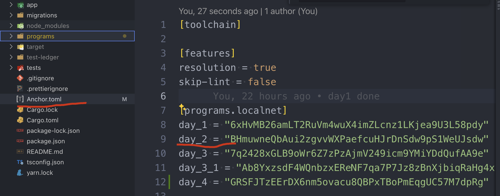
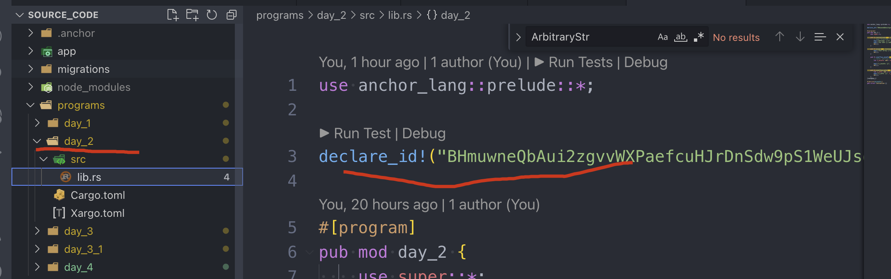

# Arithmetic_Types

we will impl the same contract as solidity:

```js
contract Day2 {

	event Result(uint256);
	event Who(string, address);
	
	function doSomeMath(uint256 a, uint256 b) public {
		uint256 result = a + b;
		emit Result(result);
	}

	function sayHelloToMe() public {
		emit Who("Hello World", msg.sender);
	}
}
```

can get the code from `day_2`

```sh
git checkout day_2
```


## Create new program

run command below to create a new program under the same project

```sh
anchor new day_2
```

Anchor will help us to create a new program id once we execute this new command.



and apply this to the new program within the soucecode.



it will fail to deploy if these two places are not match, if so, it can be easily fix by executing the sync command

```sh
anchor keys sync
```

Currently, the directory will looks like:

```sh
├── programs
│   ├── day_1
│   │   ├── Cargo.toml
│   │   ├── Xargo.toml
│   │   └── src
│   │       └── lib.rs
│   └── day_2
│       ├── Cargo.toml
│       ├── Xargo.toml
│       └── src
│           └── lib.rs
```

## Basic Types

### update day_2/lib.rs

```rust
use anchor_lang::prelude::*;

declare_id!("F6jicE4vCRP3yggTvoLyebh59pm8RnpcZ8rZRiJe9JQW");

#[program]
pub mod day_2 {
    use super::*;

  	// test1: u64/string
    pub fn initialize2(ctx: Context<Initialize>, a: u64, b: u64, message: String) -> Result<()> {
        // msg!("Greetings from: {:?}", ctx.program_id);
        msg!("message: {:?}", message);
        msg!("You sent {} and {}", a, b);
        Ok(())
    }

  	// test2: Vec
    pub fn array(ctx: Context<Initialize>, arr: Vec<u64>) -> Result<()> {
        msg!("Your array {:?}", arr);
        Ok(())
    }
}

#[derive(Accounts)]
pub struct Initialize {}

```

### create new test file

```js
import * as anchor from "@coral-xyz/anchor";
import { Program } from "@coral-xyz/anchor";
import { Day2 } from "../target/types/day_2";

describe("day_2", () => {
  // Configure the client to use the local cluster.
  anchor.setProvider(anchor.AnchorProvider.env());

  const program = anchor.workspace.Day2 as Program<Day2>;

  it("Is initialized!", async () => {
    // Add your test here.
    const tx = await program.methods.initialize2(
      new anchor.BN(777),
      new anchor.BN(888),
      "hello world"
    ).rpc();
    console.log("Your transaction signature", tx);
  });

  it.only("Initializes with vector", async () => {
    const tx = await program.methods.array([new anchor.BN(777),
    new anchor.BN(888)]).rpc();

    console.log("Your transaction signature", tx);
  });
});
```

build and test, all should be good!


## Overflow

add two more functions

```rust
    pub fn overflow_unsafe(ctx: Context<Initialize>, a: u64, b: u64) -> Result<()> {
        // test1: overflow silently
        let x_unsafe: u64 = a - b;

        msg!("x_unsafe: {}", x_unsafe);
        Ok(())
    }

    pub fn overflow_safe(ctx: Context<Initialize>, a: u64, b: u64) -> Result<()> {
        let x_safe: u64 = a.checked_sub(b).unwrap();
        msg!("x_safe: {}", x_safe);
        Ok(())
    }
```

udpate day_2.ts

```ts
  // when overflow-checks = false
  it.only("should not overflow on 100 - 200", async () => {
    const tx = await program.methods.overflowUnsafe(
      new anchor.BN(100),
      new anchor.BN(200)).rpc();

    // output:
    // Program log: Instruction: OverflowUnsafe
    // Program log: x_unsafe: 18446744073709551516
  });

  // when overflow-checks = true
  it.only("should overflow on 100 - 200", async () => {
    const tx = await program.methods.overflowUnsafe(
      new anchor.BN(100),
      new anchor.BN(200)).rpc();
  });
  // output:
  //   should overflow on 100 - 200:
  //   Error: Simulation failed.
  // Message: Transaction simulation failed: Error processing Instruction 0: Program failed to complete.

  it.only("should panic when overflow", async () => {
    const tx = await program.methods.overflowSafe(
      new anchor.BN(0),
      new anchor.BN(1)).rpc();

    // output:
    // Program log: Instruction: OverflowSafe
    // Program log: panicked at programs/day_2/src/lib.rs:30:44:
    // called `Option::unwrap()` on a `None` value
  });
```

Change the flag: `overflow-checks = false` and see the difference.

```toml
[workspace]
members = ["programs/*"]
resolver = "2"

[profile.release]
# will check globaly, and throw error during the compilation, gas costly
overflow-checks = true 

# won't check, and would need to add protection within the code, but gas efficiency
# overflow-checks = false  

lto = "fat"
codegen-units = 1
[profile.release.build-override]
opt-level = 3
incremental = false
codegen-units = 1

```


## Key Takeaways


## Links

- day2 original article: https://www.rareskills.io/post/rust-arithmetic-operators
- source_code: https://github.com/dukedaily/solana-expert-code/tree/day_2
- float: https://solana.com/docs/programs/limitations#float-rust-types-support
