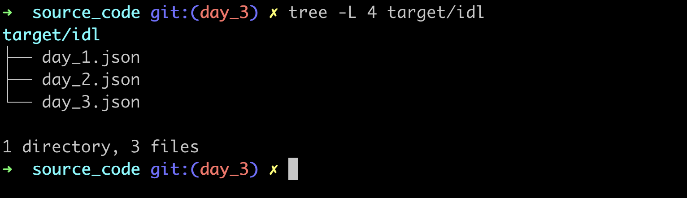
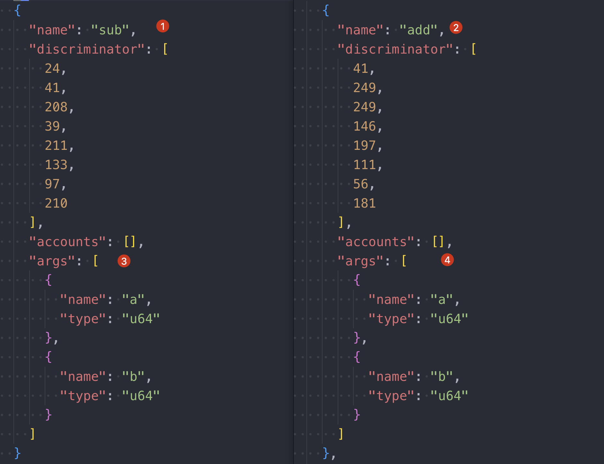
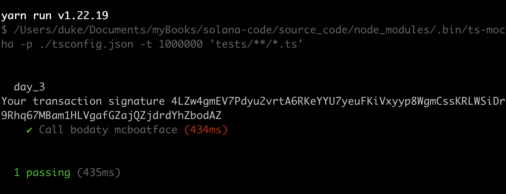

# ANCHOR PROGRAM IDL

## IDL

The IDL(Interface Definition Language)  is a Json file that describes how to interfact with solana program, it's the same concept of What ABI(Application Binary Interface) to Ethereum.


You can find the whole Source code under branch `day_3`: 

```sh
git checkout day_3
```


## No Param Fn

create a new program by command

```sh
anchor new day_3
```

update `day_3/src/lib.rs` as below:

```rust
use anchor_lang::prelude::*;

// this id would be generated automatically by the new command
declare_id!("69QhaCVcUsq5n6cSfx2TyoCve4wHY2Fzreu8aEET5x5g");

#[program]
pub mod day_3 {
    use super::*;

    // this is new!!
    pub fn boaty_mc_boatface(ctx: Context<Initialize>) -> Result<()> {
        Ok(())
    }
}

#[derive(Accounts)]
pub struct Initialize {}
```

create file: `tests/day_3.ts` and put the code to:

```ts
import * as anchor from "@coral-xyz/anchor";
import { Program } from "@coral-xyz/anchor";
import { Day3 } from "../target/types/day_3";

describe("day_3", () => {
  // Configure the client to use the local cluster.
  anchor.setProvider(anchor.AnchorProvider.env());

  const program = anchor.workspace.Day3 as Program<Day3>;

  it.only("Call bodaty mcboatface", async () => {
    const tx = await program.methods.boatyMcBoatface().rpc();
    console.log("Your transaction signature", tx);
  })
});
```

Execute: `anchor build` and you can find the idl files under folder: `target/idl`



Open `day_3.json` and take a look at the checkpoints from: 1~4

```json
{
  "address": "69QhaCVcUsq5n6cSfx2TyoCve4wHY2Fzreu8aEET5x5g",
  "metadata": {
    "name": "day_3",  // checkpoint1: program name.
    "version": "0.1.0",
    "spec": "0.1.0",
    "description": "Created with Anchor"
  },
  "instructions": [
    {
      "name": "boatyMcBoatface", // checkpoint2: function name, it converts to camel case.
      "discriminator": [
        74,
        55,
        233,
        42,
        15,
        104,
        59,
        136
      ],
      "accounts": [], // checkpoint3: empty, will discuss this later.
      "args": [] // checkpoint4: empty, cos we dont pass anything.
    }
  ]
}
```

## With Param Fn

add two more functions to `day_3/src/lib.rs` and build again.

```rust
    pub fn add(ctx: Context<Initialize>, a: u64, b: u64) -> Result<()> {
      let sum = a + b;
      msg!("Sum is {}", sum);  
      Ok(())
    }
    
    pub fn sub(ctx: Context<Initialize>, a: u64, b: u64) -> Result<()> {
      let difference = a - b;
      msg!("Difference is {}", difference);  
      Ok(())
    }
```

check `target/idl/day_3.json`, apart from the stale info, we can see the ABI of the new functions easily.



run `anchor test --skip-local-validator` to test.  you can try to `restart` the local validator if failed, and delete folder  `target` and `build` again it keeps failing, under most cases you would succeed.




## Initialize Struct

this `Initialize` within `ctx: Context<Initialize>` is not a keyword, it can be any arbitrary string, as long as it's consistent with the defination under `#[derive(Accounts)] `


we can create a new program to test it out

```sh
anchor new day_3_1
```

update the code to:

```rust
use anchor_lang::prelude::*;

declare_id!("Ab8YxzsdF4WQnbzxEReNF7qa7P7Jz8zBnXjbiqRaHg4x");

#[program]
pub mod day_3_1 {
    use super::*;

    // checkpoint1: ArbitraryStr
    pub fn non_empty_account_example(ctx: Context<ArbitraryStr>) -> Result<()> {
        Ok(())
    }
}

// checkpoint2
#[derive(Accounts)]
pub struct ArbitraryStr<'info> { 
    signer: Signer<'info>,
    another_signer: Signer<'info>,
}
```

as you may see, we change the name from `Initializ`e to `ArbitraryStr` and add two signers. we will cover the Accounts details later, you as for now, you can think it as analogous to `tx.origin` in Solidity

run `anchor build` and check `target/idl/day_3_1.json`, you can see the signers under `accounts` field:

```json
{
  "address": "Ab8YxzsdF4WQnbzxEReNF7qa7P7Jz8zBnXjbiqRaHg4x",
  "metadata": {
    "name": "day_3_1",
    "version": "0.1.0",
    "spec": "0.1.0",
    "description": "Created with Anchor"
  },
  "instructions": [
    {
      "name": "non_empty_account_example",
      "discriminator": [
        127,
        98,
        185,
        163,
        43,
        215,
        73,
        172
      ],
      "accounts": [ // checkpoint1: signers listed here as defined in lib.rs
        {
          "name": "signer",
          "signer": true
        },
        {
          "name": "another_signer",
          "signer": true
        }
      ],
      "args": []
    }
  ]
}
```

you can stroll up and see the `accounts` is an empty array in `day_3.json` as the default `Initialize`sets to empty in the source code.


## Key Takeaways

1. There is no concept of  `Contructor` function in solana
2. IDL is the same as ABI in solidity


## Links

- day3 oritinal article : https://www.rareskills.io/post/anchor-idl
- source code: https://github.com/dukedaily/solana-expert-code/tree/day_3
