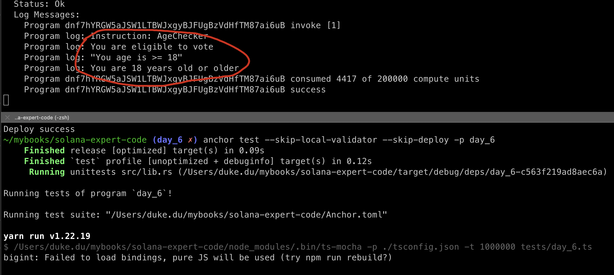
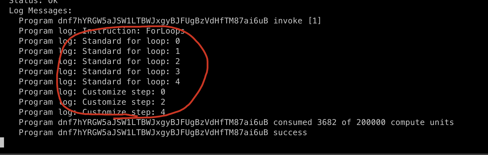
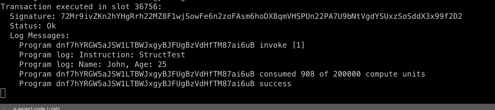
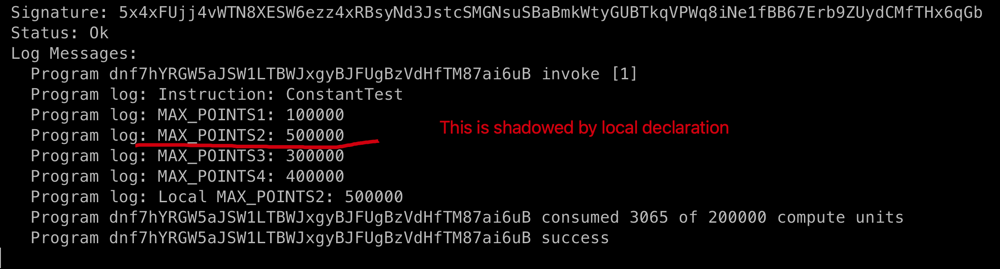
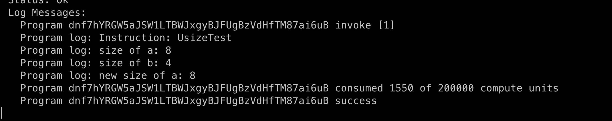

# RUST BASIC

## new program

create a new program day_6 via command

```sh
anchor new day_6
```


## if...else

There are 3 patterns of condition Claue, you can check the comment lines of 1~3.

```rust
use anchor_lang::prelude::*;

declare_id!("dnf7hYRGW5aJSW1LTBWJxgyBJFUgBzVdHfTM87ai6uB");

#[program]
pub mod day_6 {
    use super::*;

    pub fn age_checker(_ctx: Context<Initialize>, age: u64) -> Result<()> {
        // 1. standard way
        if age >= 18 {
            msg!("You are eligible to vote");
        } else {
            msg!("You are not eligible to vote");
        }

        // 2. special way
        let result = if age >= 18 {
            "You age is >= 18"
        } else {
            "You age is < 18"
        };
        msg!("{:?}", result);

        // 3. using match
        match age {
            1 => {
                msg!("You are 1 year old");
            }
            2 | 3 => {
                msg!("You are 2 or 3 years old");
            }
            4..=17 => {
                msg!("You are between 4 and 17(inclusive) years old");
            }
            _ => {
                msg!("You are 18 years old or older");
            }
        }
        Ok(())
    }
}

#[derive(Accounts)]
pub struct Initialize {}
```

create tests/day_6.ts

```ts
import * as anchor from "@coral-xyz/anchor";
import { Program } from "@coral-xyz/anchor";
import { Day6 } from '../target/types/day_6';

describe("day_6", () => {
  anchor.setProvider(anchor.AnchorProvider.env());
  const program = anchor.workspace.Day6 as Program<Day6>;

  it("should succeed age checker!", async () => {
    const tx = await program.methods.ageChecker(
      new anchor.BN(36)
    ).rpc();
    console.log("You tx signature:", tx);
  })
})
```

build & deploy & test, it would be faster if we specific the program by flag `-p`

```sh
anchor build -p day_6
anchor deploy -p day_6
anchor test --skip-local-validator --skip-deploy -p day_6
```

Result:



## For Loops

add new code:

```rust
    pub fn for_loops(_ctx: Context<Initialize>) -> Result<()> {
        // 1. standard way
        for i in 0..5 {
            msg!("Standard for loop: {}", i);
        }

        // 2. customize step
        for i in (0..5).step_by(2) {
            msg!("Customize step: {}", i);
        }
        Ok(())
    }
```

And test code:

```ts
  it("should succed test for loop!", async () => {
    const tx = await program.methods.forLoops().rpc();
    console.log("You tx signature:", tx);
  })
```

build & deploy & test again



## Fixed Array and Dynamic Array

```rust
    pub fn fixed_array(_ctx: Context<Initialize>) -> Result<()> {
        let arr_x: [u64; 5] = [1, 2, 3, 4, 5];
        let a1 = arr_x[0];
        let a2: u64 = arr_x[1];

        // compile error, cos bydefault array is immutable
        // a1_x[1]= 10；

        let mut arr_y = [1, 2, 3, 4, 5];
        // it works, cos we make it mutable during declaration
        arr_y[1] = 10;

        for i in 0..arr_y.len() {
            msg!(": {}", arr_y[i]);
        }
        Ok(())
    }

    pub fn dynamic_array(_ctx: Context<Initialize>) -> Result<()> {
        let mut d_arr: Vec<u32> = Vec::new();
        d_arr.push(1);
        d_arr.push(2);
        d_arr.push(3);

        let first = d_arr[0];
        d_arr[1] = 10;
        msg!("first: {}", first);
        Ok(())
    }
```

update test file

```ts
  it("should succeed test fixed array!", async () => {
    const tx = await program.methods.fixedArray().rpc();
    console.log("You tx signature:", tx);
  })

  it("should succeed test dynamic array!", async () => {
    const tx = await program.methods.dynamicArray().rpc();
    console.log("You tx signature:", tx);
  })
```

result


## Mappings

In EVM, we have mappings in storage, but here in solana, we have two types of mapping.

- in memory: using HashMap
- in storage: will share in later sessions

```rust
		use std::collections::HashMap;

    pub fn mapping_test(_ctx: Context<Initialize>) -> Result<()> {
        // let mut map: HashMap<String, String> = HashMap::new();
        let mut map1 = HashMap::new();
        // map.insert("name", "John");
        // map.insert("age", "25");
        map1.insert("name", "John");
        map1.insert("age", "25");

        let name = map1.get("name");
        let age = map1.get("age");
        msg!("Name: {:?}", name);
        msg!("Age: {:?}", age);

        // let mut map2: HashMap<String, u32> = HashMap::new();
        let mut map2 = HashMap::new();
        map2.insert("age", 25);
        let age = map2.get("age");
        let age_index = map2["age"];
        msg!("Age: {:?}, {}", age, age_index);
        Ok(())
    }
```

update test file:

```ts
	it("should succeed test HashMap!", async () => {
    const tx = await program.methods.mappingTest().rpc();
    console.log("You tx signature:", tx);
  })
```

result:


## Struct

same to Mappings, this struct exists in memory instead of storage, will cover solana storage later, add new function as below.

```rust
    pub fn struct_test(_ctx: Context<Initialize>) -> Result<()> {
        struct Person {
            name: String,
            age: u32,
        }

        let p1 = Person {
            // name: "John", // cannot compile, need to use to_string()
            name: "John".to_string(),
            age: 25,
        };

        msg!("Name: {}, Age: {}", p1.name, p1.age);
        Ok(())
    }
```

update test file:

```ts
  it("should succeed test struct!", async () => {
    const tx = await program.methods.structTest().rpc();
    console.log("You tx signature:", tx);
  })
```

Result:




## constant

```rust
use anchor_lang::prelude::*;

declare_id!("dnf7hYRGW5aJSW1LTBWJxgyBJFUgBzVdHfTM87ai6uB");
const MAX_POINTS1: u32 = 100_000;
const MAX_POINTS2: u32 = 200_000;

static mut x: u32 = 100; // compile ok
let x=100; // let cannot compile

#[program]
pub mod day_6 {
    // the rest of the code...

    const MAX_POINTS3: u32 = 300_000;

    pub fn constant_test(_ctx: Context<Initialize>) -> Result<()> {
        const MAX_POINTS4: u32 = 400_000;
        msg!("MAX_POINTS1: {} ", MAX_POINTS1);
        msg!("MAX_POINTS2: {} ", MAX_POINTS2);
        msg!("MAX_POINTS3: {} ", MAX_POINTS3);
        msg!("MAX_POINTS4: {} ", MAX_POINTS4);

        const MAX_POINTS2: u32 = 500_000;
        msg!("Local MAX_POINTS2: {} ", MAX_POINTS2);
        Ok(())
    }
}

#[derive(Accounts)]
pub struct Initialize {}

```

update test file:

```ts
  it("should succeed test constant!", async () => {
    const tx = await program.methods.constantTest().rpc();
    console.log("You tx signature:", tx);
  })
```

Result:



as you may see, only `constant` and `static` type of variables are allowed to define out of the mod, `let` is prohibited.


## Usize and casting

`usize`is a special type, we split the definition into three pieces:

1. It is the pointer-sized unsigned integer type.
2. It defines the size of this primitive is how many bytes it takes to reference any location in memory.
3. For example, on a 32 bit target, this is 4 bytes and on a 64 bit target, this is 8 bytes.

```rust
    pub fn usize_test(_ctx: Context<Initialize>) -> Result<()> {

        let mut a: usize = 100;
        let b: u32 = 200;
        let d: u128 = 400;
        msg!("size of a: {}", std::mem::size_of_val(&a)); // 8
        msg!("size of b: {}", std::mem::size_of_val(&b)); // 4

        a = d as usize; // conversion
        msg!("new size of a: {}", std::mem::size_of_val(&a)); // 8
        Ok(())
    }
```

update test code:

```ts
  it("should succeed test usize and casting!", async () => {
    const tx = await program.methods.usizeTest().rpc();
    console.log("You tx signature:", tx);
  })
```

Result:



## Try-Catch

Rust does not have try catch. Failures are expected to return errors directly, we can catch the errors during the invocation.


## Key Takeaways

- we can use `match` when it comes to massive conditions.
- Rust don't support dynamic array natively, need to use `Vector`.
- Solana support two types of mapping|struct, in memory and in storage.
- Constant can be defined out of the mod, but let variable cannot.
- Rust has a new primitive integer type: `usize`.
- Rust don't support try-catch


## Links

- day6 original article: https://www.rareskills.io/post/rust-basic-syntax
- Source code: https://github.com/dukedaily/solana-expert-code/tree/day_6
