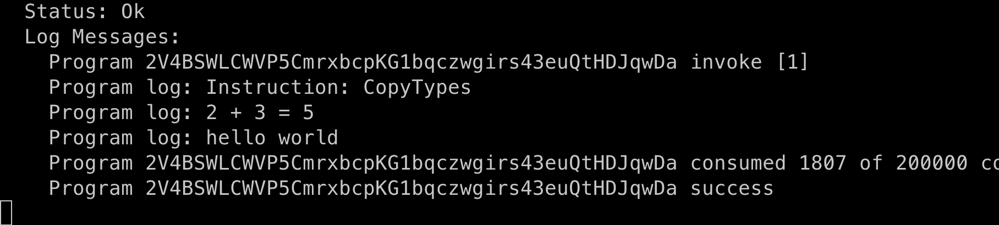
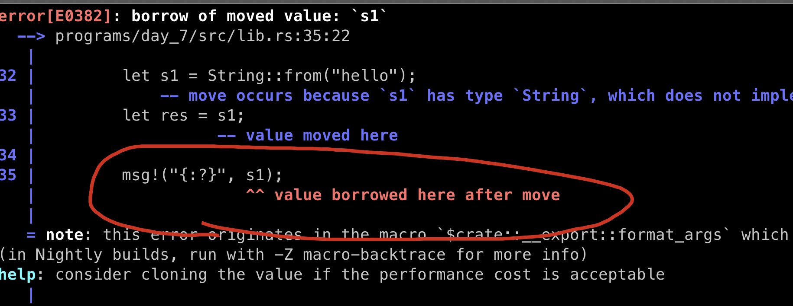
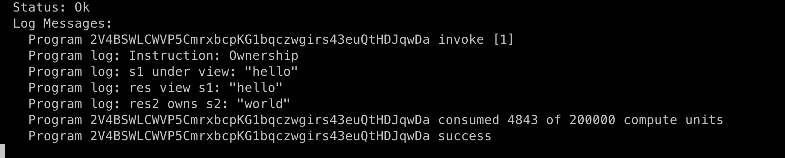
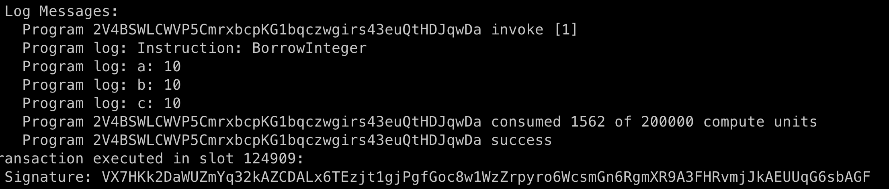
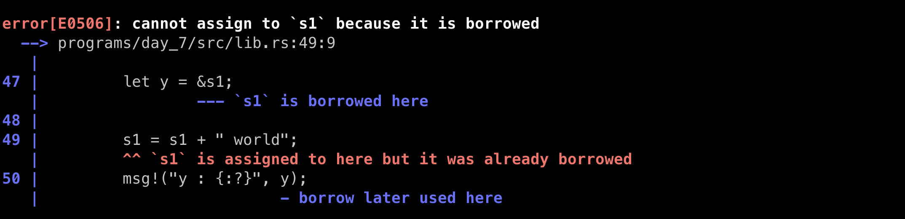
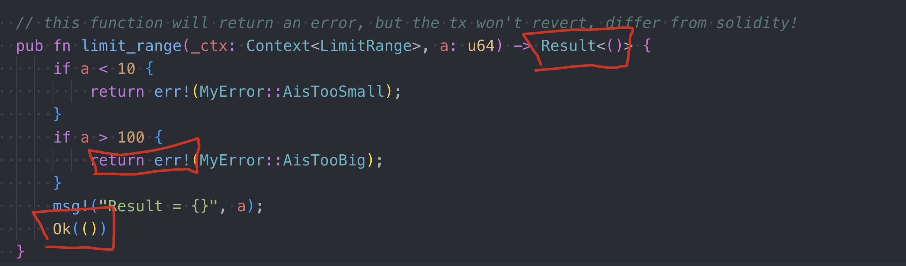
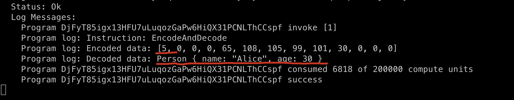

# Rust Interesting Syntax

In this session, we will discuss the following syntax: 

- &
- mut
- <_>
- unwrap()
- ?

## Copy Type vs Non-Copy Type

this is roughly the same concepts to `Value Type` and `Reference Type` as Solidity.

- it a type has the certain small size and easy to copy, including: `integers, unsigned, and floats integers, booleans, char`.
- Non-copy type: `Strings, vectors, structs`, etc

create program day_7

```sh
anchor new day_7
```

And update with the following code (be sure to replace with your program id).

```rust
use anchor_lang::prelude::*;

declare_id!("2V4BSWLCWVP5CmrxbcpKG1bqczwgirs43euQtHDJqwDa");

pub fn add(a: u32, b: u32) -> u32 {
    a + b
}

pub fn concat(s1: String, s2: String) -> String {
    format!("{}{}", s1, s2)
}

#[program]
pub mod day_7 {
    use super::*;

    pub fn copy_types(ctx: Context<Initialize>) -> Result<()> {
        let a: u32 = 2;
        let b: u32 = 3;
        msg!("{} + {} = {}", a, b, add(a, b));

        let s1 = String::from("hello");
        let s2 = String::from(" world");

        // if s1 and s2 are copied, this could be a huge data transfer
        // if the strings are very long
        msg!("{}{}", s1, s2);
        Ok(())
    }
}

#[derive(Accounts)]
pub struct Initialize {}

```

add test file `tests/day_7.ts`: 

```ts
import * as anchor from "@coral-xyz/anchor";
import { Program } from "@coral-xyz/anchor";
import { Day7 } from '../target/types/day_7';

describe("day_7", () => {
  anchor.setProvider(anchor.AnchorProvider.env());
  const program = anchor.workspace.Day7 as Program<Day7>;

  it("should succeed copy types!", async () => {
    const tx = await program.methods.copyTypes().rpc();
    console.log("You tx signature:", tx);
  })
})
```

Result:



within this demo, both a and b are type of u32, means when pass to function `add`, only need to copy 4Bytes * 2 are copied, so they are copy type.

but for the two strings, they don' have a fixed size, which means they can be as long as 1GB or 2GB, and if we use copy type on them, the system will need to allocate (1GB or 2GB) *2 for the concatenation, it's crazy, so string type must be non-copy type.


## Ownership

the ownership concept is only an issue with (apply to) non-copy-types: `Strings, vectors, structs`, and the usage is alike the term of`reference` in C++, let's dive into the details.

add this function into the code base.

```rust
    pub fn ownership(ctx: Context<Initialize>) -> Result<()> {
        let s1 = String::from("hello");
        let res = s1; // res become the owner of value: "hello"

        msg!("{:?}", s1); // this line won't compile, cos s1 is no longer the owner of value: "hello"
        msg!("{:?}", res);

        Ok(())
    }
```

and you will see this error after compilation.



To fix the code above we have two options: use the & operator or clone s1.


## Borrowing

**To give another variable or function a view of an owned variable, we prepend it with: ** **&**.

```rust
    pub fn ownership(ctx: Context<Initialize>) -> Result<()> {
        let s1 = String::from("hello");
        let res = &s1;

        msg!("s1 under view: {:?}", s1);
        msg!("res view s1: {:?}", res);

        let s2 = String::from("world");
        let res2 = s2;
        msg!("res2 owns s2: {:?}", res2);

        Ok(())
    }
```

s2 can now view `String::from("hello")` but not own it, it will holds a reference to the string value in s1, **but s1 still holds its original string value**.

in rust, we the techitical word of what we are calling `view only` is : borrowing.



## Borrowing (copy-type)

```rust
    pub fn borrow_integer(ctx: Context<Initialize>) -> Result<()> {
        let a = 10;
        let b = &a;
        let c = a;

        msg!("a: {:?}", a);
        msg!("b: {:?}", b);
        msg!("c: {:?}", c);
        Ok(())
    }

```

a, b, c all hold a new copy of value 10, the underlying reason is that the overhead is negligible.



## Clone a object

if a var of a non-copy-type is being borrowed, it cannot be reassigned, check the code below.

```rust
    pub fn clone_test(ctx: Context<Initialize>) -> Result<()> {
        let mut s1 = String::from("hello");
        // let y = &s1; // comment this line

        s1 = s1 + " world";
        // msg!("y : {:?}", y); // comment this line
        msg!("s1: {:?}", s1);
        Ok(())
    }
```

everything works now, then we uncomment two lines above, and the complier will complain:

```rust
    pub fn clone_test(ctx: Context<Initialize>) -> Result<()> {
        let mut s1 = String::from("hello");
        let y = &s1;

        s1 = s1 + " world";
        msg!("y : {:?}", y);
        msg!("s1: {:?}", s1);
        Ok(())
    }
```



in order to make it work, we can not borrow anymore, instead of we `clone`.

```rust

    pub fn clone_test(ctx: Context<Initialize>) -> Result<()> {
        let mut s1 = String::from("hello");
        // let y = &s1;
        let y = s1.clone(); // add this line

        s1 = s1 + " world";
        msg!("y : {:?}", y);
        msg!("s1: {:?}", s1);
        Ok(())
    }
```

Now, y has an entire copy of s1, no constraint anymore.


Interesting thing: if we only comment the `msg!`line and keep the borrowing line, it still work.

```rust
    pub fn clone_test(ctx: Context<Initialize>) -> Result<()> {
        let mut s1 = String::from("hello");
        let y = &s1;

        s1 = s1 + " world";
        // msg!("y : {:?}", y);
        msg!("s1: {:?}", s1);
        Ok(())
    }
```


##  Generic types

Rust also supports generic types, eliminating the need to write multiple functions for different types with the same logic.

```rust
use anchor_lang::prelude::*;

declare_id!("2V4BSWLCWVP5CmrxbcpKG1bqczwgirs43euQtHDJqwDa");

#[program]
pub mod day_7 {
    use super::*;
 		// The rest...

    pub fn generic_type_test(ctx: Context<Initialize>) -> Result<()> {
        let my_values1 = MyValues {
            foo: 42,
            bar: "hello".to_string(),
        };

        let my_values2 = MyValues {
            foo: true,
            bar: [1, 2, 3],
        };

        msg!("my_values1: {:?}", my_values1);
        msg!("my_values2: {:?}", my_values2);
        Ok(())
    }
}

#[derive(Accounts)]
pub struct Initialize {}

// derive the debug trait so we can print the struct to the console
#[derive(Debug)]
struct MyValues<T, U> {
    foo: T,
    bar: U,
}
```

we can reuse this MyValues type on different types.


## Options

```rust
fn main() {
	let v = Vec::from([1,2,3,4,5]);

	assert!(v.iter().max() == 5);
}
```

The code fails to compile with the following error:

```js
6 |     assert!(v.iter().max() == 5);
  |                               ^ expected `Option<&{integer}>`, found integer
```

The output of max() is not an integer due to the corner case that the vector v might be empty.

To handle this corner case, rust returns an Option instead. An Option is an enum which can contain either the expected value, or a special value that indicates “nothing was there.”

`option` comes together with `enum`, if the value of a type is empty, rust will return a value of type option, create new program

```sh
anchor new day_7_1
```

update with with the code below.

```rust
    pub fn option_test(ctx: Context<Initialize>) -> Result<()> {
        let v = Vec::from([1, 2, 3, 4, 5]);
        // assert!(v.iter().max() == 5); // wrong
        assert!(v.iter().max().unwrap() == &5); // correct
        Ok(())
    }
```

To turn an Option into the underlying type, we use unwrap(). unwrap() will cause a panic if we received “nothing”, so we should only use it in situations where we want the panic to occur or we are sure we won’t get a empty value.

## The deref Operator *

as you may notice, we use `&0` instead of `0`, cos the return type of `unwrap()` is a `view`, so we need to use & ahead.

```rust
        assert!(v.iter().max().unwrap() == &5); // correct
```

to convert the view of an integer backward to a regular integer, we can use * operator to deference.

```rust
        assert!(*v.iter().max().unwrap() == 5); // correct
```

You can think of * as "undoing" a & without disturbing the original value.


## Result Type

An `Option` is used when we might receive something `empty`.

An `Result` is used when we might receive an `error`. we'v seen this a lot inside our anchor programs.

in day_4, we return either error or ok in this function



if we trace back and we will get it's definition like this:

```rust
pub enum Result<T, E> {
    /// Contains the success value
    #[lang = "Ok"]
    #[stable(feature = "rust1", since = "1.0.0")]
    Ok(#[stable(feature = "rust1", since = "1.0.0")] T),

    /// Contains the error value
    #[lang = "Err"]
    #[stable(feature = "rust1", since = "1.0.0")]
    Err(#[stable(feature = "rust1", since = "1.0.0")] E),
}
```

## Operator ?

The ? operator can only be ued in functions that return a `Result`as it is syntactic sugar for returning either Err or Ok.

- unwrap() : can be used both on Option and Result. (will crash if there is an error occur, be careful).
- ?: can be used only on Result.

let test it, udpate the code:

```rust
use anchor_lang::prelude::*;
use borsh::{BorshDeserialize, BorshSerialize};

declare_id!("DjFyT85igx13HFU7uLuqozGaPw6HiQX31PCNLThCCspf");

#[program]
pub mod day_7_1 {
    use super::*;

    pub fn encode_and_decode(ctx: Context<Initialize>) -> Result<()> {
        let init_person: Person = Person {
            name: "Alice".to_string(),
            age: 30,
        };

        let encoded_data: Vec<u8> = init_person.try_to_vec().unwrap();
        msg!("Encoded data: {:?}", encoded_data);

        let data: Person = decode(ctx, encoded_data)?;
        msg!("Decoded data: {:?}", data);
        Ok(())
    }

    // pub fn decode(ctx: Context<Initialize>, encoded_data: Vec<u8>) -> Result<Person> { <<--- this won't compile, why??
    pub fn decode(ctx: Context<Initialize>, encoded_data: Vec<u8>) -> Result<(Person)> {
        let decoded_data: Person = Person::try_from_slice(&encoded_data).unwrap();
        Ok(decoded_data)
        // Ok(())
    }
}

#[derive(Accounts)]
pub struct Initialize {}

#[derive(BorshSerialize, BorshDeserialize, Debug)]
pub struct Person {
    name: String,
    age: u32,
}
```

update test file:

```ts
import * as anchor from "@coral-xyz/anchor";
import { Program } from "@coral-xyz/anchor";
import { Day71 } from '../target/types/day_7_1';

describe("day_7_1", () => {
  anchor.setProvider(anchor.AnchorProvider.env());
  const program = anchor.workspace.Day7_1 as Program<Day71>;

  it("should succeed test option!", async () => {
    const tx = await program.methods.optionTest().rpc();
    console.log("You tx signature:", tx);
  })

  it("should succeed test ? operator!", async () => {
    const tx = await program.methods.encodeAndDecode().rpc();
    console.log("You tx signature:", tx);
  })
})
```

run:



## Key Takeaways

- ownership only applicable for non-copy-types.
- borrowing (&)is to view a non-copy-type and can use (*) to get the original value.
- Option is a special enum that supports  `empty`
- Result is a special enum that supports `error`
- unwrap() is to convert an either an Option or an Result back to it's orignal type, and will cause a panic if any error occurs.
- ? is a syntax sugar for unwrap() on Result, not applicable for Option.


## Links

- day_7 original article: https://www.rareskills.io/post/rust-weird-syntax
- source code: https://github.com/dukedaily/solana-expert-code/tree/day_7