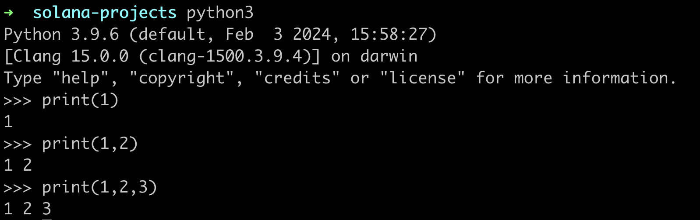
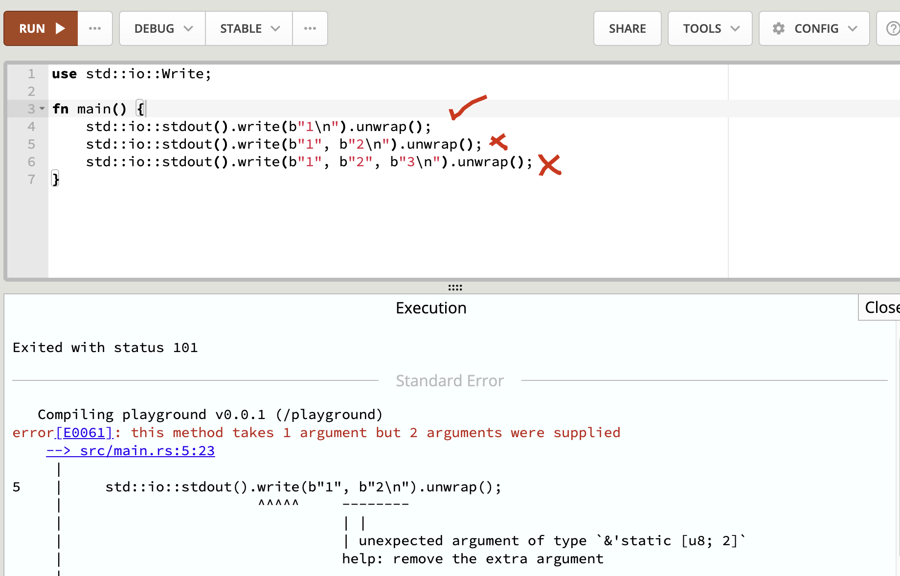
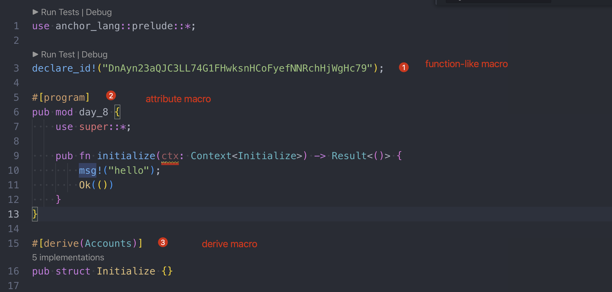

# Function-like macro

what is msg!() and println!() in our previous code base, why is there a exclamation point(!) after it? We will explain it in this session.


As a `strongly typed language`, rust cannot accept an arbitrary number of arguments to a function, for example, in Python, the following code works, cos python is a `weakly typed language` .

```python
print(1)
print(1,2)
print(1,2,3)
```



The ! denotes that the `function` is a `function-like` macro, and in rust, it is idetified by the presence of a ! symbol, for example: println!(...) or msg!(...) in solana.


## Why need Macro

in rust, a regular function to print something is `std::io::stdout().write` and it only accepts a single byte string as an argument, try it out on the [online-playground](https://play.rust-lang.org/?version=stable&mode=debug&edition=2021) with the following code:



How can we fix this? one way is to write a custom print function to handle each case for each number of arguments -- that's extremely inefficient!!!

here is a what such code would look like:

```rust
use std::io::Write;

// print one argument
fn print1(arg1: &[u8]) -> () {
		std::io::stdout().write(arg1).unwrap();
}

// print two arguments
fn print2(arg1: &[u8], arg2: &[u8]) -> () {
    let combined_vec = [arg1, b" ", arg2].concat();
    let combined_slice = combined_vec.as_slice();
		std::io::stdout().write(combined_slice).unwrap();
}

// print three arguments
fn print3(arg1: &[u8], arg2: &[u8], arg3: &[u8]) -> () {
    let combined_vec = [arg1, b" ", arg2, b" ", arg3].concat();
    let combined_slice = combined_vec.as_slice();
		std::io::stdout().write(combined_slice).unwrap();
}

fn main() {
		print1(b"1\n");
		print2(b"1", b"2\n");
		print3(b"1", b"2", b"3\n");
}
```


if we look for a pattern in the `print1`, `print2`, `print3` functions, it is simply inserting the arguments into a vector and adding a space in between them, then converting the vector back into a bytes string(a bytes slice to be precise).


Wouldn't it be nice if we could take a piece of code like `println!` and automatically expand it into a print function that takes exactly as many arguments as we need?


This is what a Rust macro does.

**A Rust macro takes Rust code as input and programatically expands it into more Rust code.**

This helps us avoid the boredom of having to write a print function for every kind of statement our code requires.


## Expand Macro

To see an example of how the rust compiler is expanding the println! Macro, check the [cargo expand](https://github.com/dtolnay/cargo-expand) github repo for more info.

```sh
cargo install cargo-expand
cd programs/day_8/src
cargo expand
```

the output is verbose wont show it here.


## Other Macro

There are three more types of macro we use for every solan programs, we will cover more in later sessions.



1. Function-like macro
2. Attribute-like macro
3. Custom derive macro


## Key Takeaways

- function-like is very convenient in writing rust code.
- Function-like macro/attribute-like macro/custom derive macro


## Links

- day_8 original article: https://www.rareskills.io/post/rust-function-like-macro
- source code: https://github.com/dukedaily/solana-expert-code/tree/day_8