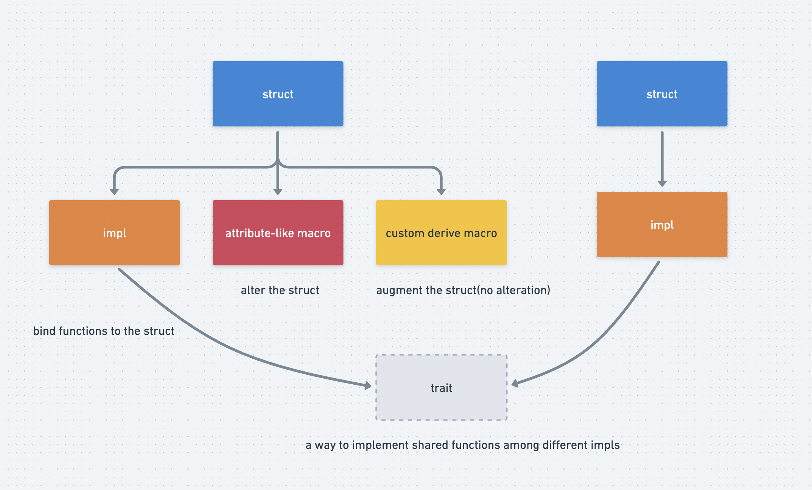
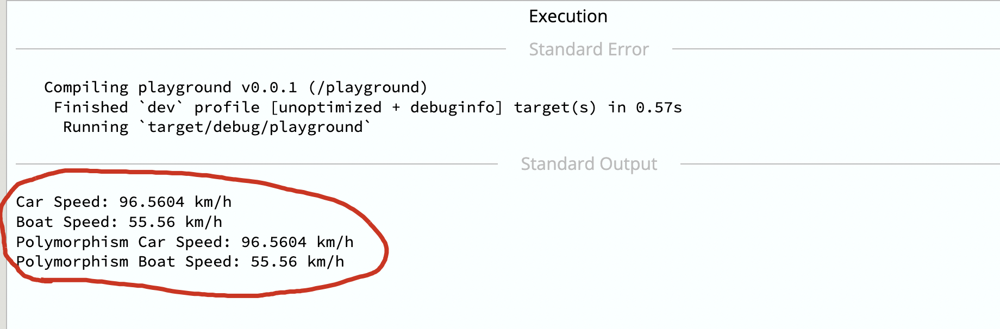
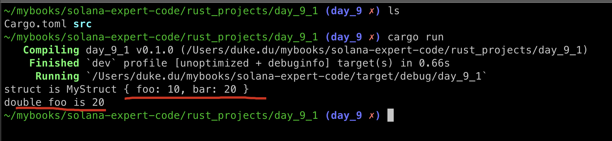
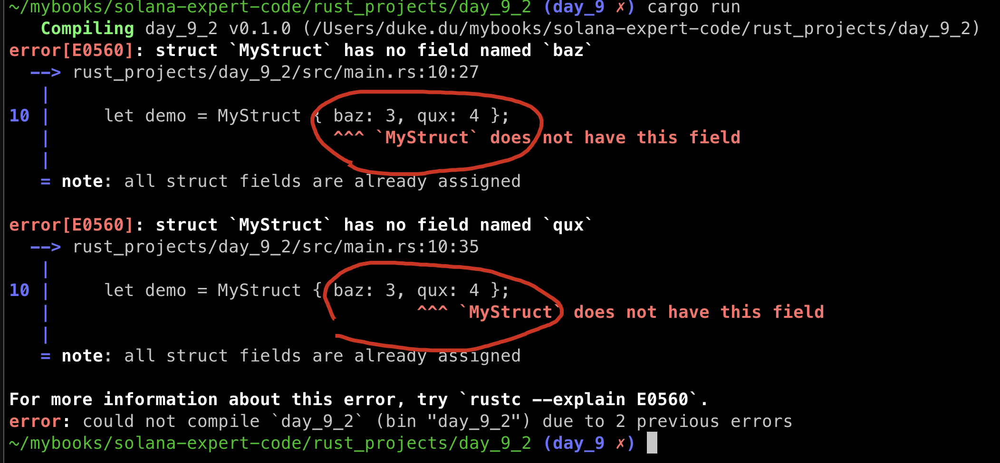

# Attribute-Like AND Custom Derive MACROS

## Three macros

normally we will encounter three types of macros within solana programs as below:

1. **Function-like macro:** a wrapper to a function, it will expand during the compilation, such as: `msg!` and `println!`.
2. **Attribute-like macro:** a wrapper to a struct, and can completely rewrite it.
3. **Custom derive macro:** a wrapper to a struct which will augments it with additional functions but cannot alert it.


we have discussed about: function-like macro before and will cover the rest here today.



## Impl

A impl is similar to a `lib` in solidity, we can bind some functions to a lib and use it with the syntax myLib.newFunction().

in rust, we can use the keyword `impl`to associate functions to a `struct`, we can test it in [playground](https://play.rust-lang.org/?version=stable&mode=debug&edition=2021).

```rust
struct Person {
    name: String,
    age: u8,
}

impl Person {
    fn new(name: String, age: u8) -> Self {
        return Person { name, age };
    }

    fn can_drink(&self) -> bool {
        return self.age >= 21;
    }

    fn get_age(&self) -> u8 {
        return self.age;
    }
}

fn main() {
    let alice = Person::new("Alice".to_string(), 30);
    println!("Can Alice drink? {}", alice.can_drink());
    println!("Alice's age: {}", alice.get_age());
}
```

// Output:

```sh
Can Alice drink? true
Alice's age: 30
```

now we have associated three functions with struct `Person`.

## Traits

Rust Traits are a way to implement shared behavior among different impls. ~~Think of them like an interface or abstract contract in solidity ---- any contract that uses the interface must implement certain functions.~~

Think of them like `polymorphism` in C++, be attention to function `get_speed` below, it accepts different instance of`impl` and gets different result accordingly.

```rust
// Traits are defined with the `trait` keyword followed by their name
trait Speed {
    fn get_speed_kph(&self) -> f64;
}

// Car struct
struct Car {
    speed_mph: f64,
}

// Boat struct
struct Boat {
    speed_knots: f64,
}

// Traits are implemented for a type using the `impl` keyword as shown below
impl Speed for Car {
    fn get_speed_kph(&self) -> f64 {
        // Convert miles per hour to kilometers per hour
        self.speed_mph * 1.60934
    }
}

// We also implement the `Speed` trait for `Boat`
impl Speed for Boat {
    fn get_speed_kph(&self) -> f64 {
        // Convert knots to kilometers per hour
        self.speed_knots * 1.852
    }
}

// Function to get the speed in km/h for any type implementing the Speed trait
fn get_speed(transport: &dyn Speed)-> f64 {
    return transport.get_speed_kph();
}

fn main() {
    // Initialize a `Car` and `Boat` type
    let car = Car { speed_mph: 60.0 };
    let boat = Boat { speed_knots: 30.0 };

    // Get and print the speeds in kilometers per hour
    let car_speed_kph = car.get_speed_kph();
    let boat_speed_kph = boat.get_speed_kph();

    println!("Car Speed: {} km/h", car_speed_kph); // 96.5604 km/h
    println!("Boat Speed: {} km/h", boat_speed_kph); // 55.56 km/h

    // polymorphism
    println!("Polymorphism Car Speed: {} km/h", get_speed(&car));
    println!("Polymorphism Boat Speed: {} km/h", get_speed(&boat));
}
```

output:




## Att-like macro

we can use attribute-like macro to change a struct, the technique beneath the surface is `impl` we just described.

we test in `rust_projects` other than anchor programs.

```sh
mkdir rust_projects
cd rust_projects
cargo new day_9_1
```

update the day_9_1/Cargo.toml as below:

```toml
[lib]
proc-macro = true

[dependencies]
syn = {version="1.0.57",features=["full","fold"]}
quote = "1.0.8"
```

### add  fields into a struct

we will define a attribute-like macro: `#[foo_bar_attribute]` and attach it to the simple struct below: 

```rust
struct MyStruct {
	baz: i32
}
```

within this macro, we will alter MyStruct by:

- adding two new fields `foo` and `bar` of type i32
- adding  a new function `double_foo` which returns twice the integer value of whatever foo is holding.

update the following code to day_9_1/src/main.rs

```rust
// day_9_1/src/main.rs
use day_9_1::foo_bar_attribute;

#[foo_bar_attribute]
struct MyStruct {
    baz: i32,
}

fn main() {
    let demo = MyStruct::default();
    println!("struct is {:?}", demo);

    let double_foo = demo.double_foo();
    println!("double foo is {}", double_foo);
}
```

create day_9_1/src/lib1.rs:

```rust
// day_9_1/src/lib1.rs

// Importing necessary external crates
extern crate proc_macro;
use proc_macro::TokenStream;
use quote::quote;
use syn::{parse_macro_input, ItemStruct};

// Declaring a procedural attribute-like macro using the `proc_macro_attribute` directive
// This makes the macro usable as an attribute

#[proc_macro_attribute]
// The function `foo_bar_attribute` takes two arguments:
// _metadata: The arguments provided to the macro (if any)
// _input: The TokenStream the macro is applied to
pub fn foo_bar_attribute(_metadata: TokenStream, _input: TokenStream) -> TokenStream {
    // Parse the input TokenStream into an AST node representing a struct
    let input = parse_macro_input!(_input as ItemStruct);
    let struct_name = &input.ident; // Get the name of the struct

    // Constructing the output TokenStream using the quote! macro
    // The quote! macro allows for writing Rust code as if it were a string,
    // but with the ability to interpolate values
    TokenStream::from(quote! {
        // Derive Debug trait for #struct_name to enable formatted output with `println()`
        #[derive(Debug)]
        // Defining a new struct #struct_name with two fields: foo and bar
        struct #struct_name {
            foo: i32,
            bar: i32,
        }

        // Implementing the Default trait for #struct_name
        // This provides a default() method to create a new instance of #struct_name
        impl Default for #struct_name {
            // The default method returns a new instance of #struct_name
            // with foo set to 10 and bar set to 20
            fn default() -> Self {
                #struct_name { foo: 10, bar: 20}
            }
        }

        impl #struct_name {
            // Defining a method double_foo for #struct_name
            // This method returns double the value of foo
            fn double_foo(&self) -> i32 {
                self.foo * 2
            }
        }
    })
}

```

Result: `cargo run`



### remove fields from a struct

```sh
cd rust_projects
cargo new day_9_2
```

Main.ts

```rust
use day_9_2::destroy_attribute;

#[destroy_attribute]
struct MyStruct {
    baz: i32,
    qux: i32,
}

fn main() {
    let demo = MyStruct { baz: 3, qux: 4 };

    println!("struct is {:?}", demo);
}
```

lib.rs

```rust
// src/lib.rs
// Importing necessary external crates
extern crate proc_macro;
use proc_macro::TokenStream;
use quote::quote;
use syn::{parse_macro_input, ItemStruct};

#[proc_macro_attribute]
pub fn destroy_attribute(_metadata: TokenStream, _input: TokenStream) -> TokenStream {
    let input = parse_macro_input!(_input as ItemStruct);
    let struct_name = &input.ident; // Get the name of the struct

    TokenStream::from(quote! {
        // This returns an empty struct with the same name
        #[derive(Debug)]
        struct #struct_name {
        }
    })
}
```

cargo run: 



we got two errors on the compliation stage, this means baz and qux are no longer belong to MyStruct as expected!!

## Derive macro

This support a way to augment a struct without changing it, a derive macro can, among other things, attach an `impl` to a struct.

```rust
struct Foo {
	bar: i32,
}

pub fn main() {
	let foo = Foo { bar: 3 };
	println!("{:?}", foo);
}
```

The code will not compile cos structs are not "printable".

To make them printable, they need an `impl` with a function `fmt` which returns a string representation of the struct. If we do the following instead:

```rust
#[derive(Debug)]
struct Foo {
	bar: i32,
}

pub fn main() {
	let foo = Foo { bar: 3 };
	println!("{:?}", foo);
}
```

result: 


can get the code from day_9_3.

## Anchor #[pragram]

The attribute #[pragram] is modifying the module behind the scenes. For example, it implements a router that automatically directs incoming blockchain instructions to the appropriate functions within the module.


## Key Takeaways

- An impl is a group of functions that operate on a struct. They are “attached” to the struct by using the same name as the struct.
- A trait enforces that an impl implements certain functions
- An attribute-like macro takes in a struct and can completely rewrite it.
- A derive macro augments a struct with additional functions.


## Links

- day_9 original article: https://www.rareskills.io/post/rust-attribute-derive-macro
- source code: https://github.com/dukedaily/solana-expert-code/tree/day_9