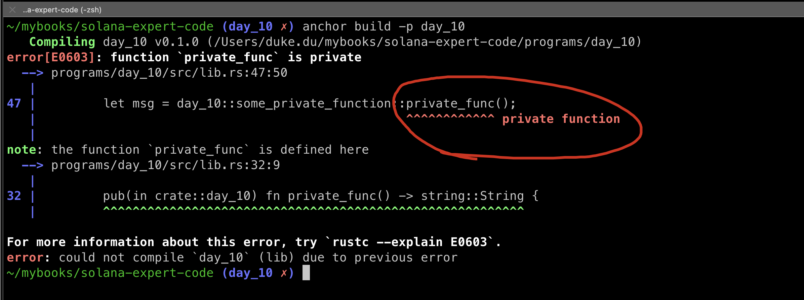
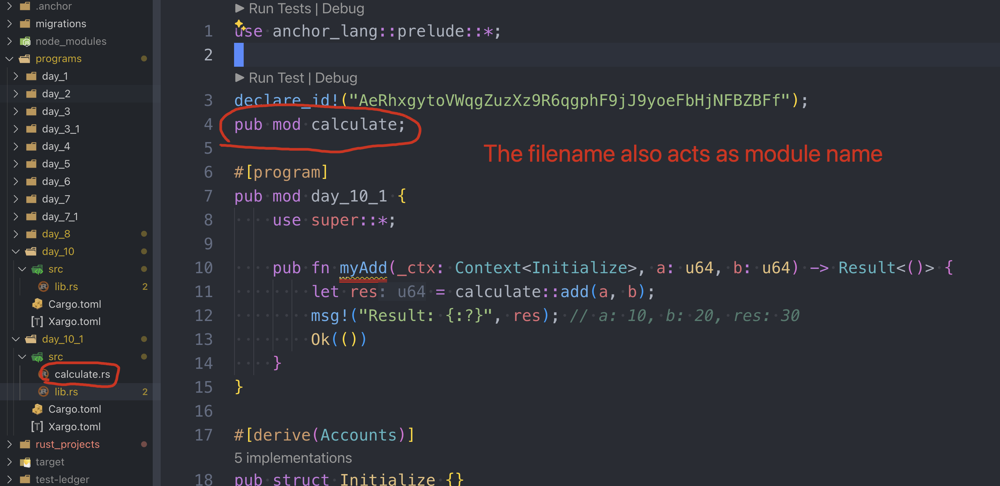

# VISIBILITY AND INHERIENCE

There are four types of function visibility in solidity, they are:

- public: accessible from within the contract and externally.
- external: accessible from outside the contract only.
- internal: accessible within the contract and inheriting contracts.
- private: accessible within the contract only.

That's see how we can acchieve this in Solana.


## Public functions

We can define a function with the `pub` prefix to indicate that it is public.

All the functions we have defined since day_1 till date arel all public functions:

```rust
pub fn public_function(ctx: Contex<Initialize>) -> Result<()> {
  //...
  Ok(())
}
```

You cannot remove the `pub`keyword for functions inside of the module(mod) labeled `#[program]`, it willnot compile.

Solana don't have external functions.


## Internal functions

Rust, and hence Solana, does not have "class" the way solidity does, as Rust is not object-oriented, and Rust uses modules to organize code.

1. define a mode `pub mod internal_func `inside `pub mod day_10`
2. call `internal_func1`within `initialize` via mod_name::function_name

```rust
#[program]
pub mod day_10 {
    use super::*;

    pub fn initialize(ctx: Context<Initialize>) -> Result<()> {
        msg!("Greetings from: {:?}", ctx.program_id);

        let number = get_number();
        msg!("Number: {:?}", number);

        let num = internal_func::internal_func1();
        msg!("Internal num: {:?}", num);
        Ok(())
    }

    pub mod internal_func {
        pub fn internal_func1() -> u64 {
            return 20;
        }
    }
}
```

define another mod within this file `lib.rs` but outside of `pub mod day_10`, 

import and call function of mod `internal_func`

```rust
mod call {
    use crate::day_10;
    pub fn call_internal_func() {
        let num = day_10::internal_func::internal_func1();
        println!("Internal num: {:?}", num);
    }
}
```

the full code:

```rust
use anchor_lang::prelude::*;

declare_id!("C7Qm8zwexesfhk4CSeEKJkasuPsUE1RPQPepsr36wkNS");

#[program]
pub mod day_10 {
    use super::*;

    pub fn initialize(ctx: Context<Initialize>) -> Result<()> {
        msg!("Greetings from: {:?}", ctx.program_id);

        let number = get_number(); // <--call a single function outside any mod
        msg!("Number: {:?}", number);

        let num = internal_func::internal_func1();
        msg!("Internal num: {:?}", num);
        Ok(())
    }

    pub mod internal_func {
        pub fn internal_func1() -> u64 {
            return 20;
        }
    }
}

// This is a outer module
mod call {
    use crate::day_10;
    pub fn call_internal_func() {
        let num = day_10::internal_func::internal_func1();
        println!("Internal num: {:?}", num);
    }
}

pub fn get_number() -> u64 {
    10
}

#[derive(Accounts)]
pub struct Initialize {}
```


add test cases and run: (can get the source code down below).


this is how we acchieve internal functions, it can be accessed by parent ` mod (day_10)`, and outside `mod call` as well.


## Private functions

Definiing a function within a specific module and ensuring they are not exposed outside that scope is a way to achieve private visibility:

```rust
use anchor_lang::prelude::*;

declare_id!("C7Qm8zwexesfhk4CSeEKJkasuPsUE1RPQPepsr36wkNS");

#[program]
pub mod day_10 {
    use super::*;

    pub fn initialize(ctx: Context<Initialize>) -> Result<()> {
        // the reset code

        let msg = some_private_function::private_func();
        msg!("Private function: {:?}", msg);
        Ok(())
    }

    pub mod some_private_function {
        use std::string;
        pub(in crate::day_10) fn private_func() -> string::String {
            return "Hello private function!".to_string();
        }
    }
}

// This is a outer module
mod call {
    use crate::day_10;
    // the reset code
    pub fn call_private_func() {
        let msg = day_10::some_private_function::private_func();
        println!("Private function: {:?}", msg);
    }
}

pub fn get_number() -> u64 {
    10
}

#[derive(Accounts)]
pub struct Initialize {}

```

The `pub(in crate::day_10)` keyword indicates that `private_func` function is only visible within `day_10` module, let's build again!

```sh
anchor build -p day_10
```

result:



This shows that `private_func` is not publicly accessible and cannot be invoked from outside the module where it is visible. Check out [visibility and privacy](https://doc.rust-lang.org/beta/reference/visibility-and-privacy.html#pubin-path-pubcrate-pubsuper-and-pubself) in Rust docs for more.


## Rust Module

Let's split our code into separate files to better manage our codebase. We can use the `mod` keyword to achieve this.

```sh
anchor new day_10_1
```

create a file `calculate.rs`with the following code:

```rust
pub fn add(a: u64, b: u64) -> u64 {
    a + b
}

pub fn sub(a: u64, b: u64) -> u64 {
    a - b
}
```

import calculate within `lib.rs`

```rust
use anchor_lang::prelude::*;

declare_id!("AeRhxgytoVWqgZuzXz9R6qgphF9jJ9yoeFbHjNFBZBFf");
pub mod calculate;

#[program]
pub mod day_10_1 {
    use super::*;

    pub fn myAdd(_ctx: Context<Initialize>, a: u64, b: u64) -> Result<()> {
        let res = calculate::add(a, b);
        msg!("Result: {:?}", res); // a: 10, b: 20, res: 30
        Ok(())
    }
}

#[derive(Accounts)]
pub struct Initialize {}
```

Be careful with the way that we import mod `calculate`, should be the same.



Build successfully.

```sh
 anchor build -p day_10_1
```


## Key takeaways

1. functions under `#[program]` mod must be public: Adding `pub` keyword prior to function names
2. it's allowed to declare functions without pub inside the files out of a mod
3. A file's name is also it's module name


## Links

- day_10 original article:
- source code:

