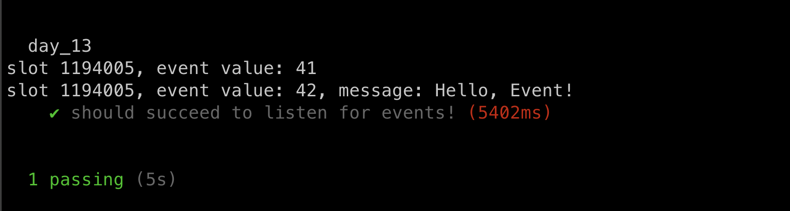
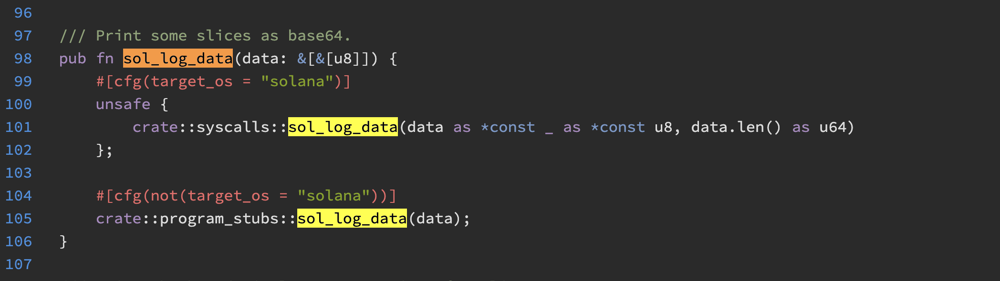

# Event Log Transaction

Events in Solana are intended to pass information to the frontend rather than document past transactions. To get pas history, Solana transactions can be queried by address.


## Solana Logs and Events

```sh
anchor new day _13
```

The program below has two events: `MyEvent` and `MySecondEvent`. Similar to how Ethereum events have **arguments**, Solana events have fields in the struct.

```rust
use anchor_lang::prelude::*;

declare_id!("5bQr6jnC8PvXXa8npycQD8xU6ZEzVjHNF8UufCPM13Sr");

#[program]
pub mod day_13 {
    use super::*;

    pub fn initialize(ctx: Context<Initialize>) -> Result<()> {
        emit!(MyEvent { value: 41 });
        emit!(MySecondEvent {
            value: 42,
            message: "Hello, Event!".to_string()
        });
        Ok(())
    }
}

#[derive(Accounts)]
pub struct Initialize {}

#[event]
pub struct MyEvent {
    pub value: u64,
}

#[event]
pub struct MySecondEvent {
    pub value: u64,
    pub message: String,
}
```

build

```sh
anchor build -p day_13
```

Events become part of the [ANCHOR PROGRAM IDL](../03_Anchor_Program_IDL/README.md), similar to how events are part of a Solidity smart contract's ABI. Below is the full IDL of the code above.

```json
{
  "address": "5bQr6jnC8PvXXa8npycQD8xU6ZEzVjHNF8UufCPM13Sr",
  "metadata": {
    "name": "day_13",
    "version": "0.1.0",
    "spec": "0.1.0",
    "description": "Created with Anchor"
  },
  "instructions": [
    {
      "name": "initialize",
      "discriminator": [
        175,
        175,
        109,
        31,
        13,
        152,
        155,
        237
      ],
      "accounts": [],
      "args": []
    }
  ],
  "events": [
    {
      "name": "MyEvent",
      "discriminator": [
        96,
        184,
        197,
        243,
        139,
        2,
        90,
        148
      ]
    },
    {
      "name": "MySecondEvent",
      "discriminator": [
        48,
        215,
        165,
        169,
        66,
        156,
        9,
        164
      ]
    }
  ],
  "types": [
    {
      "name": "MyEvent",
      "type": {
        "kind": "struct",
        "fields": [
          {
            "name": "value",
            "type": "u64"
          }
        ]
      }
    },
    {
      "name": "MySecondEvent",
      "type": {
        "kind": "struct",
        "fields": [
          {
            "name": "value",
            "type": "u64"
          },
          {
            "name": "message",
            "type": "string"
          }
        ]
      }
    }
  ]
}
```

be sure to note, there is no `indexed` concept in Solana.


Unlike Ethereum, we cannot directly query for past events over a range of block numbers. We can only listen for events as they occur(**Will Discuss Later**). The code below showcase how to listen for events in Solana:

```ts
import * as anchor from "@coral-xyz/anchor";
import { Program } from "@coral-xyz/anchor";
import { Day13 } from '../target/types/day_13';

describe("day_13", () => {
  anchor.setProvider(anchor.AnchorProvider.env());
  const program = anchor.workspace.Day13 as Program<Day13>;

  it("should succeed to listen for events!", async () => {
    const listner = program.addEventListener("myEvent",
      (event, slot) => {
        console.log(`slot ${slot}, event value: ${event.value}`)
      }
    )

    const listener2 = program.addEventListener('mySecondEvent',
      (event, slot) => {
        console.log(`slot ${slot}, event value: ${event.value}, message: ${event.message}`)
      }
    )

    await program.methods.initialize().rpc();
    await new Promise((resolve) => setTimeout(resolve, 5000));

    program.removeEventListener(listner);
    program.removeEventListener(listener2);
  })
})
```

result:



We register a listener for each event and remove them 5 seconds after emitting the events by invoking the `initialize()` function.


## How logs work under the hood

In the EVM, logs are emitted by running the `log0`, `log1`, `log2`etc opcode. In Solana, logs are run by calling the system call `sol_log_data`. As an argument, it is simply a sequence of bytes: [check source code here](https://docs.rs/solana-program/latest/src/solana_program/log.rs.html#116-124)



The `struct` structure we are using to create an event is an abstraction on the byte sequence. **Behind the scenes, Anchor turns the struct into a byte sequence to pass to this function**. The Solana system call only takes a byte sequence, not a struct.


## Solana logs are not for historical quering

In Ethereum, logs are used for auditing purpose, but in solana, logs cannot be used in that manner since they can only be queried as they occur. Therefore, **they are better suited for passing information to the frontend application**. 

Solana functions cannot return data to the frontend the way that solidity view functions can, so Solana logs are a lightweight way to accomplish this.


Question: can we see the events in explorer?? 

// TODO


## Can not get tx history by wallet in Ethereum

In Ethereum, we can not get a user's history transactions by wallet, we will need to do this indirectly by parsing every block since the walllet become active or the smart contract was deployed.

In addition, to audit the transactions in a smart contract, we developers can add events to query transactoins of interest.

## How to query tx history in Solana 

Solana has an RPC function `getSignaturesForAddress` which lists all the txs an address has done. The address can be a program or a wallet.

The following is a script to list the txs from an given address:

```ts
  it.only("should succeed to list all the txs!", async () => {
    const connection = new Connection('https://api.mainnet-beta.solana.com');
    const getTxs = async (address, limit) => {
      const pubKey = new PublicKey(address);
      let txList = await connection.getSignaturesForAddress(pubKey, {
        limit
      });
      let signatureList = txList.map((tx) => tx.signature);
      console.log('signatureList: ', signatureList.length);

      for await (const sig of signatureList) {
        console.log(await connection.getParsedTransaction(sig, {
          maxSupportedTransactionVersion: 0
        }));
      }
    }

    let myAddress = '8Qmw55X5cUZdwupBFQrN3ZBNSQ6tbwLVgu8yjD9Df2X5'
    getTxs(myAddress, 10);
  })
```

Note that the actual content of the Transaction is retrieved using the `getParsedTransaction` RPC method.

## Key Takeaways

- It is not possible to scan for past logs like it is in Ethereum, they must be watched for while the transactions is happening.

## Links

- day_13 original article: https://www.rareskills.io/post/solana-logs-transaction-history
- source code: https://github.com/dukedaily/solana-expert-code/tree/day_13

