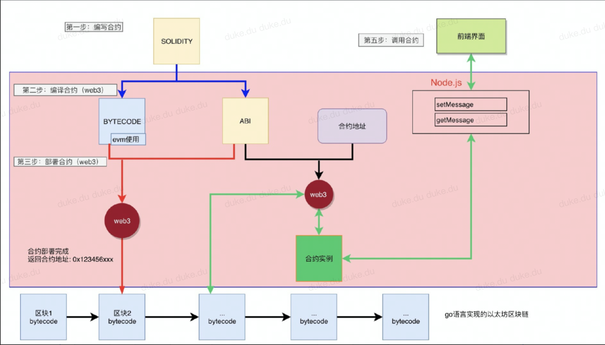

# evm智能合约开发

# 编辑器

- ==remix在线编辑器，最好用的==：https://remix.ethereum.org/#optimize=false&version=soljson-v0.4.24+commit.e67f0147.js&runs=200&evmVersion=null&language=Solidity
- vscode编辑器（类似于记事本的编辑器，打开非常快）



# 开发语言

- ==solidity==，当前版本：0.8.15，
  - 官方手册：https://docs.soliditylang.org/en/v0.8.15/
  - 个人教程：https://dukedaily.github.io/blockchain_expert/01_solidity%E5%9F%BA%E7%A1%80/01_helloworld.html
- verby（没用过，非主流）
- 语言特点：
  - 类似于JavaScript
  - 是图灵完备的

# Demo开发

```js
// SPDX-License-Identifier: GPL-3.0

// 明确编辑语言，以及编译器版本号
pragma solidity ^0.8.10;

// 智能合约是有contract关键字包裹，类似于其他语言中的类的概念，如c++/java/js中的class
contract Gretting {
    
    // 状态变量，真正上链的数据，修改需要钱，读取不需要花钱，其中：
    // string 数据类型
    // public 表示可以在链上读取（还有private和internal）
    // name 变量名
    string public name; 

    //public 表示可以在链上读取，private表示不能在链上读取，internal表示只能在自己和子合约中读取
    uint256 private age;

    // 只有引用数据类型才涉及到memory和storage关键字，bytes, array, map, struct, string
    // memory ：表示值类型，直接copy，修改时不会修改原始变量
    // storage : 表示引用类型，相当于传递指针，会同步修改原始变量

    //值类型的不需要上述两个关键字：uint, bool
    function getName() external view returns (string memory) {
        return name;
    }

    // 修改状态变量，需要消耗gas
    // _name是规范，使语义更加明确
    // external表示该方法只能在合约之外调用，当前合约不可以调用
    function setName(string memory _name, uint256 _age) external {
        age = _age;
        name = _name;
    }
}

contract HelloWorld {
    
}
```

# Kovan部署

https://kovan.etherscan.io/address/0x30e8d8433ebeaee3625c0b420ac0d93bf2d6a2fb

# Dapp开发教程

内部分享文档：https://c1ey4wdv9g.larksuite.com/docs/docusl4Ex7n0KZ9rvf25GY0YUFh

配套视频：https://c1ey4wdv9g.larksuite.com/minutes/obushpzav2e88n686ugagqp3

uniswapV2合约关系图：


# 以太坊主网空投(工具)

https://cn.etherscan.com/address/0xaD2bC3859120273bd1B2B634F8404432812eC198#writeContract


