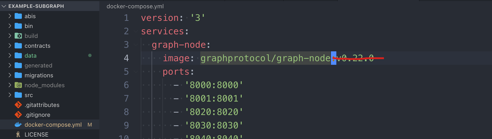

# 第1节：本地化部署ganache和graphnode


# 参考

1. 官方文档：https://thegraph.academy/developers/local-development/
2. example：https://thegraph.com/docs/en/deploying/deploying-a-subgraph-to-hosted/
3. 获取代码请移步这里：https://github.com/dukedaily/subgraph-demo

# 一、安装准备

## 命令

```sh
npm install -g ganache-cli truffle @graphprotocol/graph-cli
```

## 创建项目

```sh
graph init --from-example dukedaily/example-subgraph
```


如果安装依赖失败，可以手动安装依赖

```sh
yarn install
```

## 启动ganache-cli

```sh
ganache-cli -h 0.0.0.0
```

# 二、部署合约

## 更新图片

替换Migrations/3_create_gravatars.js中的链接：（原demo中的链接已经失效）

```sh
# Carl: 
https://gateway.pinata.cloud/ipfs/QmRRPWG96cmgTn2qSzjwr2qvfNEuhunv6FNeMFGa9bx6mQ

# Lucas: 
https://gateway.pinata.cloud/ipfs/QmcJYkCKK7QPmYWjp4FD2e3Lv5WCGFuHNUByvGKBaytif4
```


## 编译部署

```sh
$ cd example-subgraph
$ truffle compile
$ truffle migrate
```


部署后得到目标地址：==0x32969911a7C0396d7BbAe2290e5Ca98f54C38AB8==，需要subgraph来监听这个地址。

# 三、配置subgraph

在subgraph.yaml中，替换地址<GANACHE_CONTRACT_ADDRESS>为上面部署的地址！

```sh
#sed -i -e \
#  's/0x2E645469f354BB4F5c8a05B3b30A929361cf77eC/<GANACHE_CONTRACT_ADDRESS>/g' \
#  subgraph.yaml

sed -i -e \
  's/0x2E645469f354BB4F5c8a05B3b30A929361cf77eC/0x32969911a7C0396d7BbAe2290e5Ca98f54C38AB8/g' \
  subgraph.yaml
```

替换后：


修改docker-compose.yml文件，将下图：v0.22.0删掉，保证使用最新版本。



## 编译subgraph

```sh
yarn codegen
yarn build
```


## 启动graphnode（docker）

确保docker已经启动

```sh
docker-compose up
```

## 创建subgraph（本地）

```sh
# 先创建
yarn create-local
# 后部署
yarn deploy-local
```


同步事件（需要几分钟）


使用浏览器查看日志信息（在truffle migrate中，会自动执行：3_create_gravatars.js，这个脚本会调用合约，发送两个事件）

url：http://127.0.0.1:8000/subgraphs/name/dukedaily/example-subgraph/graphql

```sql
{
  gravatars {
    id
    owner
    displayName
    imageUrl
  }
}
```

执行请求成功！


# 四、准备前端

```sh
git clone git@github.com:graphprotocol/ethdenver-dapp.git
cd ethdenver-dapp
```

## 前端配置graph

```sh
#echo "REACT_APP_GRAPHQL_ENDPOINT=http://localhost:8000/subgraphs/name/<GITHUB_USERNAME>/example-subgraph" > .env

echo "REACT_APP_GRAPHQL_ENDPOINT=http://localhost:8000/subgraphs/name/dukedaily/example-subgraph" > .env
```

## 启动前端

```sh
yarn install  # global VPN mode
yarn start
```

## 安装有问题（可选）

```sh
# 删除文件
rm -rf yarn.lock

# 安装nvm，安装后需要配置文件，请仔细查看打印的log，有指导
brew install nvm

# 切换node版本，版本查询：https://www.npmjs.com/package/node
nvm install v10.24.1
nvm use v10.24.1

# 重新安装
npm install
```


## 查看效果

效果如下，切换Order By可以调整展示顺序，由于网络问题，图片没能正常展示，可以在代码中自行替换。

